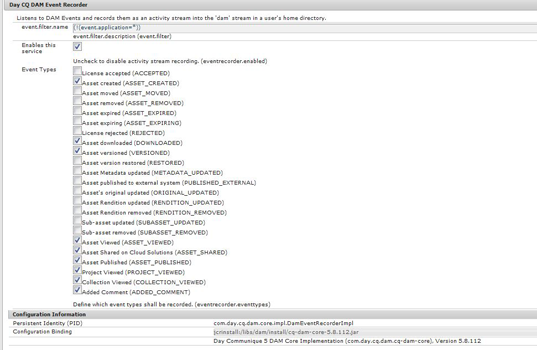
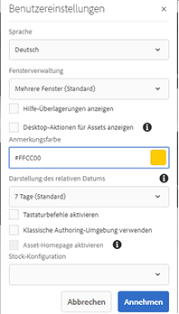
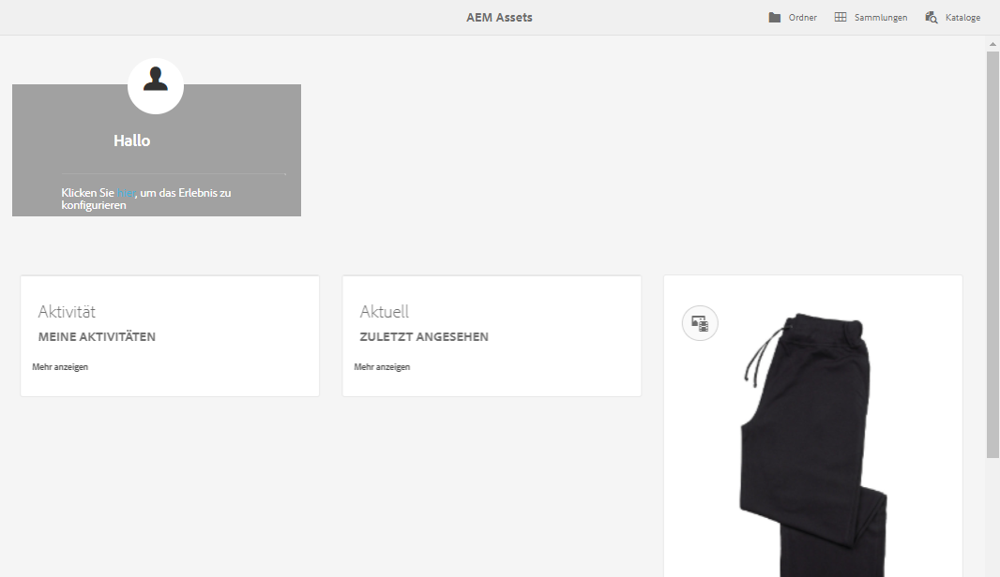

# [!DNL Adobe Experience Manager Assets]-Startseiten-Erlebnis {#aem-assets-home-page-experience}

Personalisieren Sie die [!DNL Adobe Experience Manager Assets]-Startseite, um Benutzenden ein ansprechendes Erlebnis auf dem Willkommensbildschirm zu bieten, einschließlich einer Übersicht der letzten Aktivitäten rund um Assets.

Die [!DNL Assets]-Startseite bietet ein ansprechendes und personalisiertes Willkommenserlebnis, einschließlich einer Übersicht der letzten Aktivitäten, wie z. B. kürzlich angezeigte oder hochgeladene Assets.

Die [!DNL Assets]-Startseite ist standardmäßig deaktiviert. Gehen Sie wie folgt vor, um sie zu aktivieren:

1. Öffnen Sie [!DNL Experience Manager] Configuration Manager `https://[aem_server]:[port]/system/console/configMgr`.
1. Öffnen Sie den Dienst **[!UICONTROL Day CQ DAM Event Recorder]**.
1. Wählen Sie **[!UICONTROL Diesen Dienst aktivieren]** aus, um die Aktivitätsaufzeichnung zu aktivieren.

   

1. Wählen Sie aus der Liste **[!UICONTROL Ereignistypen]** die Ereignisse aus, die aufgezeichnet werden sollen, und speichern Sie die Änderungen.

   >[!CAUTION]
   >
   >Die Aktivierung der Optionen „Angezeigte Assets“, „Angezeigte Projekte“ und „Angezeigte Sammlungen“ erhöht die Anzahl der aufgezeichneten Ereignisse erheblich.

1. Öffnen Sie den Dienst **[!UICONTROL DAM Assets-Startseitenfunktion-Flag]** von Configuration Manager aus `https://[aem_server]:[port]/system/console/configMgr`.
1. Wählen Sie die Option `isEnabled.name` aus, um die [!DNL Assets]-Startseitenfunktion zu aktivieren. Speichern Sie die Änderungen.

   

1. Öffnen Sie das Dialogfeld **[!UICONTROL Benutzereinstellungen]** und wählen Sie **[!UICONTROL Assets-Startseite aktivieren]** aus. Speichern Sie die Änderungen.

   

Nach der Aktivierung der [!DNL Assets]-Startseite navigieren Sie entweder über die Navigationsseite oder direkt über die URL `https://[aem_server]:[port]/aem/assetshome.html/content/dam` zur [!DNL Assets]-Benutzeroberfläche.

Klicken Sie auf **[!UICONTROL Hier klicken, um Ihr Erlebnis zu konfigurieren]**, um Ihren Benutzernamen, Ihr Hintergrundbild und Ihr Profilbild hinzuzufügen.

Die [!DNL Assets]-Startseite enthält die folgenden Abschnitte:

* Begrüßungsabschnitt
* Widget-Abschnitt

**Begrüßungsabschnitt**

Wenn Ihr Profil vorhanden ist, wird im Begrüßungsabschnitt eine Begrüßungsnachricht für Sie angezeigt. Darüber hinaus werden Ihr Profilbild und ein Begrüßungsbild angezeigt (wenn bereits konfiguriert).

Wenn Ihr Profil unvollständig ist, zeigt der Begrüßungsabschnitt eine generische Begrüßungsnachricht und einen Platzhalter für Ihr Profilbild an.

**Widget-Abschnitt**

Dieser Abschnitt wird unter dem Begrüßungsabschnitt angezeigt und bietet vorkonfigurierte Widgets unter den folgenden Abschnitten:

* Aktivität
* Aktuell
* Entdecken

**Aktivität**: Unter diesem Abschnitt zeigt das Widget **[!UICONTROL Meine Aktivität]** die aktuellsten Aktivitäten an, die angemeldete Personen mit Assets durchgeführt haben (einschließlich Assets ohne Ausgabedarstellungen), z. B. Asset-Uploads, -Downloads, Asset-Erstellung, Bearbeitungen, Kommentare, Anmerkungen und Freigaben.

**Aktuell**: Das Widget **[!UICONTROL Vor kurzem angezeigt]** unter diesem Abschnitt zeigt vor kurzem durch angemeldete Benutzende aufgerufene Entitäten an, z. B. Ordner, Sammlungen und Projekte.

**Entdecken**: Das Widget **[!UICONTROL Neu]** unter diesem Abschnitt zeigt die Assets und Ausgabedarstellungen an, die zuletzt in die [!DNL Assets]-Bereitstellung hochgeladen wurden.

Um das Löschen von Benutzeraktivitätsdaten zu aktivieren, aktivieren Sie den **[!UICONTROL DAM Event Purge-Dienst]** vom Configuration Manager aus. Nachdem Sie diesen Dienst aktiviert haben, werden die Aktivitäten der angemeldeten Person, die eine bestimmte Anzahl überschreiten, vom System gelöscht.

Der Begrüßungsbildschirm enthält einfache Navigationshilfen, z. B. Symbole in der Symbolleiste für das Zugreifen auf Ordner, Sammlungen und Kataloge.

>[!NOTE]
>
>Die Dienste [!UICONTROL Day CQ DAM Event Recorder] und [!UICONTROL DAM Event Purge] erhöhen die Zahl der JCR-Schreibvorgänge und die Suchindizierung, was die Last auf dem [!DNL Experience Manager]-Server erheblich erhöht. Die zusätzliche Last auf dem [!DNL Experience Manager]-Server kann dessen Leistung beeinträchtigen.

>[!CAUTION]
>
>Das Erfassen, Filtern und Bereinigen von Benutzeraktivitäten für die [!DNL Assets]-Startseite erfordert einen gewissen Mehraufwand. Daher sollten Admins die Homepage für Zielbenutzerinnen und -benutzer effektiv konfigurieren.
>
>Adobe empfiehlt Administratoren und Benutzern, die mit großen Datenmengen arbeiten, die Verwendung der Asset-Homepage-Funktion zu vermeiden, um einen Anstieg der Benutzeraktivitäten zu verhindern. Außerdem können Admins Aufzeichnungsaktivitäten von bestimmten Benutzenden unterbinden, indem sie den [!UICONTROL Day CQ DAM Event Recorder] vom [!UICONTROL Configuration Manager] aus konfigurieren.
>
>Wenn Sie die Funktion verwenden, empfiehlt Adobe, dass Sie die Bereinigungsfrequenz auf der Grundlage der Serverlast planen.
