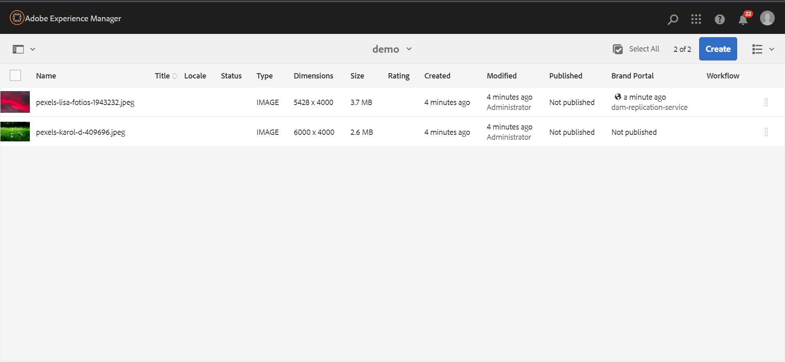

# Veröffentlichen von Assets in Brand Portal {#publish-assets-to-brand-portal}

| Version | Artikel-Link |
| -------- | ---------------------------- |
| AEM as a Cloud Service | [Hier klicken](https://experienceleague.adobe.com/docs/experience-manager-cloud-service/content/assets/brand-portal/publish-to-brand-portal.html?lang=de) |
| AEM 6.5 | Dieser Artikel |

Als Adobe Experience Manager (AEM) Assets-Admin können Sie für Ihre Organisation Assets und Ordner in der AEM Assets Brand Portal-Instanz veröffentlichen (oder den Veröffentlichungs-Workflow für einen späteren Zeitpunkt planen). Allerdings müssen Sie zunächst AEM Assets mit Brand Portal konfigurieren. Weitere Informationen finden Sie unter [Konfigurieren der von AEM Assets mit Brand Portal](/help/assets/configure-aem-assets-with-brand-portal.md).

Nach erfolgreicher Replikation können Sie Assets, Ordner und Sammlungen in Brand Portal veröffentlichen. Gehen Sie wie folgt vor, um Assets in Brand Portal zu veröffentlichen:

>[!NOTE]
>
>Adobe empfiehlt eine gestaffelte Veröffentlichung, vorzugsweise außerhalb der Spitzenzeiten, sodass die AEM-Autoreninstanz keine übermäßigen Ressourcen belegt.

1. Wählen Sie in der Assets-Konsole die Assets/Ordner aus, die Sie veröffentlichen möchten, und klicken Sie in der Symbolleiste auf **[!UICONTROL Quick Publish]**.

   Alternativ können Sie auch die Assets auswählen, die Sie in Brand Portal veröffentlichen möchten.

   

1. Um die Assets in Brand Portal zu veröffentlichen, stehen die beiden folgenden Optionen zur Verfügung:
   * [Sofortiges Veröffentlichen von Assets](#publish-to-bp-now)
   * [Assets später veröffentlichen](#publish-to-bp-now)

## Sofortiges Veröffentlichen von Assets {#publish-to-bp-now}

Um die ausgewählten Assets in Brand Portal zu veröffentlichen, führen Sie einen der folgenden Schritte aus:

* Wählen Sie in der Symbolleiste **[!UICONTROL Quick Publish]** aus. Wählen Sie dann im Menü die Option **[!UICONTROL In Brand Portal veröffentlichen]** aus.

* Wählen Sie in der Symbolleiste **[!UICONTROL Veröffentlichung verwalten]** aus.

   1. Wählen Sie dann unter **[!UICONTROL Aktion]** die Option **[!UICONTROL In Brand Portal veröffentlichen]** und unter **[!UICONTROL Zeitplan]** die Option **[!UICONTROL Jetzt]** aus. Klicken Sie auf **[!UICONTROL Weiter]**.

   2. Bestätigen Sie Ihre Auswahl unter **[!UICONTROL Bereich]** und klicken Sie auf **[!UICONTROL In Brand Portal veröffentlichen]**.

Eine Meldung erscheint, die besagt, dass die Assets zur Veröffentlichung in Brand Portal in die Warteschlange gestellt wurden. Melden Sie sich bei der Brand Portal-Benutzeroberfläche an, um die veröffentlichten Assets zu sehen.

## Assets später veröffentlichen {#publish-to-bp-later}

So planen Sie die Veröffentlichung der Assets in Brand Portal zu einem späteren Zeitpunkt:

1. Nachdem Sie die zu veröffentlichenden Assets/Ordner ausgewählt haben, wählen Sie oben in der Symbolleiste **[!UICONTROL Veröffentlichung verwalten]** aus.

1. Wählen Sie auf der Seite **[!UICONTROL Veröffentlichung verwalten]** die Option **[!UICONTROL In Brand Portal veröffentlichen]** unter **[!UICONTROL Aktion]** und dann **[!UICONTROL Später]** unter **[!UICONTROL Zeitplan]** aus.

   

1. Wählen Sie ein **[!UICONTROL Aktivierungsdatum]** aus und geben Sie die Zeit an. Klicken Sie auf **[!UICONTROL Weiter]**.

1. Wählen Sie ein **Aktivierungsdatum** aus und geben Sie die Zeit an. Klicken Sie auf **Weiter**.

1. Geben Sie einen **[!UICONTROL Workflow-Titel]** in **[!UICONTROL Workflows]** an. Klicken Sie auf **[!UICONTROL Später veröffentlichen]**.

   

Melden Sie sich jetzt bei Brand Portal an, um zu sehen, ob die veröffentlichten Assets auf der Brand Portal-Benutzeroberfläche verfügbar sind.

## Ansicht der veröffentlichten Datei oder des Ordners in Brand Portal {#view-published-file-folder}

1. Melden Sie sich bei der Brand Portal-Benutzeroberfläche an, um die veröffentlichten Assets zu sehen (je nach Ihrem geplanten Zeitpunkt).

   

1. Wechseln Sie zur , um den aktuellen Veröffentlichungsstatus des Assets anzuzeigen.

<!--2. On the [Asset Reports page](#https://experienceleague.adobe.com/en/docs/experience-manager-cloud-service/content/assets/admin/asset-reports), you can see the current state of the report job, for example, Success, Failed, Queued, or Scheduled.-->

