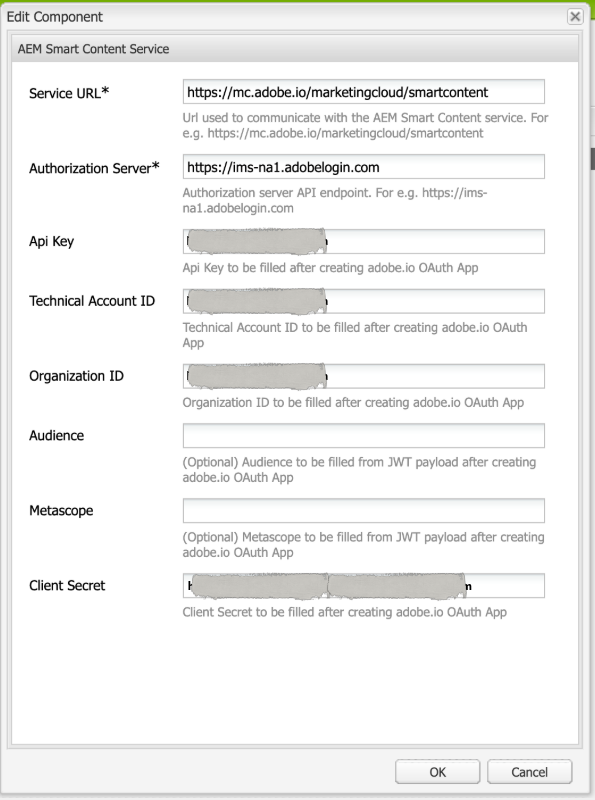
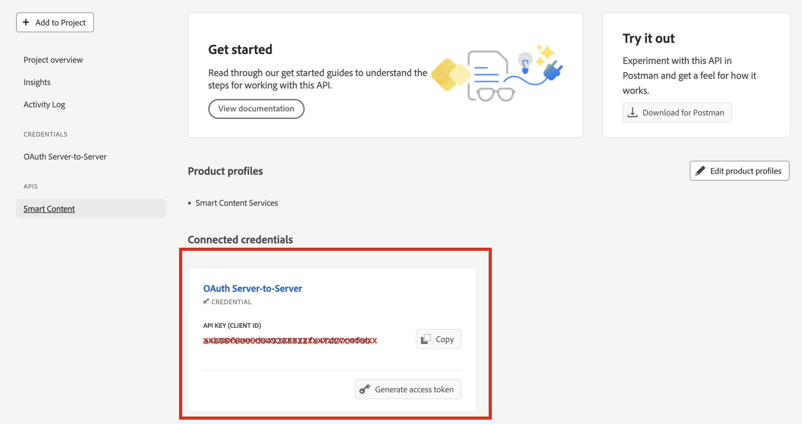

# Fehlerbehebung für Smart-Tags hinsichtlich OAuth-Anmeldedaten {#oauth-config}

Eine offene Autorisierungskonfiguration ist erforderlich, um die Zustimmung dafür zu erhalten, dass die Anwendung [!DNL Adobe Experience Manager] auf sichere Weise mit Smart Content Services interagiert.

>[!NOTE]
>
> Sie können seit Juni 2024 keine neuen JWT-Anmeldedaten mehr erstellen. Von nun an werden nur noch OAuth-Anmeldedaten erstellt. 
> Die JWT-Integration bleibt nur für bestehende AMS- und On-Premise-Benutzende noch bis Januar 2025 im Betrieb.

## OAuth-Konfiguration für die neuen AMS-Benutzenden {#oauth-config-existing-ams-users}

Informationen zur Konfiguration von OAuth-Diensten für neue Benutzende finden Sie unter [Konfiguration von Smart Content Services](#integrate-adobe-io). Führen Sie danach die folgenden [Schritte](#prereqs-config-oauth-onprem) aus.

>[!NOTE]
>
>Bei Bedarf können Sie ein Support-Ticket einreichen, indem Sie dem [Support-Prozess](https://experienceleague.adobe.com/de?lang=de&amp;support-tab=home#support) folgen.

## OAuth-Konfiguration für die vorhandenen AMS-Benutzenden {#oauth-config-new-ams-users}

Bevor Sie einen der Schritte in dieser Methode durchführen, müssen Sie Folgendes implementieren:

### Voraussetzungen {#prereqs-config-oauth-onprem}

Eine OAuth-Konfiguration erfordert die folgenden Voraussetzungen:

* Erstellen Sie in der [Developer Console](https://developer.adobe.com/console/user/servicesandapis) eine neue OAuth-Integration. Verwenden Sie die Eigenschaften `ClientID`, `ClientSecret`, `OrgID` und andere in den folgenden Schritten:
* Die folgenden Dateien befinden sich unter diesem Pfad `/apps/system/config in crx/de`:
   * `com.**adobe**.granite.auth.oauth.accesstoken.provider.<randomnumbers>.config`
   * `com.adobe.granite.auth.ims.impl.IMSAccessTokenRequestCustomizerImpl.<randomnumber>.config`

### OAuth-Konfiguration für die vorhandenen AMS- und On-Premise-Benutzenden {#steps-config-oauth-onprem}

Die folgenden Schritte können von den Systemadmins ausgeführt werden. AMS-Kundschaft kann sich an den Adobe-Support wenden oder ein Support-Ticket einreichen, indem der [Support-Prozess](https://experienceleague.adobe.com/de?lang=de&amp;support-tab=home#support) befolgt wird.

1. Fügen Sie in `com.adobe.granite.auth.oauth.accesstoken.provider.<randomnumbers>.config` die folgenden Eigenschaften hinzu oder aktualisieren Sie sie:

   * `auth.token.provider.authorization.grants="client_credentials"`
   * `auth.token.provider.orgId="<OrgID>"`
   * `auth.token.provider.default.claims=("\"iss\"\ :\ \"<OrgID>\"")`
   * `auth.token.provider.scope="read_pc.dma_smart_content,\ openid,\ AdobeID,\ additional_info.projectedProductContext"`
     `auth.token.validator.type="adobe-ims-similaritysearch"`
   * Aktualisieren Sie die `auth.token.provider.client.id` mit der Client-ID der neuen OAuth-Konfiguration.
   * Ändern Sie die Angabe für `auth.access.token.request` in `"https://ims-na1.adobelogin.com/ims/token/v3"`.
1. Benennen Sie die Datei in `com.adobe.granite.auth.oauth.accesstoken.provider-<randomnumber>.config` um.
1. Führen Sie in `com.adobe.granite.auth.ims.impl.IMSAccessTokenRequestCustomizerImpl.<randomnumber>.config` die folgenden Schritte aus:
   * Aktualisieren Sie die Eigenschaft „auth.ims.client.secret“ mit dem Client-Geheimnis aus der neuen OAuth-Integration.
   * Benennen Sie die Datei in `com.adobe.granite.auth.ims.impl.IMSAccessTokenRequestCustomizerImpl-<randomnumber>.config` um.
1. Speichern Sie alle Änderungen in der Entwicklungskonsole des Content-Repositorys, z. B. CRXDE.
<!--
1. Navigate to `/system/console/configMgr` and replace the OSGi configuration from `.<randomnumber>` to `-<randomnumber>`.
1. Delete the old OSGi configuration for `"Access Token provider name: adobe-ims-similaritysearch"` in `/system/console/configMgr`.
-->
1. Löschen Sie in `System/console/configMgr` die alten Konfigurationen für `com.adobe.granite.auth.ims.impl.IMSAccessTokenRequestCustomizerImpl` und den Namen des Zugriffs-Token-Anbieters `adobe-ims-similaritysearch`.
1. Starten Sie die Konsole neu.

## Überprüfen der Konfiguration {#validate-the-configuration}

Nachdem Sie die Konfiguration abgeschlossen haben, können Sie die Konfiguration mit einem JMX MBean überprüfen. Führen Sie zum Überprüfen die folgenden Schritte aus.

1. Greifen Sie unter `https://[aem_server]:[port]` auf Ihren [!DNL Experience Manager]-Server zu.

1. Gehen Sie zu **[!UICONTROL Tools]** > **[!UICONTROL Vorgänge]** > **[!UICONTROL Web-Konsole]**, um die OSGi-Konsole zu öffnen. Klicken Sie auf **[!UICONTROL Main] > [!UICONTROL JMX]**.

1. Klicken Sie auf `com.day.cq.dam.similaritysearch.internal.impl`. Die Seite **[!UICONTROL SimilaritySearch Miscellaneous Tasks]** wird geöffnet

1. Klicken Sie auf `validateConfigs()`. Klicken Sie im Dialogfeld **[!UICONTROL Konfigurationen prüfen]** auf **[!UICONTROL Aufrufen]**.

Das Überprüfungsergebnis wird im selben Dialogfeld angezeigt.

## Integrieren in die Adobe Developer Console {#integrate-adobe-io}

Wenn Sie eine neue Benutzerin bzw. ein neuer Benutzer sind, authentifiziert bei der Integration in die Adobe Developer Console der [!DNL Experience Manager]-Server Ihre Service-Anmeldedaten beim Adobe Developer Console-Gateway, bevor er Ihre Anfrage an den Smart Content Service weiterleitet. Zur Integration benötigen Sie ein Adobe ID-Konto mit Administratorrechten für die für Ihr Unternehmen erworbene und aktivierte Smart Content Service-Lizenz.

Gehen Sie wie folgt vor, um den Smart Content Service zu konfigurieren:

1. Um einen öffentlichen Schlüssel zu generieren, [erstellen Sie in [!DNL Experience Manager] eine Smart Content Service](#obtain-public-certificate)-Konfiguration. [Laden Sie ein öffentliches Zertifikat für die OAuth-Integration herunter](#obtain-public-certificate).

1. *[Nicht anwendbar für bestehende Benutzende]*. [Erstellen Sie in diesem Fall eine Integration in Adobe Developer Console](#create-adobe-i-o-integration).

1. [Konfigurieren Sie die Bereitstellung](#configure-smart-content-service) mithilfe des API-Schlüssels und der anderen Anmeldedaten aus der Adobe Developer Console.

1. [Testen Sie die Konfiguration](#validate-the-configuration).

## Herunterladen eines öffentlichen Zertifikats durch Erstellen einer Konfiguration des Smart Content Service {#download-public-certificate}

Ein öffentliches Zertifikat ermöglicht Ihnen die Authentifizierung Ihres Profils in der Adobe Developer Console.

1. Greifen Sie in der [!DNL Experience Manager]-Benutzeroberfläche auf **[!UICONTROL Tools]** > **[!UICONTROL Cloud Services]** > **[!UICONTROL Ältere Cloud Services]** zu.

1. Klicken Sie auf der Seite „Cloud Services“ unter **[!UICONTROL Assets Smart Tags]** auf **[!UICONTROL Jetzt konfigurieren]**.

1. Geben Sie im Dialogfeld **[!UICONTROL Konfiguration erstellen]** einen Titel und einen Namen für die Smart-Tags-Konfiguration ein. Klicken Sie auf **[!UICONTROL Erstellen]**.

1. Verwenden Sie im Dialogfeld **[!UICONTROL AEM Smart Content Service]** die folgenden Werte:

   **[!UICONTROL Service-URL]**: `https://smartcontent.adobe.io/<region where your Experience Manager author instance is hosted>`

   Beispiel: `https://smartcontent.adobe.io/apac`. Sie können `na`, `emea` oder `apac` als die Regionen angeben, in denen Ihre Experience Manager-Autoreninstanz gehostet wird.

   >[!NOTE]
   >
   >Wenn der Experience Manager Managed Service vor dem 1. September 2022 bereitgestellt wurde, verwenden Sie die folgende Service-URL:
   >`https://mc.adobe.io/marketingcloud/smartcontent`

   **[!UICONTROL Autorisierungsserver]**: `https://ims-na1.adobelogin.com`

   Lassen Sie die anderen Felder vorerst leer (Werte werden später bereitgestellt). Klicken Sie auf **[!UICONTROL OK]**.

   

   *Abbildung: Dialogfeld von Content Service zum Bereitstellen der Content Service-URL*

   >[!NOTE]
   >
   >Die als [!UICONTROL Service-URL] angegebene URL ist über den Browser nicht erreichbar und erzeugt einen 404-Fehler. Die Konfiguration funktioniert problemlos mit demselben Wert für den [!UICONTROL Service-URL]-Parameter. Informationen zum Gesamtstatus und Wartungszeitplan für den Service finden Sie unter [https://status.adobe.com](https://status.adobe.com).

1. Klicken Sie auf **[!UICONTROL Öffentliches Zertifikat für OAuth-Integration herunterladen]** und laden Sie die öffentliche Zertifikatdatei `AEM-SmartTags.crt` herunter. Außerdem müssen Sie dieses Zertifikat nicht mehr in die Adobe Developer Console hochladen.

   

   *Abbildung: Einstellungen für den Smart-Tagging-Service.*

## Erstellen einer Integration in der Adobe Developer Console {#create-adobe-i-o-integration}

Um die Smart Content Service-APIs zu verwenden, erstellen Sie eine Integration in der Adobe Developer Console, um den [!UICONTROL API-Schlüssel] (der im Feld [!UICONTROL CLIENT-ID] der Adobe Developer Console-Integration generiert wird), die [!UICONTROL ID DES TECHNISCHEN KONTOS], die [!UICONTROL ORGANISATIONS-ID] und das [!UICONTROL CLIENT-GEHEIMNIS] für die [!UICONTROL Smart Tagging Service-Einstellungen für Assets] der Cloud-Konfiguration in [!DNL Experience Manager].

1. Rufen Sie [https://developer.adobe.com/console/](https://developer.adobe.com/console/) in einem Browser auf. Wählen Sie das entsprechende Konto aus und vergewissern Sie sich, dass die zugehörige Organisationsrolle „Systemadministrator“ ist.

1. Erstellen Sie ein Projekt mit einem beliebigen Namen. Klicken Sie auf **[!UICONTROL API hinzufügen]**.

1. Wählen Sie auf der Seite **[!UICONTROL API hinzufügen]** die Option **[!UICONTROL Experience Cloud]** und dann **[!UICONTROL Smart Content]** aus. Klicken Sie auf **[!UICONTROL Weiter]**.

1. Wählen Sie die Authentifizierungsmethode **[!UICONTROL OAuth-Server-zu-Server]** aus.

1. Fügen Sie nach Bedarf den **[!UICONTROL Berechtigungsnamen]** hinzu oder ändern Sie ihn. Klicken Sie auf **[!UICONTROL Weiter]**.

1. Wählen Sie das Produktprofil **[!UICONTROL Smart Content Services]** aus. Klicken Sie auf **[!UICONTROL Konfigurierte API speichern]**. Die OAuth-API wird unter den verbundenen Anmeldedaten für die weitere Verwendung hinzugefügt. Sie können daraus den [!UICONTROL API-Schlüssel (Client-ID)] kopieren oder das [!UICONTROL Zugriffs-Token generieren].
<!--
1. On the **[!UICONTROL Select product profiles]** page, select **[!UICONTROL Smart Content Services]**. Click **[!UICONTROL Save configured API]**.

   A page displays more information about the configuration. Keep this page open to copy and add these values in [!UICONTROL Assets Smart Tagging Service Settings] of cloud configuration in [!DNL Experience Manager] to configure smart tags.

   

   *Figure: Details of integration in Adobe Developer Console*
-->

*Abbildung: OAuth-Server-zu-Server konfiguriert in Adobe Developer Console*

## Konfigurieren des Smart Content Service {#configure-smart-content-service}

Verwenden Sie zum Konfigurieren der Integration die Werte der Felder [!UICONTROL ID DES TECHNISCHEN KONTOS], [!UICONTROL ORGANISATIONS-ID], [!UICONTROL CLIENT-GEHEIMNIS] und [!UICONTROL CLIENT-ID] aus der Adobe Developer Console-Integration. Das Erstellen einer Smart-Tags-Cloud-Konfiguration ermöglicht die Authentifizierung von API-Anfragen aus der [!DNL Experience Manager]-Bereitstellung.

1. Gehen Sie in [!DNL Experience Manager] zu **[!UICONTROL Tools]** > **[!UICONTROL Cloud Service]** > **[!UICONTROL Ältere Cloud-Services]**, um die [!UICONTROL Cloud Services]-Konsole zu öffnen.

1. Öffnen Sie unter **[!UICONTROL Smart-Tags für Assets]** die oben erstellte Konfiguration. Klicken Sie auf der Seite „Diensteinstellungen“ auf **[!UICONTROL Bearbeiten]**.

1. Verwenden Sie im Dialogfeld **[!UICONTROL AEM Smart Content Service]** die vorausgefüllten Werte für die Felder **[!UICONTROL Service-URL]** und **[!UICONTROL Autorisierungsserver]**.

1. Für die Felder [!UICONTROL API-Schlüssel], [!UICONTROL ID des Technischen Kontos], [!UICONTROL Organisations-ID] und [!UICONTROL Client-Geheimnis], kopieren und verwenden Sie die folgenden Werte, die in [Integration der Adobe Developer Console](#create-adobe-i-o-integration) generiert wurden.

   | [!UICONTROL Diensteinstellungen für Smart-Tagging in Assets] | [!DNL Adobe Developer Console] Integrationsfelder |
   |--- |--- |
   | [!UICONTROL API-Schlüssel] | [!UICONTROL CLIENT-ID] |
   | [!UICONTROL ID des technischen Kontos] | [!UICONTROL  ID DES TECHNISCHEN KONTOS] |
   | [!UICONTROL Organisations-ID] | [!UICONTROL ORGANISATIONS-ID] |
   | [!UICONTROL Client-Geheimnis] | [!UICONTROL CLIENT-GEHEIMNIS] |

>[!MORELIKETHIS]
>
>* [Überblick über Smart-Tags und deren Training](enhanced-smart-tags.md)
>* [Konfigurieren des Smart-Tagging](config-smart-tagging.md)
>* [Video-Tutorial zu Smart-Tags](https://experienceleague.adobe.com/docs/experience-manager-learn/assets/metadata/image-smart-tags.html?lang=de)
