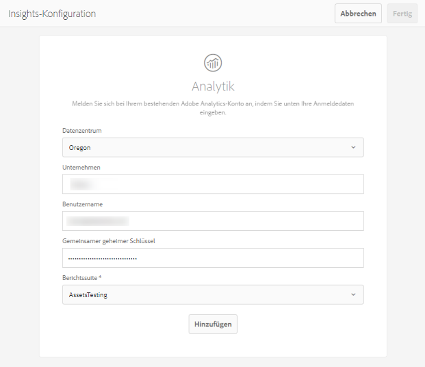
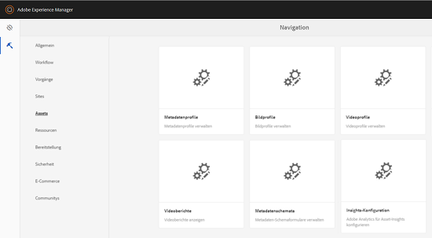

# Konfigurieren von Asset Insights {#configure-asset-insights}

[!DNL Adobe Experience Manager Assets] ruft Nutzungsdaten zu digitalen Assets, die von Websites Dritter verwendet werden, von [!DNL Adobe Analytics] ab. Um Asset Insights zu aktivieren und diese Daten abzurufen und Statistiken zu erzeugen, konfigurieren Sie zuerst die Funktion zur Integration mit [!DNL Adobe Analytics]. Um diese Funktion in einer On-Premise-Installation zu verwenden, kaufen Sie die [!DNL Adobe Analytics]-Lizenz separat. Kundinnen und Kunden mit [!DNL Managed Services] erhalten die [!DNL Analytics]-Lizenz im Paket mit [!DNL Experience Manager]. Siehe [Managed Services-Produktbeschreibung](https://helpx.adobe.com/de/legal/product-descriptions/adobe-experience-manager-managed-services.html).

>[!NOTE]
>
>Insights werden nur für Bilder unterstützt und bereitgestellt.

1. Klicken Sie in [!DNL Experience Manager] auf **[!UICONTROL Tools]** > **[!UICONTROL Assets]**.

   

1. Klicken Sie auf die Karte **[!UICONTROL Insights-Konfiguration]**.
1. Wählen Sie im Assistenten ein Rechenzentrum aus und geben Sie Ihre Anmeldedaten an, z. B. den Namen Ihres Unternehmens, den Benutzernamen und gemeinsamen geheimen Schlüssel.

   

   *Abbildung: Konfigurieren von [!DNL Adobe Analytics] für Asset Insights in [!DNL Experience Manager].*

1. Klicken Sie auf **[!UICONTROL Authentifizieren]**.
1. Nachdem [!DNL Experience Manager] Ihre Anmeldedaten authentifiziert hat, wählen Sie aus der Liste **[!UICONTROL Report Suite]** eine Report Suite aus, aus der Asset Insights Daten abrufen soll. [!DNL Adobe Analytics] Klicken Sie auf **[!UICONTROL Hinzufügen]**.
1. Nach der Einrichtung der Report Suite durch [!DNL Experience Manager] klicken Sie auf **[!UICONTROL Fertig]**.

## Seitenverfolgung {#page-tracker}

Nachdem Sie Ihr [!DNL Adobe Analytics]-Konto konfiguriert haben, wird der Seitenverfolgungs-Code für Sie erzeugt. Um Asset Insights zur Verfolgung von [!DNL Experience Manager]-Assets in Websites von Drittanbietern zu aktivieren, schließen Sie den Seitenverfolgungs-Code in den Website-Code ein. Verwenden Sie das Dienstprogramm zur [!UICONTROL Seitenverfolgung] in [!DNL Experience Manager Assets], um den Seitenverfolgungs-Code zu erzeugen. Weitere Informationen dazu, wie Sie Ihren Seitenverfolgungs-Code in Web-Seiten von Drittanbietern einbeziehen, finden Sie unter [Verwenden von Seitenverfolgung und Einbettungs-Code in Web-Seiten](/help/assets/use-page-tracker.md).

1. Klicken Sie in [!DNL Experience Manager] auf **[!UICONTROL Tools]** > **[!UICONTROL Assets]**.

   

1. Klicken Sie in der **[!UICONTROL Navigationsseite]** auf die Karte **[!UICONTROL Insights-Seitenverfolgung]**.
1. Klicken Sie auf **[!UICONTROL Herunterladen]**, um den Seitenverfolgungs-Code herunterzuladen.
