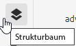
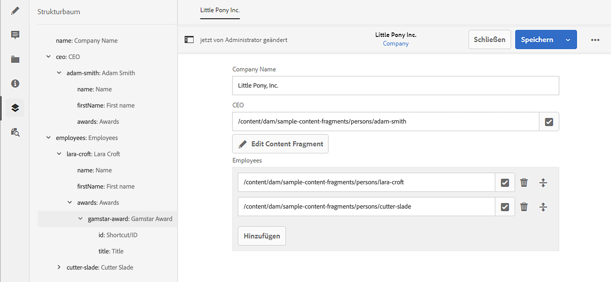

# Strukturbaum der Inhaltsfragmente {#content-fragment-structure-tree}

Verwenden Sie die Funktion „Strukturbaum“ des Inhaltsfragment-Editors in AEM, um Ihre Headless-Inhalte besser zu verstehen.

Im Inhaltsfragment-Editor können Sie das Strukturbaumsymbol auswählen:

Dadurch wird eine Darstellung der Fragmentstruktur im linken Fensterbereich geöffnet. Auf diese Weise können Sie durch referenzierte Fragmente navigieren und zu ihnen gelangen. Wenn Sie eine Referenz auswählen, wird dieses Fragment zur Bearbeitung geöffnet.

>[!NOTE]
>
>Mithilfe der Breadcrumbs im Hauptbedienfeld können Sie zurück zu Ihrem Ausgangspunkt gelangen.

