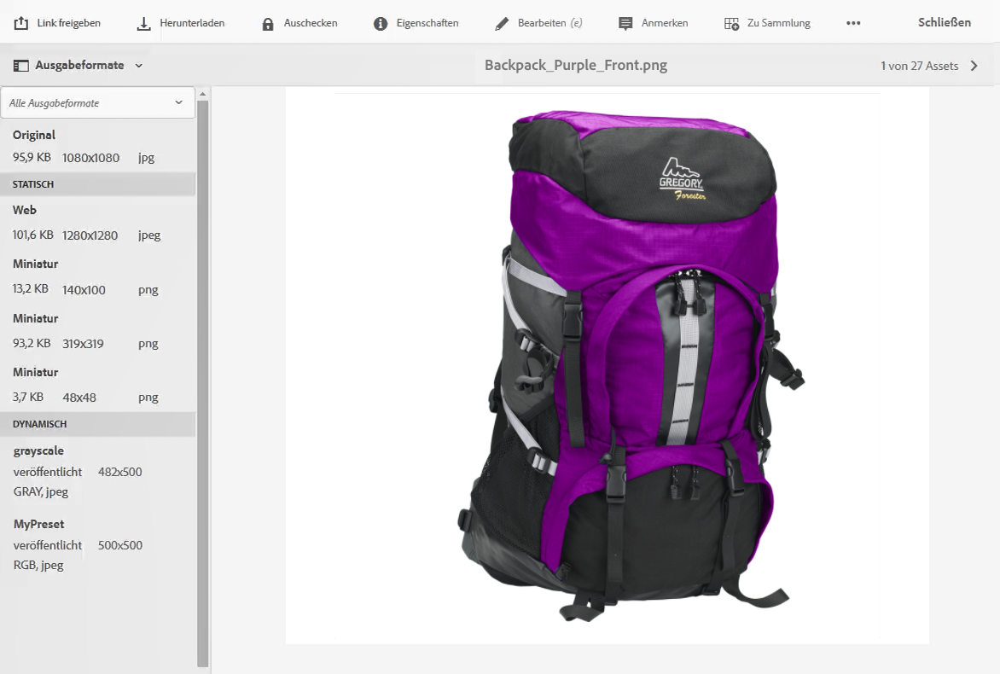
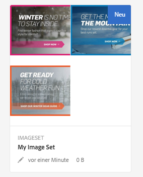
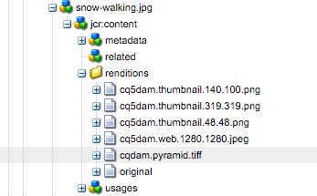

# Arbeiten mit Dynamic Media {#working-with-dynamic-media}

Mit [Dynamic Media](https://business.adobe.com/de/products/experience-manager/assets/dynamic-media.html) können Sie visuell ansprechende Merchandising- und Marketing-Assets nach Bedarf bereitstellen, die automatisch für die Anzeige auf Web- sowie Mobile- und Social-Media-Sites skaliert werden. Anhand eines Sets von Assets aus Primärquellen können Sie mit der Software mehrere Varianten reichhaltiger Inhalte in Echtzeit über das globale, skalierbare und leistungsoptimierte Netzwerk generieren und bereitstellen.

Die Software ermöglicht interaktive Anzeigeerlebnisse wie Zoom, Drehen um 360 Grad und Videos. Sie bindet die Workflows der Adobe Experience Manager-Lösung für Digital Asset Management (Assets) zum Vereinfachen und Optimieren der Verwaltung digitaler Kampagnen auf einzigartige Weise ein.

<!--
>ARTICLE IS MISSING. GIVES 404 [!NOTE]
>
>A Community article is available on [Working with Adobe Experience Manager and Dynamic Media](https://helpx.adobe.com/experience-manager/using/aem_dynamic_media.html).
-->

## Einsatzmöglichkeiten der Software {#what-you-can-do-with-dynamic-media}

Mit der Software können Sie Assets vor ihrer Veröffentlichung verwalten. Eine ausführliche Beschreibung der allgemeinen Arbeit mit digitalen Assets finden Sie in [Arbeiten mit digitalen Assets](manage-assets.md). Die allgemeinen Themen umfassen das Hochladen, Herunterladen, Bearbeiten und Veröffentlichen von Assets, das Anzeigen und Bearbeiten von Eigenschaften und die Suche nach Assets.

Funktionen, die nur für Dynamic Media vorgesehen sind:

* [Karussellbanner](carousel-banners.md)
* [Bild-Sets](image-sets.md)
* [Interaktive Bilder](interactive-images.md)
* [Interaktive Videos](interactive-videos.md)
* [Sets für gemischte Medien](mixed-media-sets.md)
* [Panoramabilder](panoramic-images.md)

* [Rotations-Sets](spin-sets.md)
* [Video](video.md)
* [Bereitstellen von Dynamic Media-Assets](delivering-dynamic-media-assets.md)
* [Verwalten von Assets](managing-assets.md)
* [Erstellen eines benutzerdefinierten Popup-Fensters mithilfe einer Schnellansicht](custom-pop-ups.md)

Siehe auch [Einrichten von Dynamic Media](administering-dynamic-media.md).

>[!NOTE]
>
>Informationen zu den Unterschieden zwischen der Verwendung von Dynamic Media und der Integration von Dynamic Media Classic in Adobe Experience Manager finden Sie unter [Dynamic Media Classic-Integration versus Dynamic Media](/help/sites-administering/scene7.md#aem-scene-integration-versus-dynamic-media).

## Aktivierte und deaktivierte Dynamic Media-Funktion im Vergleich {#dynamic-media-on-versus-dynamic-media-off}

Anhand der folgenden Merkmale können Sie erkennen, ob die Software aktiviert ist:

* Dynamische Ausgabedarstellungen sind beim Herunterladen oder Anzeigen von Assets in der Vorschau verfügbar.
* Bild-Sets, Rotations-Sets und Sets für gemischte Medien sind verfügbar.
* PTIFF-Ausgabedarstellungen werden erstellt.

Wenn Sie ein Bild-Asset auswählen, erscheint die Ansicht des Assets bei [aktivierter](config-dynamic.md#enabling-dynamic-media) Software anders. Sie nutzt die On-Demand-HTML5-Viewer.

### Dynamische Ausgabedarstellungen {#dynamic-renditions}

Dynamische Ausgabedarstellungen wie Bild- und Viewer-Vorgaben (unter **[!UICONTROL Dynamisch]**) sind verfügbar, wenn die Software aktiviert ist.

### Bild-Sets, Rotationssets und Sets für gemischte Medien {#image-sets-spins-sets-mixed-media-sets}

Bild-, Rotations- und gemischte Mediensets sind verfügbar, wenn die Software aktiviert ist.

### PTIFF-Ausgabedarstellungen {#ptiff-renditions}

Für Dynamic Media aktivierte Assets enthalten `pyramid.tiffs`.

### Änderung der Asset-Ansichten {#asset-views-change}

Wenn die Software aktiviert ist, können Sie durch Klicken auf die Schaltflächen `+` und `-` ein- bzw. auszoomen. Sie können auch durch Klicken in einen bestimmten Bereich einzoomen. Durch „Wiederherstellen“ können Sie zur Originalansicht zurückkehren und durch Klicken auf die diagonalen Pfeile das Bild im Vollbildmodus anzeigen. Wenn die Software aktiviert ist, ist die Ansicht wie folgt:

Wenn die Software deaktiviert ist, können Sie die Ansicht vergrößern und verkleinern oder die Originalgröße wiederherstellen:

