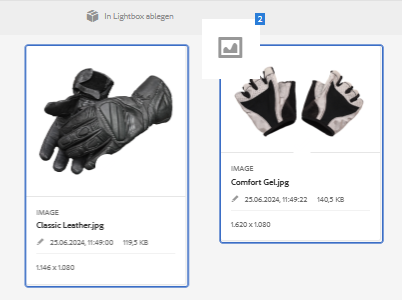

# Lightbox {#lightbox}

Lightbox ist ein spezieller Sammlungstyp, der den einfachen Zugriff auf Assets ermöglicht. Sie können schnell auf Lightbox zugreifen, um Assets hinzuzufügen oder zu löschen. Es dient als Ihre persönliche Bildergalerie.

Wenn Sie [!DNL Adobe Experience Manager Assets] verwenden, wird Lightbox bei Ihrer ersten Anmeldung bei der Anwendung automatisch erstellt. Lightbox bezieht sich ausschließlich auf Ihre eigenen Anmeldungen. Andere Benutzende können nicht auf Ihren Lightbox-Ordner zugreifen.

## Hinzufügen von Assets zu Lightbox {#adding-assets-to-lightbox}

1. Wählen Sie in der [!DNL Assets]-Benutzeroberfläche die Assets aus, die zu Lightbox hinzugefügt werden sollen.
1. Ziehen Sie die Assets in den Bereich **[!UICONTROL In Lightbox ablegen]**. Lassen Sie die Maustaste los, wenn die Dropzone aktiv wird und sich die Bezeichnung in **[!UICONTROL Zum Hinzufügen ablegen]** ändert.

   

1. Klicken Sie im Dialogfeld auf **[!UICONTROL Hinzufügen]** und schließen Sie es anschließend, um den Vorgang abzuschließen. Die ausgewählten Assets werden zu Lightbox hinzugefügt.
1. Um Lightbox anzuzeigen, wechseln Sie zur Konsole „Sammlungen“.^
1. Klicken Sie auf **[!UICONTROL Lightbox]**, um die darin enthaltenen Assets anzuzeigen.

   >[!NOTE]
   >
   >Obwohl Lightbox einer Sammlung ähnelt, können Sie nicht alle Aktionen ausführen, die Sie normalerweise mit Sammlungen ausführen. Sie können beispielsweise keine Einstellungen für eine Lightbox löschen, freigeben oder anzeigen. Außerdem können Sie sie nicht zu anderen Sammlungen hinzufügen. Sie können aber die Assets in einer Lightbox bearbeiten.

## Entfernen von Assets aus Lightbox {#removing-assets-from-lightbox}

1. Gehen Sie zur Konsole „Sammlungen“ und klicken Sie auf „Lightbox“, um die entsprechenden Assets anzuzeigen.
1. Wählen Sie die Assets aus, die Sie entfernen möchten.
1. Klicken Sie in der Symbolleiste auf **[!UICONTROL Entfernen]**.
1. Klicken Sie im Dialogfeld auf **[!UICONTROL Entfernen]**, um den Löschvorgang zu bestätigen. Die Assets werden aus Lightbox gelöscht.
