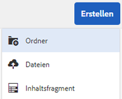
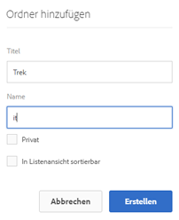
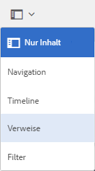
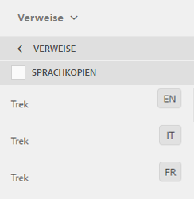

# Vorbereiten von Assets für die Übersetzung {#preparing-assets-for-translation}

Bei mehrsprachigen Assets handelt es sich um Assets mit Binärdateien, Metadaten und Tags in verschiedenen Sprachen. Im Allgemeinen liegen Binärdateien, Metadaten und Tags für Assets in einer Sprache vor, die dann für die Verwendung in mehrsprachigen Projekten in andere Sprachen übersetzt wird.

In [!DNL Adobe Experience Manager Assets] sind mehrsprachige Assets in Ordnern enthalten, wobei jeder Ordner die Assets in einer anderen Sprache enthält.

Jeder Sprachordner wird als Sprachkopie bezeichnet. Der Stammordner einer Sprachkopie, auch als Sprachstamm bezeichnet, identifiziert die Sprache des Inhalts in der Sprachkopie. Zum Beispiel ist */content/dam/it* der Stamm der italienischen Sprache für die italienische Sprachkopie. Sprachkopien müssen einen [korrekt konfigurierten Sprachstamm](preparing-assets-for-translation.md#creating-a-language-root) verwenden, damit die korrekte Sprache ausgewählt wird, wenn Übersetzungen von Quell-Assets durchgeführt werden.

Die Sprachkopie, für die Sie ursprünglich Assets hinzufügen, ist die primäre Sprache. Die primäre Sprache ist die Quelle, die in andere Sprachen übersetzt wird. Eine Beispielordnerhierarchie enthält mehrere Sprachstämme:

```shell
/content
    /- dam
        |- en
        |- fr
        |- de
        |- es
        |- it
        |- ja
        |- zh
```

Führen Sie die folgenden Schritte aus, um Ihre Assets für die Übersetzung vorzubereiten:

1. Erstellen Sie den Sprachstamm für Ihre primäre Sprache. Beispielsweise lautet der Sprachstamm der englischen Sprachkopie in der Beispielordnerhierarchie `/content/dam/en`. Stellen Sie sicher, dass der Sprachstamm entsprechend den Informationen unter [Erstellen eines Sprachstamms](preparing-assets-for-translation.md#creating-a-language-root) konfiguriert ist.

1. Fügen Sie Assets zu Ihrer primären Sprache hinzu.
1. Erstellen Sie den Sprachstamm der jeweiligen Zielsprache, für die Sie eine Sprachkopie benötigen.

## Erstellen eines Sprachstamms {#creating-a-language-root}

Um den Sprachstamm zu erstellen, erstellen Sie einen Ordner und verwenden Sie einen ISO-Sprach-Code als Wert für die Name-Eigenschaft. Nachdem Sie den Sprachstamm erstellt haben, können Sie eine Sprachkopie auf jeder Ebene im Sprachstamm erstellen.

Beispielsweise verfügt die Stammseite der italienischen Sprachkopie der Beispielhierarchie über `it` als Eigenschaft „Name“. Die Name-Eigenschaft wird als Name des Asset-Knotens im Repository verwendet und bestimmt daher den Pfad des Assets. (`https://[aem_server]:[port]/assets.html/content/dam/it/`).

1. Klicken Sie in der [!DNL Assets]-Konsole auf **[!UICONTROL Erstellen]** und wählen Sie **[!UICONTROL Ordner]** aus dem Menü aus.

   

1. Geben Sie im Feld **[!UICONTROL Name]** den Länder-Code im Format `<language-code>` ein.

   

1. Klicken Sie auf **[!UICONTROL Erstellen]**. Der Sprachstamm wird in der [!DNL Assets]-Konsole erstellt.

## Anzeigen von Sprachstämmen {#viewing-language-roots}

In der [!DNL Experience Manager]-Benutzeroberfläche gibt es ein Bedienfeld **[!UICONTROL Verweise]**, das eine Liste der in [!DNL Assets] erstellten Sprachstämme anzeigt.

1. Wählen Sie in der [!DNL Assets]-Konsole die primäre Sprache aus, für die Sie Sprachkopien erstellen möchten.
1. Wählen Sie in der linken Leiste die Option **[!UICONTROL Verweise]** aus, um den Bereich [!UICONTROL Verweise] zu öffnen.

   

1. Klicken Sie im Bereich „Verweise“ auf **[!UICONTROL Sprachkopien]**. Der Bereich [!UICONTROL Sprachkopien] zeigt die Sprachkopien der Assets an.

   
