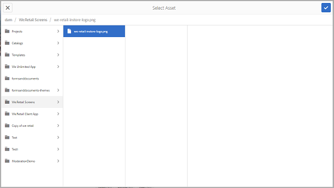

# Verknüpfte Assets {#related-assets}

Mit [!DNL Adobe Experience Manager Assets] können Sie Assets manuell entsprechend den Anforderungen Ihres Unternehmens verknüpfen. Verwenden Sie hierfür die Funktion „Verknüpfte Assets“. Beispielsweise können Sie einem Asset oder einem Bild/Video mit einer Lizenzdatei zu einem ähnlichen Thema verknüpfen. Sie können Assets verknüpfen, die bestimmte Attribute gemeinsam haben. Mit der Funktion können Sie außerdem Quellbeziehungen/abgeleitete Beziehungen zwischen Assets erstellen. Beispielsweise können Sie PDF-Dateien, die aus einer INDD-Datei generiert wurden, mit der INDD-Quelldatei verknüpfen.

Mit dieser Funktion können Sie eine PDF- oder JPG-Datei mit niedriger Auflösung für Anbieter oder Agenturen freigeben und die hochauflösende INDD-Datei nur auf Anfrage verfügbar machen.

>[!NOTE]
>
>Nur Benutzer mit Bearbeitungsberechtigungen für Assets können die Assets verknüpfen und die Verknüpfung aufheben.

## Verknüpfen von Assets {#relating-assets}

1. Öffnen Sie in der [!DNL Experience Manager]-Benutzeroberfläche von die Seite **[!UICONTROL Eigenschaften]** für ein Asset, das Sie verknüpfen möchten.

   

   *Abbildung: [!DNL Assets] Seite [!UICONTROL Eigenschaften], um Assets zu verknüpfen.*

   Wählen Sie alternativ das gewünschte Asset in der Listenansicht aus.

   

   Sie können das Asset auch aus einer Sammlung auswählen.

   

1. Um das ausgewählte Asset mit einem anderen Asset zu verknüpfen, klicken Sie in der Symbolleiste auf **[!UICONTROL Verknüpfen]** .
1. Führen Sie einen der folgenden Schritte aus:

   * Um die Quelldatei des Elements zuzuordnen, wählen Sie **[!UICONTROL Quelle]** aus der Liste aus.
   * Um eine abgeleitete Datei zuzuordnen, wählen Sie **[!UICONTROL Abgeleitet]** aus der Liste aus.
   * Um eine Zweiwege-Beziehung zwischen den Assets zu erstellen, wählen Sie **[!UICONTROL Andere]** aus der Liste aus.

1. Navigieren Sie im Bildschirm **[!UICONTROL Assets auswählen]** zum Speicherort des Assets, das Sie zuordnen möchten, und wählen Sie es aus.

   

1. Klicken Sie auf **[!UICONTROL Bestätigen]**.
1. Klicken Sie auf **[!UICONTROL OK]**, um das Dialogfeld zu schließen. Je nach Auswahl der Beziehung in Schritt 3 wird das verknüpfte Asset unter einer entsprechenden Kategorie im Abschnitt **[!UICONTROL Verknüpft]** aufgeführt. Beispiel: Wenn das verknüpfte Asset die Quelldatei des aktuellen Elements ist, wird es unter **[!UICONTROL Quelle]** aufgeführt.

   

1. Um die Verknüpfung eines Assets aufzuheben, klicken Sie in der Symbolleiste auf **[!UICONTROL Verknüpfung aufheben]** .

1. Wählen Sie die Assets, deren Verknüpfung Sie aufheben möchten, im Dialogfeld **[!UICONTROL Verknüpfungen aufheben]** aus, und klicken Sie auf **[!UICONTROL Aufheben]**.

   

1. Klicken Sie auf **[!UICONTROL OK]**, um das Dialogfeld zu schließen. Die Assets, für die Sie Verknüpfungen entfernt haben, werden aus der Liste der verknüpften Assets im Abschnitt **[!UICONTROL Verknüpft]** gelöscht.

## Übersetzen verknüpfter Assets {#translating-related-assets}

Für die Übersetzungs-Workflows ist die Erstellung von Quellbeziehungen / abgeleiteten Beziehungen zwischen Assets mit der Funktion „Verknüpfte Assets“ nützlich. Wenn Sie für ein abgeleitetes Asset einen Übersetzungs-Workflow ausführen, ruft [!DNL Experience Manager Assets] automatisch beliebige Assets ab, die von der Quelldatei referenziert werden, und nimmt sie in die Übersetzung auf. Auf diese Weise wird das vom Quell-Asset referenzierte Asset zusammen mit dem Quell-Asset und den abgeleiteten Assets übersetzt. Beispiel: In einem Szenario enthält die Kopie in englischer Sprache ein abgeleitetes Asset und die entsprechende Quelldatei wie gezeigt.

Ist die Quelldatei mit einem anderen Asset verknüpft, ruft [!DNL Experience Manager Assets] das referenzierte Asset ab und nimmt es in die Übersetzung auf.

*Abbildung: Quell-Asset der verknüpften Assets, die zur Übersetzung hinzugefügt werden sollen.*

1. Übersetzen Sie die Assets im Quellordner für eine Zielsprache, indem Sie die Schritte unter [Übersetzungsprojekt erstellen](translation-projects.md#create-a-new-translation-project) befolgen. Übersetzen Sie in diesem Fall zum Beispiel Ihre Assets ins Französische.

1. Öffnen Sie auf der Seite [!UICONTROL Projekte] den Übersetzungsordner.

1. Klicken Sie auf die Projektkachel, um die Seite mit den Details zu öffnen.

   

1. Klicke Sie auf die Auslassungszeichen unter der Karte „Übersetzungsauftrag“, um den Übersetzungsstatus anzuzeigen.

   

1. Wählen Sie das Asset aus und klicken Sie in der Symbolleiste auf **[!UICONTROL In Assets einblenden]**, um den Übersetzungsstatus für das Asset anzuzeigen.

   

1. Um sicherzustellen, dass die mit der Quelle verknüpften Assets übersetzt wurden, klicken Sie auf das Quellen-Asset.

1. Wählen Sie das mit der Quelle verknüpfte Asset aus und klicken Sie auf **[!UICONTROL In Assets einblenden]**. Das übersetzte zugehörige Asset wird angezeigt.
