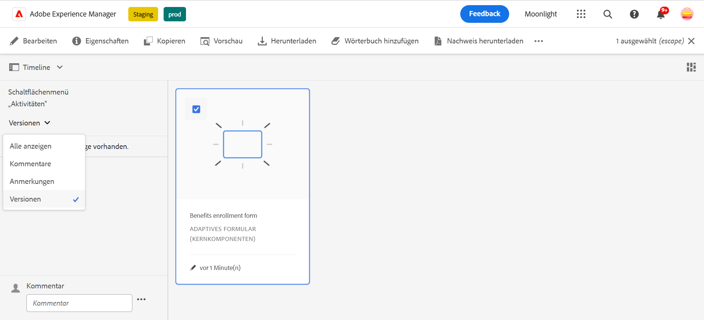
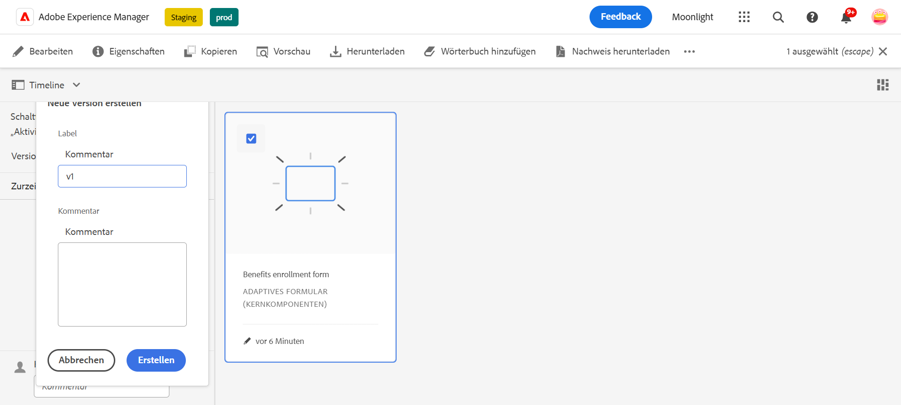
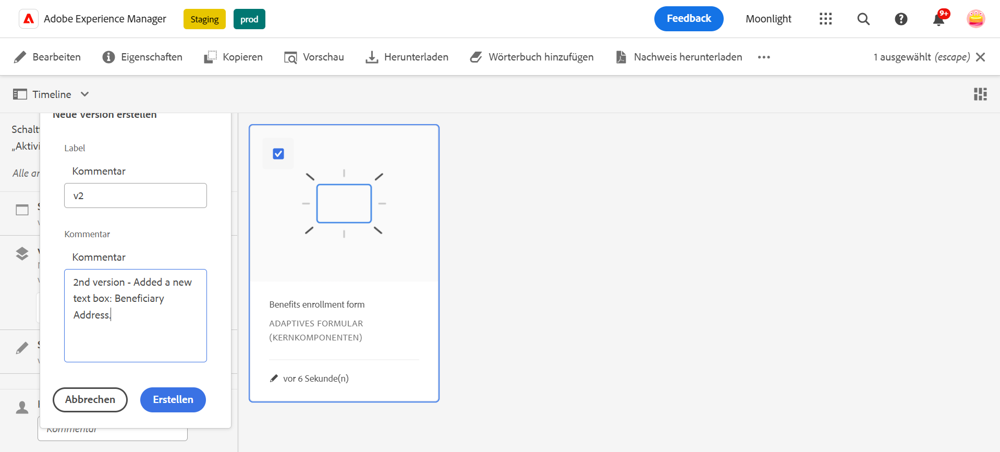
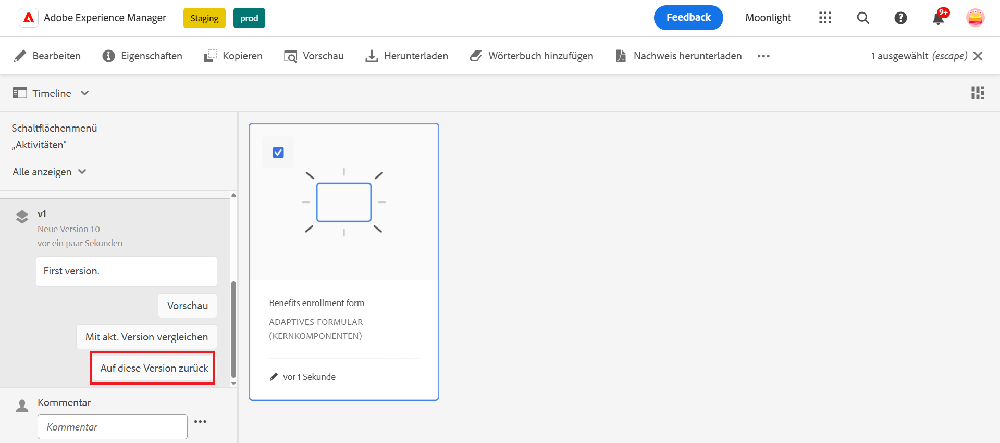
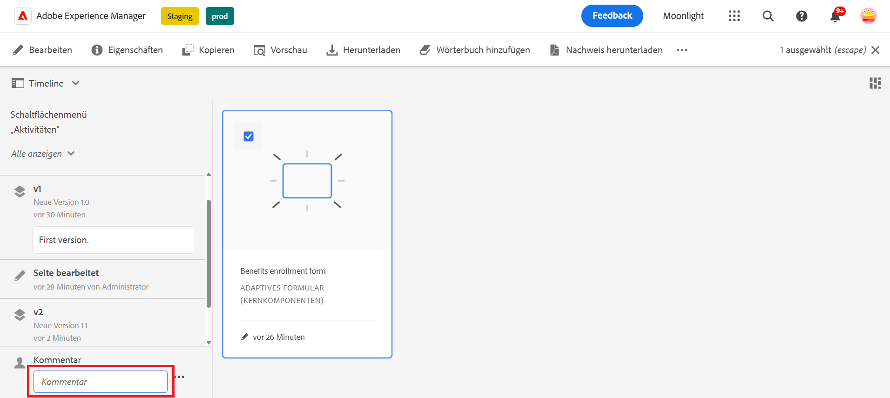
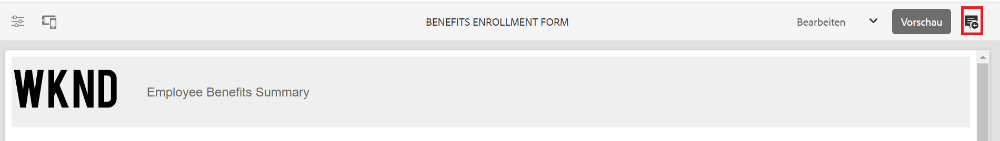
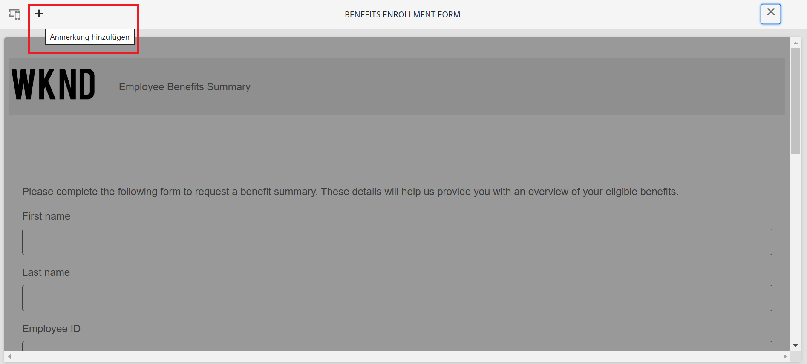
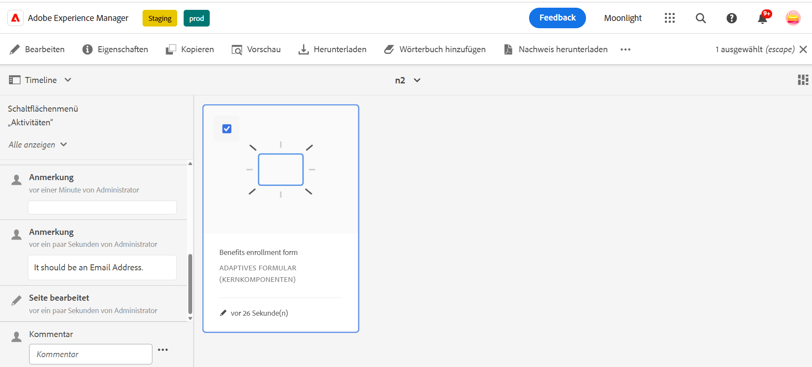

# Versionieren, Überprüfen und Kommentieren eines adaptiven Formulars

Diese Funktion ist standardmäßig nicht aktiviert. Sie können von Ihrer offiziellen Adresse aus an aem-forms-ea@adobe.com schreiben, um Zugriff auf die Funktion zu beantragen.

Mit Kernkomponenten für adaptive Formulare können Formularautorinnen und -autoren Versionierungen, Kommentare und Anmerkungen zu Formularen hinzufügen. Diese Funktionen vereinfachen die Formularentwicklung, indem sie es Benutzenden ermöglichen, mehrere Versionen zu erstellen und zu verwalten, Kommentare zu erstellen und Notizen zu bestimmten Formularabschnitten hinzuzufügen, wodurch die Formularerstellung verbessert wird.

## Voraussetzung {#prerequisite-versioning}

Um Versionierungs-, Kommentar- und Anmerkungsfunktionen in einem adaptiven Formular zu verwenden, stellen Sie sicher, dass [Kernkomponenten für adaptive Formulare](/help/forms/using/enable-adaptive-forms-core-components.md) in Ihrer AEM Forms-Umgebung aktiviert ist.

## Versionierung adaptiver Formulare {#adaptive-form-versioning}

Durch die Versionierung adaptiver Formulare können Versionen zu einem Formular hinzugefügt werden. Formularautoren und -autorinnen können einfach mehrere Versionen eines Formulars erstellen und schließlich die Version verwenden, die für die jeweiligen Geschäftsziele geeignet ist. Darüber hinaus haben Formularbenutzende die Möglichkeit, das Formular auf vorherige Versionen zurückzusetzen. Außerdem können Autorinnen und Autoren zwei Versionen eines Formulars vergleichen, indem sie sie in einer Vorschau anzeigen und so im Kontext der Benutzeroberfläche besser analysieren können. Im Folgenden werden die einzelnen Funktionen für die Versionierung adaptiver Formulare genauer beschrieben:

### Erstellen einer Formularversion {#create-a-form-version}

Gehen Sie wie folgt vor, um eine Formularversion zu erstellen:

1. Navigieren Sie in Ihrer AEM Forms-Umgebung zu **[!UICONTROL Formular]**>>**[!UICONTROL Formulare und Dokumente]** und wählen Sie Ihr **Formular** aus.
1. Wählen Sie im linken Bedienfeld in der Auswahl-Dropdown-Liste die Option **[!UICONTROL Versionen]** aus.
   
1. Klicken Sie im unteren Bedienfeld auf der linken Seite auf die Punkte **drei Punkte** und klicken Sie auf **[!UICONTROL Als Version speichern]**.
1. Geben Sie nun ein Label für die Formularversion an. Sie können außerdem durch einen Kommentar Informationen zum Formular angeben.
   

### Aktualisieren einer Formularversion {#update-a-form-version}

Indem Sie das Formular bearbeiten und aktualisieren, fügen Sie dem Formular eine neue Version hinzu. Führen Sie die im letzten Abschnitt beschriebenen Schritte aus, um eine neue Version des Formulars zu benennen, wie in der folgenden Abbildung dargestellt:

### Wiederherstellen einer Formularversion {#revert-a-form-version}

Um eine Formularversion wieder auf die vorherige Version zurückzusetzen, wählen Sie eine Formularversion aus und klicken Sie auf **[!UICONTROL Auf diese Version zurück]**.

### Vergleichen von Formularversionen {#compare-form-versions}

Formularautorinnen und -autoren können zwei verschiedene Versionen eines Formulars zu Vorschauzwecken vergleichen. Um Versionen zu vergleichen, wählen Sie eine beliebige Formularversion aus und klicken Sie auf **[!UICONTROL Mit aktueller Version vergleichen]**. Es werden zwei verschiedene Formularversionen im Vorschaumodus angezeigt.

## Hinzufügen von Kommentaren {#add-comments}

Bei einer Überprüfung handelt es sich um einen Mechanismus, mit dem ein oder mehrere Überprüfungspersonen zu Formularen Kommentare abgeben können. Alle Formularbenutzenden können ein Formular kommentieren oder anhand von Kommentaren einer Überprüfung unterziehen. Um ein Formular zu kommentieren, wählen Sie ein **[!UICONTROL Formular]** aus und fügen Sie dem Formular einen **[!UICONTROL Kommentar]** hinzu.

>[!NOTE]
> Wenn Sie, wie oben beschrieben, Kommentare in Kernkomponenten adaptiver Formulare verwenden, ist die Formularfunktion zum [Hinzufügen von Prüferinnen und Prüfern zu Formularen](/help/forms/using/create-reviews-forms.md) deaktiviert.

## Hinzufügen von Anmerkungen {#adaptive-form-annotations}

In vielen Fällen müssen Benutzende von Formulargruppen Anmerkungen zu einem Formular hinzufügen, um dieses zu überprüfen, z. B. auf einer bestimmten Registerkarte eines Formulars oder für Komponenten eines Formulars. In solchen Situationen können Autorinnen und Autoren Anmerkungen verwenden.
Um Anmerkungen zu einem Formular hinzuzufügen, führen Sie die folgenden Schritte aus:

1. Öffnen Sie ein Formular im **[!UICONTROL Bearbeitungsmodus]**.

1. Klicken Sie auf das Symbol **Hinzufügen** in der oberen rechten Leiste, wie in der folgenden Abbildung dargestellt.
   

1. Klicken Sie auf das Symbol **Hinzufügen** in der oberen linken Leiste, wie in der folgenden Abbildung dargestellt, um die Anmerkung hinzuzufügen.
   

1. Nun können Sie Formularkomponenten Kommentare hinzufügen oder diese mit mehrfarbigen Skizzen versehen.

1. Um alle Anmerkungen anzuzeigen, die Sie einem Formular hinzugefügt haben, wählen Sie das Formular aus. Daraufhin sind die Anmerkungen zu sehen, die im linken Bereich hinzugefügt wurden, wie in der folgenden Abbildung dargestellt.

   

## Siehe auch

* [Vergleichen von Kernkomponenten für adaptive Formulare](/help/forms/using/compare-forms-core-components.md)
