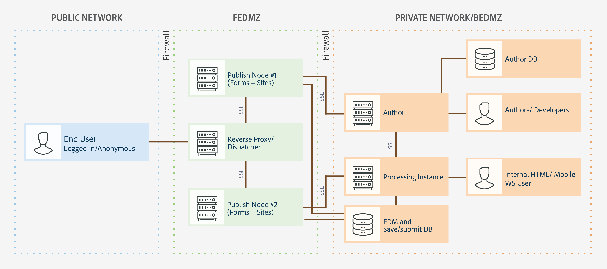

# Architektur und Bereitstellungstopologien für AEM Forms {#architecture-and-deployment-topologies-for-aem-forms}

| Version | Artikel-Link |
| -------- | ---------------------------- |
| AEM as a Cloud Service | [Hier klicken](https://experienceleague.adobe.com/docs/experience-manager-cloud-service/content/forms/forms-overview/aem-forms-cloud-service-architecture.html?lang=de) |
| AEM 6.5 | Dieser Artikel |

## Architektur {#architecture}

AEM Forms ist eine Anwendung, die in AEM als AEM bereitgestellt wird. Das Paket wird als AEM Forms Add-On-Paket bezeichnet. AEM Forms-Pakete enthalten sowohl Services (API-Anbieter), die im AEM OSGI-Container bereitgestellt werden, als auch Servlets (die Frontend- und REST-API-Funktion bereitstellen), die über das AEM Sling-Framework verwaltet werden. Das folgende Diagramm zeigt diese Einrichtung:

Die Architektur für AEM Forms beinhaltet die folgenden Komponenten:

* **Kern-AEM-Dienste:** Grundlegende Dienste, die von AEM für eine bereitgestellte Anwendung verfügbar gemacht werden. Zu den Services gehören ein JCR-kompatibles Inhalts-Repository, ein OSGi-Service-Container, eine Workflow-Engine, ein Trust Store, ein Key Store usw. Diese Services sind für die AEM Forms-Anwendung verfügbar, werden aber nicht von AEM Forms-Paketen bereitgestellt. Die Services sind ein integraler Bestandteil des gesamten AEM-Stapels und verschiedene AEM Forms-Komponenten verwenden diese Services.
* **Formular-Services:** Stellen formularbezogene Funktionen bereit, z. B. das Erstellen, Zusammenführen, Verteilen und Archivieren von PDF-Dokumenten, das Hinzufügen digitaler Signaturen zum Beschränken des Zugriffs auf Dokumente und das Dekodieren von Barcode-Formularen. Viele dieser Services sind öffentlich für die Nutzung durch benutzerdefinierten Code verfügbar, der in AEM bereitgestellt wird.
* **Weblayer:** JSPs oder Servlets, die auf allgemeine Services oder Formular-Services aufgesetzt wurden und folgende Funktionalität bieten:

   * **Authoring-Frontend**: Eine Benutzeroberfläche zum Erstellen und Verwalten von Formularen.
   * **Formularwiedergabe und -übermittlungs-Frontend**: Eine Benutzeroberfläche für Endbenutzende von AEM Forms (z. B. Bürgerinnen und Bürger, die auf eine Behördenseite zugreifen). Dadurch werden Formularwiedergabe (Formular in einem Webbrowser anzeigen) und Sendefunktionen bereitgestellt.
   * **REST APIs**: JSPs und Servlets exportieren einen Teil der Formula-Services zur Nutzung durch HTTP-basierte Clients wie das SDK für mobile Formulare.

**AEM Forms on OSGi:** Bei einer AEM Forms on OSGi-Umgebung handelt es sich um ein standardmäßiges AEM-Autor- oder AEM-Veröffentlichungspaket, auf dem das AEM Forms-Paket bereitgestellt ist. Sie können AEM Forms on OSGi in [Einzel-Server-Umgebungen, Farm- und Cluster-Setups ausführen](/help/sites-deploying/recommended-deploys.md). Die Cluster-Setup ist nur für AEM Autoreninstanzen verfügbar. 

<!--

**AEM Forms on JEE:** AEM Forms on JEE is AEM Forms server running on JEE stack. It has AEM Author with AEM Forms add-on packages and additional AEM Forms JEE capabilities co-deployed on a single JEE stack running on an application server. You can run AEM Forms on JEE in single-server and clustered setups. AEM Forms on JEE is required only to run document security, process management, and for LiveCycle customers upgrading to AEM Forms. Here are a few additional scenarios to use AEM Forms on JEE:

* **HTML workspace support (for customers using HTML workspace):** AEM Forms on JEE enables single sign-on with Processing instances, serves certain assets rendered on Processing instances, and handles submission of forms rendered within the HTML workspace.
* **Advanced additional form/interactive communication data processing**: AEM Forms on JEE can be utilized for additionally processing form/interactive communication data (and saving the results to a suitable data store) in complex use-cases where advanced process-management capabilities are required.

AEM Forms on JEE also includes provides following supporting services to the AEM components:

* **Integrated user management:** Allows users of AEM Forms on JEE to be recognized as AEM forms on OSGi users and helps enable SSO for both OSGi and JEE users. This is required for scenarios where single sign-on between AEM forms on OSGi and AEM Forms on JEE is required (for example, HTML workspace).
* **Asset hosting:** AEM Forms on JEE can serve assets (for example, HTML5 forms) rendered on AEM Forms on OSGi.

-->

Von der AEM Forms-Authoring-Benutzeroberfläche wird das Erstellen von Datensatzdokumenten (DOR), PDF-Formularen und HTML5-Formularen nicht unterstützt. Solche Assets werden mit der eigenständigen Forms Designer-Anwendung entworfen und einzeln in AEM Forms Manager hochgeladen. <!--Alternatively, for AEM Forms on JEE, forms can be designed as application (in AEM Forms Workbench) assets and deployed into AEM Forms on JEE server.-->

AEM Forms unter OSGi <!--and AEM Forms on JEE both--> über Workflow-Funktionen verfügen. Sie können grundlegende Workflows für verschiedene Aufgaben in AEM Forms on OSGi schnell erstellen und bereitstellen.<!--, without having to install the full-fledged Process Management capability of AEM Forms on JEE. There is some difference in the [features of Form-centric workflow on AEM Forms on OSGi and Process Management capability of AEM Forms on JEE](capabilities-osgi-jee-workflows.md). The development and management of Form-centric workflows on AEM Forms on OSGi uses the familiar AEM Workflow and AEM Inbox capabilities.-->

## Begriffe {#terminologies}

Das folgende Bild zeigt verschiedene AEM Forms-Server-Konfigurationen und ihre Komponenten, die in einer typischen AEM Forms-Bereitstellung verwendet werden: 

**Autor:** Eine Autoreninstanz ist ein AEM Forms-Server, der im Standardmodus „Autor“ ausgeführt wird. <!--It can be AEM Forms on JEE or AEM Forms on OSGi environment.--> Es richtet sich an interne Benutzer, Designer von Formularen und interaktiver Kommunikation sowie Entwickler. Ermöglicht werden folgende Funktionen:

* **Erstellen und Verwalten von Formularen und interaktiver Kommunikation:** Designer und Entwickler können adaptive Formulare und interaktive Kommunikation erstellen und bearbeiten, extern erstellte Formulare anderer Art, z. B. in Adobe Forms Designer erstellte Formulare, hochladen und diese Elemente mithilfe der Forms Manager-Konsole verwalten.
* **Veröffentlichen von Formularen und interaktiven Kommunikationen:** In einer Autoreninstanz gehostete Assets können in einer Veröffentlichungsinstanz veröffentlicht werden, um Laufzeitvorgänge durchzuführen. Die Veröffentlichung von Assets verwendet die Replikationsfunktionen von AEM. Adobe empfiehlt, in jeder Autoreninstanz einen Replikationsagenten für die manuelle Übertragung von veröffentlichten Formularen an die Verarbeitungsinstanzen und in jeder Verarbeitungsinstanz einen Replikationsagenten mit aktiviertem Auslöser *Bei Empfang* zu konfigurieren, damit die empfangenen Formulare automatisch zur Veröffentlichung repliziert werden.

**Veröffentlichen:** Eine Veröffentlichungsinstanz ist ein AEM Forms-Server, der im Standardmodus „Veröffentlichen“ ausgeführt wird. Veröffentlichungsinstanzen sind für Endbenutzer formularbasierter Anwendungen vorgesehen, z. B. Benutzer, die auf eine öffentliche Website zugreifen und Formulare senden. Ermöglicht werden folgende Funktionen:

* Rendern und Senden von Formularen für Endbenutzende.
* Transport unbearbeiteter gesendeter Formulardaten zur weiteren Verarbeitung an Verarbeitungsinstanzen und zum Speichern im endgültigen Aufzeichnungssystem. Die Standardimplementierung in AEM Forms erreicht dies mit den von AEM bereitgestellten Funktionen zur Rückwärtsreplikation. Eine alternative Implementierung ist auch für das direkte Weiterleiten der Formulardaten an Verarbeitungs-Server verfügbar, anstatt sie zuerst lokal zu speichern (letzteres ist eine Voraussetzung für die Aktivierung der Rückwärtsreplikation). Kunden, die Bedenken bei der Speicherung potenziell vertraulicher Daten auf Veröffentlichungsinstanzen haben, können diese [alternative Implementierung](/help/forms/using/configuring-draft-submission-storage.md) wählen, da die Verarbeitung üblicherweise in einer sichereren Zone erfolgt.
* Rendern und Übermitteln von interaktiven Kommunikationen und Briefen: Eine interaktive Kommunikation und Briefe werden auf Veröffentlichungsinstanzen gerendert und die entsprechenden Daten werden zur Speicherung und Nachbearbeitung an Verarbeitungsinstanzen übermittelt. Die Daten können entweder lokal in einer Veröffentlichungsinstanz gespeichert und später an eine Verarbeitungsinstanz rückrepliziert (Standardoption) oder ohne Speicherung auf der Veröffentlichungsinstanz direkt an die Verarbeitungsinstanz gesendet werden. Letztere Implementierung ist für sicherheitsbewusste Kunden nützlich.

**Verarbeitung:** Eine Instanz von AEM Forms, die im Autorenmodus ausgeführt wird, wobei kein Benutzer der Gruppe „forms-manager“ zugewiesen ist. Sie können <!--AEM Forms on JEE or--> AEM Forms unter OSGi als Verarbeitungsinstanz bereitstellen. Die Benutzer werden nicht zugewiesen, um sicherzustellen, dass Formularerstellungs- und -verwaltungsaktivitäten nicht in der Verarbeitungsinstanz ausgeführt werden, sondern nur in der Autoreninstanz stattfinden. Eine Verarbeitungsinstanz ermöglicht die folgenden Funktionen:

* **Die Verarbeitung von Formularrohdaten aus der Veröffentlichungsinstanz:** Dies wird hauptsächlich auf der Verarbeitungsinstanz über AEM-Workflows erreicht, die ausgelöst werden, wenn die Daten eingehen. Die Workflows können den standardmäßig bereitgestellten Schritt „Formulardatenmodell“ verwenden, um die Daten oder Dokumente in einem geeigneten Datenspeicher zu archivieren.
* **Sicheres Speichern der Formulardaten**: Die Verarbeitung bietet ein hinter der Firewall befindliches Repository für Formularrohdaten, auf das die Benutzer keinen Zugriff haben. Weder Formular-Designer in der Autoreninstanz noch Endbenutzer in der Veröffentlichungsinstanz können auf dieses Repository zugreifen.

  >[!NOTE]
  >
  >Es wird empfohlen, anstelle des AEM-Repositorys einen Datenspeicher von Drittanbietern zum Speichern abgeschlossener verarbeiteter Daten zu verwenden.

* **Speicherung und Nachbearbeitung von Korrespondenzdaten aus einer Veröffentlichungsinstanz:** AEM-Workflows führen die optionale Nachbearbeitung der entsprechenden Briefdefinitionen durch. Diese Workflows können die endgültigen verarbeiteten Daten in geeigneten externen Datenspeichern speichern. 

* **HTML Workspace-Hosting**: Eine Verarbeitungsinstanz hostet das Frontend für HTML Workspace. HTML Workspace bietet die Benutzeroberfläche für die zugehörige Aufgaben-/Gruppenzuweisung für Prüfungs- und Genehmigungsprozesse.

Eine Verarbeitungsinstanz wurde aus folgenden Gründen für die Ausführung im Autorenmodus konfiguriert:

* Dies ermöglicht die Rückwärtsreplikation von Formularrohdaten aus der Veröffentlichungsinstanz. Der standardmäßige Datenspeicher-Handler benötigt die Rückwärtsreplikationsfunktion.
* Es wird empfohlen, dass AEM-Workflows (die Hauptmethode zur Verarbeitung von Formularrohdaten aus der Veröffentlichungsinstanz) auf einem Autorensystem ausgeführt werden.

<!--

## Sample physical topologies for AEM Forms on JEE {#sample-physical-topologies-for-aem-forms-on-jee}

The AEM Forms on JEE topologies recommended below are mainly for customers upgrading from LiveCycle or a previous version of AEM Forms on JEE. Adobe recommends using AEM Forms on OSGi for fresh installations. A fresh installation of AEM Forms on JEE only recommended for using Document Security and Process Management capabilities.

### Topology for using document services or document security capabilities {#topology-for-using-document-services-or-document-security-capabilities}

AEM Forms customers planning to use only document services or document security capabilities can have a topology similar to the one displayed below. This topology recommends using a single instance of AEM Forms. You can also create a cluster or farm of AEM Forms servers, if necessary. This topology is recommended when most users programmatically access capabilities of AEM Forms server and intervention through the user interface is minimum. The topology is helpful in batch processing operations of document services. For example, using output service to create hundreds of non-editable PDF documents on daily basis.

Although, AEM Forms lets you set up and run all the functionalities from a single server, yet, you should do capacity planning, load balancing, and set up dedicated servers for specific capabilities in a production environment. For example, for an environment using the PDF Generator service to convert thousands of pages a day and add digital signatures to limit access to documents, set up separate AEM Forms servers for the PDF Generator service and digital signature capabilities. It helps provide optimum performance and scale the servers independent of each other.

### Topology for using AEM Forms process management {#topology-for-using-aem-forms-process-management}

AEM Forms customers planning to use AEM Forms process management features, for example, HTML Workspace can have a topology similar to the one displayed below. The AEM Forms on JEE server can be in a single server or cluster configuration.

If you are upgrading from LiveCycle ES4, this topology closely mirrors with what you already have in LiveCycle except for the addition of AEM Author built-in to AEM Forms on JEE. Moreover, there is no change in the clustering requirements for customers performing an upgrade. If you were using AEM Forms in a clustered environment, you can continue with same in AEM 6.5 Forms. For a fresh installation of AEM Forms of JEE for using HTML Workspace, running AEM author instance built-in to the JEE environment is an additional requirement.

Form data store is a third-party data store used for storing final processed data of forms and interactive communications. This is an optional element in the topology. You can also choose to set up a processing instance and use its repository as the final system-of-record system, if necessary.

The topology is recommended to the customers planning to use AEM Forms on JEE server for process management capabilities (HTML Workspace) without using any post-processing, adaptive forms, HTML5 forms, and interactive communication capabilities.

### Topology for using adaptive forms, HTML5 forms, interactive communication capabilities {#topology-for-using-adaptive-forms-html-forms-interactive-communication-capabilities}

AEM Forms customers planning to use AEM Forms data capture capabilities, for example, adaptive forms, HTML5 Forms, PDF Forms, can have a topology similar to the one displayed below. This topology is also recommended for using interactive communication capabilities of AEM Forms.

You can make the following changes/customizations to the above-suggested topology:

* Using HTML Workspace and AEM Forms app requires an AEM author or processing instance. You can use the AEM author instance built-in to AEM Forms on JEE server instead of setting up an additional external AEM author server.
* An AEM Author or Processing instance is required only for Forms-centric workflows on OSGi, adaptive forms, forms portal, and interactive communication.
* interactive communication Agent UI is generally run within the organization. So, you can keep a publish server for Agent UI within the private network.
* AEM forms on OSGi instance built-in to AEM Forms on JEE server can also run Forms-centric workflows on OSGi and Watched Folders.

-->

## Beispiele für physikalische Topologien für die Verwendung von AEM Forms on OSGi {#sample-physical-topologies-for-using-aem-forms-on-osgi}

### Topologie für die Datenerfassung, interaktive Kommunikation, formularzentrierten Workflow on OSGi-Fähigkeiten {#topology-for-data-capture-interactive-communication-form-centric-workflow-on-osgi-capabilities}

AEM Forms-Kunden, die AEM Forms-Datenerfassungsfunktionen verwenden möchten, z. B. adaptive Formulare, HTML5-Formulare, PDF-Formulare, können eine ähnliche Topologie nutzen wie die unten abgebildete. Diese Topologie wird auch für die Verwendung interaktiver Kommunikation und formularzentrierte Workflows für OSGi empfohlen, z. B. für die Verwendung von AEM Inbox und AEM Forms Programm für Geschäftsprozess-Workflows.

### Topologie für die Verwendung von Funktionen für überwachte Ordner für die Offline-Stapelverarbeitung {#topology-for-using-watched-folder-capabilities-for-offline-batch-processing}

AEM Forms-Kundinnen und -Kunden, die überwachte Ordner für die Stapelverarbeitung verwenden möchten, können eine ähnliche Topologie wie die unten gezeigte nutzen. Die Topologie zeigt eine Cluster-Umgebung. Sie entscheiden sich jedoch je nach Auslastung, ob Sie eine einzelne Instanz oder eine Farm von AEM Forms Server verwenden. Die Drittanbieter-Datenquelle ist Ihr eigenes Aufzeichnungssystem. Sie fungiert als Eingabequelle für überwachte Ordner. Die Topologie zeigt auch die Ausgabe in Form einer gedruckten Datei an. Sie können den Ausgabeinhalt auch in einem Dateisystem speichern, per E-Mail senden und andere benutzerdefinierte Methoden verwenden, um die Ausgabe zu nutzen.

### Topologie für die Verwendung von Dokumentendienst-Funktionen für die API-basierte Offline-Verarbeitung {#topology-for-using-document-services-capabilities-for-offline-api-based-processing}

AEM Forms-Kundinnen und -Kunden, die nur Dokumentendienst-Funktionen verwenden möchten, können eine ähnliche Topologie wie die unten angezeigte nutzen. Für diese Topologie empfiehlt sich die Verwendung eines Clusters von AEM Forms auf OSGi-Servern. Diese Topologie wird empfohlen, wenn die meisten Benutzenden programmgesteuert (über APIs) auf die Funktionen des AEM Forms-Servers zugreifen und das Eingreifen über die Benutzeroberfläche nur minimal ist. Die Topologie ist in vielen Software-Client-Szenarien sehr hilfreich. Beispiel: Mehrere Clients, die PDF Generator-Service verwenden, um PDF-Dokumente bei Bedarf zu erstellen.

Auch wenn Sie mit AEM Forms alle Funktionen von einem einzigen Server aus einrichten und ausführen können, sollten Sie eine Kapazitätsplanung und einen Lastausgleich vornehmen und dedizierte Server für bestimmte Funktionen in einer Produktionsumgebung einrichten. Wenn Sie beispielsweise den PDF-Generator-Dienst für die Konvertierung von Tausenden von Seiten pro Tag und mehrere adaptive Formulare für die Datenerfassung verwenden, richten Sie separate AEM Forms-Server für den PDF Generator-Dienst und die adaptiven Formularfunktionen ein. Dies erleichtert es, eine optimale Leistung zu erzielen und die Server unabhängig voneinander zu skalieren.

