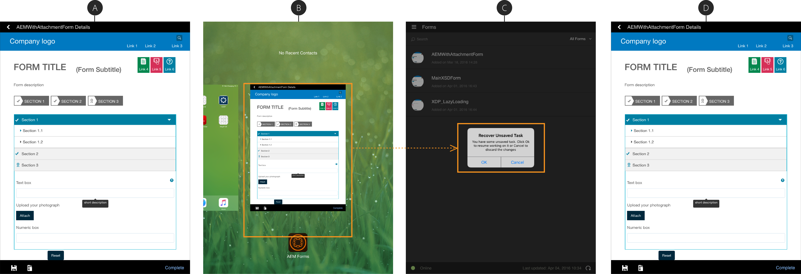

# Verwenden der automatischen Speicherung in der AEM Forms-App{#using-autosave-in-aem-forms-app}

Wenn Sie Daten in die Adobe Experience Manager Forms-App eingeben, speichert die Funktion sie automatisch in regelmäßigen Abständen. Die automatische Speicherung in der AEM Forms-App hilft Ihnen, Datenverlust zu vermeiden, wenn die App versehentlich geschlossen wird.

Ihre App kann versehentlich geschlossen werden:

* Wenn sich Ihr Gerät aufgrund eines niedrigen Akkustands ausschaltet.
* Wenn der Benutzer die App abbricht
* Wenn es zu einem unerwarteten Absturz kommt.

Sie können die Intervalle angeben, in denen die App die eingegebenen Daten speichert.

>[!NOTE]
>
>Wählen Sie den Wert sorgfältig aus. Eine häufige automatische Speicherung kann spürbare Auswirkungen auf die Leistung Ihres Geräts haben.

Führen Sie die folgenden Schritte aus, um die automatische Speicherung in der AEM Forms-App zu verwenden:

1. Melden Sie sich bei der App an und navigieren Sie zu **Einstellungen > Allgemein**.
1. Verwenden Sie im Bildschirm „General“ die Option **Autosave Frequency**, um die Intervalle auszuwählen, in denen das Programm die eingegebenen Daten speichern soll.
   

1. Wenn Sie die App neu starten und sich als derselbe Benutzer anmelden, werden Sie aufgefordert, Ihre Aufgabe mit dem Dialogfeld „Nicht gespeicherte Aufgabe wiederherstellen“ wiederherzustellen. Klicken Sie in diesem Dialogfeld auf **OK**, um die Arbeit an der gespeicherten Aufgabe fortzusetzen. Klicken Sie auf **Abbrechen**, um die gespeicherten Daten entsprechend der zuletzt ausgelösten automatischen Speicherung zu löschen und an einer neuen Aufgabe zu arbeiten.

   Wenn Sie auf **OK** klicken, wird die Aufgabe mit den Daten entsprechend der zuletzt ausgelösten automatischen Speicherung vor Absturz der App wiederhergestellt. Sie enthält die Formulardaten und alle Anlagen, die mit der Aufgabe verbunden sind.
   **A.** Ein Formular für laufende Arbeiten **B.** Schließen der App wurde erzwungen **C.** App wurde mit dem Dialogfeld „Nicht gespeicherte Aufgabe wiederherstellen“ erneut gestartet **D.** Formular wurde mit Originaldaten wiederhergestellt
