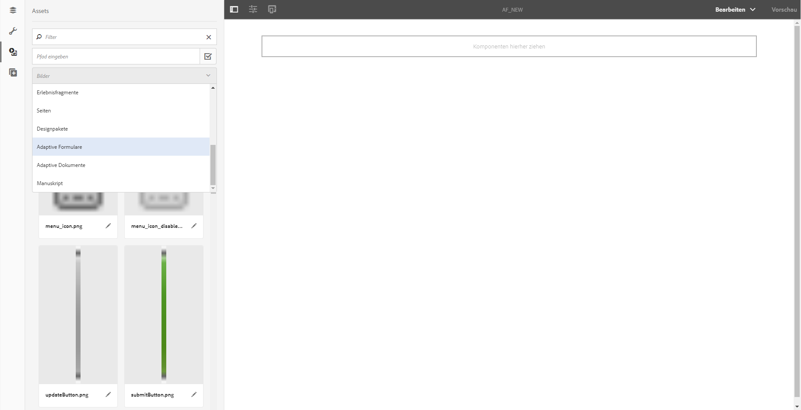
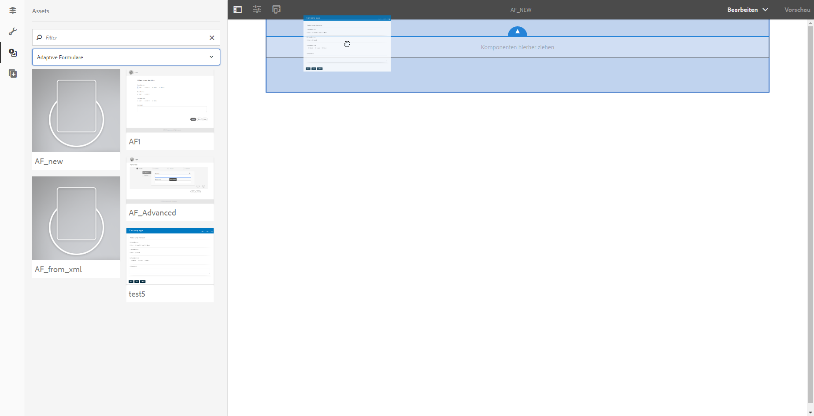

# Erstellen eines adaptiven Formulars mit einem Satz adaptiver Formulare{#create-an-adaptive-form-using-a-set-of-adaptive-forms}

<span class="preview"> Adobe empfiehlt, die modernen und erweiterbaren [Kernkomponenten](https://experienceleague.adobe.com/docs/experience-manager-core-components/using/adaptive-forms/introduction.html?lang=de) zur Datenerfassung zu verwenden, um [neue adaptive Formulare zu erstellen](/help/forms/using/create-an-adaptive-form-core-components.md) oder [adaptive Formulare zu AEM Sites-Seiten hinzuzufügen](/help/forms/using/create-or-add-an-adaptive-form-to-aem-sites-page.md). Diese Komponenten stellen einen bedeutenden Fortschritt bei der Erstellung adaptiver Formulare dar und sorgen für beeindruckende Anwendererlebnisse. In diesem Artikel wird der ältere Ansatz zum Erstellen adaptiver Formulare mithilfe von Foundation-Komponenten beschrieben. </span>

## Überblick {#overview}

In einem Workflow wie etwa einem Antrag zum Eröffnen eines Bankkontos müssen Benutzende mehrere Formulare ausfüllen. Anstatt sie zu bitten, eine Reihe von Formularen auszufüllen, können Sie die Formulare zusammenfassen und ein großes (übergeordnetes) Formular erstellen. Wenn Sie ein adaptives Formular zu dem größeren Formular hinzufügen, wird es als Panel (untergeordnetes Formular) hinzugefügt. Sie fügen eine Reihe untergeordneter Formulare hinzu, um ein übergeordnetes Formular zu erstellen. Sie können Panels je nach Benutzereingabe ein- oder ausblenden. Schaltflächen im übergeordneten Formular, z. B. „Absenden“ und „Zurücksetzen“, setzen die Schaltflächen im untergeordneten Formular außer Kraft. Um ein adaptives Formular im übergeordneten Formular hinzuzufügen, können Sie das adaptive Formular per Drag-and-Drop aus dem Asset-Browser ziehen (so wie adaptive Formularfragmente).

Die verfügbaren Funktionen lauten:

* Unabhängige Inhaltserstellung
* Einblenden/Ausblenden geeigneter Formulare
* Lazy Loading (langsames Laden)

Funktionen wie die unabhängige Inhaltserstellung und verzögertes Laden bieten im Vergleich zur Verwendung einzelner Komponenten, um übergeordnete Formulare zu erstellen, eine bessere Leistung.

>[!NOTE]
>
>Sie können XFA-basierte adaptive Formulare/Fragmente nicht als untergeordnete oder übergeordnete Formulare verwenden.

## Hinter den Kulissen {#behind-the-scenes}

Sie können XSD-basierte adaptive Formulare und Fragmente im übergeordneten Formular hinzufügen. Die Struktur des übergeordneten Formulars entspricht der eines [beliebigen adaptiven Formulars](../../forms/using/prepopulate-adaptive-form-fields.md). Wenn Sie ein adaptives Formular als untergeordnetes Formular hinzufügen, wird es in Form eines Bedienfelds im übergeordneten Formular hinzugefügt. Daten eines gebundenen untergeordneten Formulars werden unter dem `data`Stamm des `afBoundData` Abschnitts des XML-Schemas des übergeordneten Formulars gespeichert.

Ihre Kundinnen und Kunden füllen zum Beispiel ein Antragsformular aus. Die ersten beiden Felder des Formulars sind „Name“ und „Identität“. Der XML-Code lautet:

```xml
<afData>
    <afUnboundData>
        <data />
    </afUnboundData>
    <afBoundData>
        <data xmlns:xfa="https://www.xfa.org/schema/xfa-data/1.0/">
            <applicantName>Sarah Rose</applicantName>
            <applicantId>1234</applicantId>
        </data>
    </afBoundData>
</afData>
```

Sie können ein anderes Formular im Antrag hinzufügen, sodass Ihre Kundinnen und Kunden ihre Geschäftsadresse eintragen können. Der Schemastamm des Formulars des untergeordneten Elements ist `officeAddress`. Übernehmen `bindref` `/application/officeAddress` oder `/officeAddress`. Wenn `bindref` nicht angegeben wird, wird das Formular des untergeordneten Elements als Unterstruktur von `officeAddress` hinzugefügt. So sehen Sie die „XML“ im unten stehenden Formular:

```xml
<afData>
    <afUnboundData>
        <data />
    </afUnboundData>
    <afBoundData>
        <data xmlns:xfa="https://www.xfa.org/schema/xfa-data/1.0/">
            <applicantName>Sarah Rose</applicantName>
            <applicantId>1234</applicantId>
            <officeAddress>
                <addressLine>1, Geometrixx City</addressLine>
                <zip>11111</zip>
            </officeAddress>
        </data>
    </afBoundData>
</afData>
```

Wenn Sie ein anderes Formular einfügen, über das Ihre Kunden eine Hausadresse angeben können, wenden Sie `bindref` `/application/houseAddress or /houseAddress.` an. Das XML sieht wie folgt aus:

```xml
<afData>
    <afUnboundData>
        <data />
    </afUnboundData>
    <afBoundData>
        <data xmlns:xfa="https://www.xfa.org/schema/xfa-data/1.0/">
            <applicantName>Sarah Rose</applicantName>
            <applicantId>1234</applicantId>
            <officeAddress>
                <addressLine>1, Geometrixx City</addressLine>
                <zip>11111</zip>
            </officeAddress>
            <houseAddress>
                <addressLine>2, Geometrixx City</addressLine>
                <zip>11111</zip>
            </houseAddress>
        </data>
    </afBoundData>
</afData>
```

Wenn Sie denselben Unterstammnamen wie den Schemastamm beibehalten möchten (in diesem Beispiel `Address`), verwenden Sie indizierte Bindrefs.

Sie können zum Beispiel Bindrefs wie `/application/address[1]` oder `/address[1]` und `/application/address[2]` oder `/address[2]` anwenden. Das XML des Formulars lautet:

```xml
<afData>
    <afUnboundData>
        <data />
    </afUnboundData>
    <afBoundData>
        <data xmlns:xfa="https://www.xfa.org/schema/xfa-data/1.0/">
            <applicantName>Sarah Rose</applicantName>
            <applicantId>1234</applicantId>
            <address>
                <addressLine>1, Geometrixx City</addressLine>
                <zip>11111</zip>
            </address>
            <address>
                <addressLine>2, Geometrixx City</addressLine>
                <zip>11111</zip>
            </address>
        </data>
    </afBoundData>
</afData>
```

Sie können die Standardunterstruktur des adaptiven Formulars/Fragments mithilfe der Eigenschaft `bindRef` ändern. Mit der Eigenschaft `bindRef` können Sie den Pfad, der auf einen Ordner in der Ordnerstruktur des XML-Schemas zeigt, angeben.

Wenn das untergeordnete Formular ungebunden ist, werden seine Daten unter dem `data` Stamm des `afUnboundData` Abschnitts des XML-Schemas des übergeordneten Formulars gespeichert.

Sie können ein adaptives Formular mehrmals als untergeordnetes Formular hinzufügen. Stellen Sie sicher, dass das `bindRef` ordnungsgemäß geändert wird, sodass jede verwendete Instanz des adaptiven Formulars auf einen anderen untergeordneten Stamm des Datenstamms zeigt.

>[!NOTE]
>
>Wenn andere Formulare/Fragmente demselben untergeordneten Stamm zugeordnet sind, werden die Daten überschrieben.

## Hinzufügen eines adaptiven Formulars als untergeordnetes Formular mit dem Asset-Browser {#adding-an-adaptive-form-as-a-child-form-using-asset-browser}

Führen Sie die folgenden Schritte aus, um mit dem Asset-Browser ein adaptives Formular als untergeordnetes Formular hinzuzufügen.

1. Öffnen Sie das adaptive Formular im Bearbeitungsmodus.
1. Klicken Sie in der Seitenleiste auf **Assets** . Wählen Sie **Adaptives Formular** aus der Dropdown-Liste.
   [](assets/asset-1.png)

1. Ziehen Sie das adaptive Formular, das Sie als untergeordnetes Formular hinzufügen möchten, per Drag-and-Drop.
   [](assets/drag-drop-1.png)Das adaptive Formular, das Sie ablegen, wird als untergeordnetes Formular hinzugefügt.
