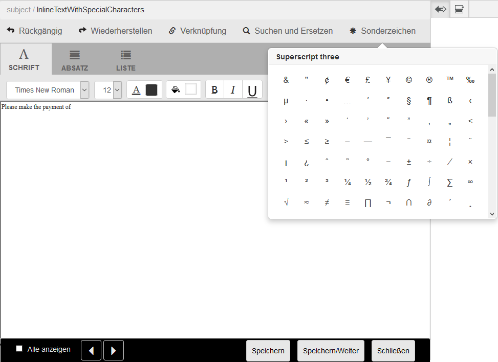

# Benutzerdefinierte Sonderzeichen in Correspondence Management{#custom-special-characters-in-correspondence-management}

## Übersicht {#overview}

Correspondence Management umfasst eine integrierte Standardunterstützung für 210 Sonderzeichen, die Sie mühelos in Briefen einfügen können.

Sie können beispielsweise die folgenden Sonderzeichen einfügen:

* Währungssymbole wie €,￥ und £
* Mathematische Symbole wie ∑, √, ∂ und ^
* Interpunktionssymbole wie „ und “

Sie können Sonderzeichen in Briefe einfügen:

* Im [Texteditor](/help/forms/using/document-fragments.md#createtext)
* In einem [editierbaren Inline-Modul in einer Korrespondenz](../../forms/using/create-correspondence.md#managecontent)

Der Administrator kann Unterstützung für mehr/benutzerdefinierte Sonderzeichen durch Anpassung hinzufügen. In diesem Artikel finden Sie Anweisungen dazu, wie Sie Unterstützung für zusätzliche benutzerdefinierte Sonderzeichen hinzufügen können.

## Hinzufügen oder Ändern von Unterstützung für benutzerdefinierte Sonderzeichen in Correspondence Management {#creatingfolderstructure}

Führen Sie die folgenden Schritte aus, um Unterstützung für benutzerdefinierte Sonderzeichen hinzuzufügen:

1. Wechseln Sie zu `https://'[server]:[port]'/[ContextPath]/crx/de` und melden Sie sich als Administrator an.
1. Erstellen Sie im Anwendungsordner einen Ordner mit dem Namen **[!UICONTROL specialcharacters]** mit einem ähnlichen Pfad/einer ähnlichen Struktur wie der Ordner „specialcharacters“ (der sich im textEditorConfig-Ordner unter libs befindet):

   1. Klicken Sie mit der rechten Maustaste auf den Ordner **specialcharacters** unter dem folgenden Pfad und wählen Sie **Überlagerungsknoten**:

      `/libs/fd/cm/ma/gui/configuration/textEditorConfig/specialcharacters`

   1. Stellen Sie sicher, dass das Dialogfeld „Überlagerungsknoten“ die folgenden Werte enthält:

      **Pfad:** /libs/fd/cm/ma/gui/configuration/textEditorConfig/specialcharacters

      **Überlagerungsspeicherort:** /apps/

      **Knotentypen abgleichen**: Kontrollkästchen aktiviert

      >[!NOTE]
      >
      >Ändern Sie nicht die /libs-Verzweigung. Alle Änderungen, die Sie vornehmen, gehen möglicherweise verloren, da diese Verzweigung sich ändern kann, wenn Sie:
      >
      >
      >
      >    * Ihre Instanz aktualisieren
      >    * einen Hotfix anwenden
      >    * ein Feature Pack installieren
      >
      >

   1. Klicken Sie auf **OK** und dann auf **Alle speichern**. Der Ordner „specialcharacters“ wird in dem angegebenen Pfad erstellt.

      Überprüfen Sie nach dem Erstellen der Überlagerung die Knotenstruktur-Tags. Jeder Knoten, der in /Apps mit der Überlagerung erstellt wurde, sollte dieselbe Klasse und dieselben Eigenschaften haben, wie es für diesen Knoten in /libs definiert ist. Wenn eine Eigenschaft oder ein Tag in der Knotenstruktur unter /Apps fehlt, synchronisieren sie die Tags mit dem entsprechenden Knoten in /libs.

1. Stellen Sie sicher, dass der Knoten **[!UICONTROL textEditorConfig]** folgende Eigenschaften und Werte aufweist:

   | Name | Typ | Wert |
   |---|---|---|
   | cmConfigurationType | Zeichenfolge | cmTextEditorConfiguration |
   | cssPath | Zeichenfolge | /libs/fd/cm/ma/gui/components/admin/createasset/textcontrol/clientlibs/textcontrol |

1. Klicken Sie mit der rechten Maustaste auf den Ordner **[!UICONTROL specialcharacters]** unter dem folgenden Pfad und wählen Sie **Erstellen > Untergeordneter Knoten** und klicken Sie dann auf **Alle speichern**:

   /apps/fd/cm/ma/gui/configuration/textEditorConfig/specialcharacters/&lt;IhrUntergeordneterKnoten>

1. Aktualisieren Sie den Texteditor\Benutzeroberfläche „Korrespondenz erstellen“. Der Knoten, den Sie hinzugefügt haben, ist der letzte in der Liste der Sonderzeichen in der Benutzeroberfläche.
1. Klicken Sie auf **Alle speichern**.
1. Änderungen in den Sonderzeichen wie erforderlich:

<table>
 <tbody>
  <tr>
   <td><strong>To...</strong></td>
   <td><strong>Führen Sie nun die folgenden Schritte durch</strong></td>
  </tr>
  <tr>
   <td>Fügen Sie ein benutzerdefiniertes Sonderzeichen hinzu</td>
   <td>
    <ol>
     <li>Fügen Sie einen untergeordneten Knoten unter „/apps/fd/cm/ma/gui/configuration/textEditorConfig/specialcharacters“ mit obligatorischen Eigenschaften hinzu.</li>
     <li>Klicken Sie auf „Alle speichern“</li>
     <li>Aktualisieren Sie den Texteditor bzw. die Benutzeroberfläche „Korrespondenz erstellen“, um die Änderungen anzuzeigen.</li>
    </ol> </td>
  </tr>
  <tr>
   <td>Aktualisieren Sie die Eigenschaften der vorhandenen Sonderzeichen</td>
   <td>
    <ol>
     <li>Überlagern Sie den Knoten, der wie oben beschrieben aktualisiert werden soll, und überprüfen Sie Tags und Klassen.</li>
     <li>Ändern Sie beliebige Werte wie „caption“, „value“, „endValue“ und „multipleCaption“. </li>
     <li>Klicken Sie auf Alle speichern. </li>
     <li>Aktualisieren Sie den Texteditor bzw. die Benutzeroberfläche „Korrespondenz erstellen“, um die Änderungen anzuzeigen.</li>
    </ol> </td>
  </tr>
  <tr>
   <td>Ausblenden von Sonderzeichen</td>
   <td>
    <ol>
     <li>Überlagern Sie den Knoten, der unter „/apps/fd/cm/ma/gui/configuration/textEditorConfig/specialcharacters“ ausgeblendet werden soll</li>
     <li>Fügen Sie die Eigenschaft sling:hideResource (boolesch) zum Knoten (unter Apps) hinzu, der ausgeblendet werden soll. </li>
     <li>Klicken Sie auf „Alle speichern“. </li>
     <li>Aktualisieren Sie den Texteditor bzw. die Benutzeroberfläche „Korrespondenz erstellen“, um die Änderungen anzuzeigen.  </li>
    </ol> </td>
  </tr>
  <tr>
   <td>Ausblenden mehrerer Sonderzeichen</td>
   <td>
    <ol>
     <li>Fügen Sie die Eigenschaft „sling:hideChildren (String or String[])“ zu „/apps/fd/cm/ma/gui/configuration/textEditorConfig/specialcharacters” hinzu. </li>
     <li>Fügen Sie Knotennamen (auszublendende Sonderzeichen) als Werte für die Eigenschaft „sling:hideChildren“ hinzu. </li>
     <li>Klicken Sie auf „Alle speichern“. </li>
     <li>Aktualisieren Sie den Texteditor bzw. die Benutzeroberfläche „Korrespondenz erstellen“, um die Änderungen anzuzeigen.  </li>
    </ol> </td>
  </tr>
  <tr>
   <td>Anordnen von Sonderzeichen</td>
   <td>
    <ol>
     <li>Fügen Sie einen untergeordneten Knoten unter „/apps/fd/cm/ma/gui/configuration/textEditorConfig/specialcharacters“ mit obligatorischen Eigenschaften hinzu. </li>
     <li>Fügen Sie die Eigenschaft „sling:orderBefore (String)“ zum neu erstellten untergeordneten Knoten hinzu. </li>
     <li>Fügen Sie den Knotennamen als den Wert hinzu, vor dem das neu hinzugefügte Sonderzeichen angezeigt werden soll. </li>
     <li>Klicken Sie auf „Alle speichern“. </li>
     <li>Aktualisieren Sie den Texteditor bzw. die Benutzeroberfläche „Korrespondenz erstellen“, um die Änderungen anzuzeigen.  </li>
    </ol> </td>
  </tr>
 </tbody>
</table>
