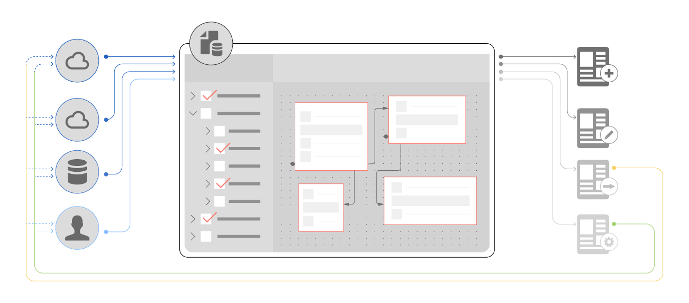

# [!DNL AEM Forms]-Datenintegration {#aem-forms-data-integration}

Unternehmensinfrastrukturen umfassen unterschiedliche Back-End-Systeme oder Datenquellen wie Datenbanken, Webservices, REST-Services, OData-Services und CRM-Lösungen. Zusammen bilden sie ein Informationssystem, das Daten für Unternehmensanwendungen zur Abwicklung des Tagesgeschäfts bereitstellt. Umgekehrt erfassen die Anwendungen Daten und senden sie zurück, um die Datenquellen zu aktualisieren.

Für [!DNL AEM Forms]-Programme wie adaptive Formulare und interaktive Kommunikation ist die Integration in Datenquellen erforderlich, damit Kundendaten abgerufen, während Formulare gerendert werden und die interaktive Kommunikation erstellt wird. Es gibt Anwendungsfälle, bei denen Daten basierend auf Benutzereingaben in adaptiven Formularen aus Datenquellen abgerufen werden. Zusätzlich können die übermittelten Daten im adaptiven Formular zurückgeschrieben werden, um die jeweiligen Datenquellen zu aktualisieren.

Ein verteiltes, modulares System hat seine eigenen Vorteile, aber die Herausforderung besteht darin, Datenverknüpfungen über Datenquellen hinweg zu integrieren und zu erstellen. Datenintegration ist der Schlüssel zu einer funktionsfähigen und effizienten Unternehmensinfrastruktur mit unterschiedlichen Datenquellen, die für den Austausch von Geschäftsdaten mit Anwendungen verbunden sind.

## Übersicht über die Datenintegration {#data-integration-overview}

[!DNL AEM Forms]-Datenintegration ermöglicht die Konfiguration und Verbindung verschiedener Datenquellen mit [!DNL AEM Forms]. In der intuitiven Benutzeroberfläche können Sie ein einheitliches Datendarstellungsschema der Geschäftsbereiche und Services für sämtliche verbundenen Datenquellen erstellen. Diese einheitliche Darstellung wird als Formulardatenmodell bezeichnet. Es handelt sich um eine Erweiterung des JSON-Schemas. Die Entitäten in einem Formulardatenmodell werden als Datenmodellobjekte bezeichnet. Mit einem Formulardatenmodell können Sie Folgendes ausführen:

* Zugreifen auf Datenmodellobjekte, Eigenschaften und Services aus verbundenen Datenquellen.
* Erstellen benutzerdefinierter Datenmodellobjekten und -eigenschaften.
* Erstellen von Verknüpfungen zwischen Datenmodellobjekten innerhalb und zwischen Datenquellen.
* Aufrufen von Services für Datenmodellobjekte zum Abfragen von Daten aus und Schreiben von Daten in Datenquellen.

Nachdem Sie ein Formulardatenmodell erstellt haben, können Sie es in verschiedenen Workflows für adaptive Formulare und interaktive Kommunikationen verwenden, zum Beispiel:

* Erstellen adaptiver Formulare und interaktiver Kommunikationen basierend auf dem Formulardatenmodell
* Ausfüllen adaptiver Formulare und interaktiver Kommunikation aus konfigurierten Datenquellen
* Aufrufen von Datenquellendiensten/-vorgängen mithilfe von Regeln für adaptive Formulare
* Schreiben von übermittelten Daten aus adaptiven Formularen in Datenquellen

## Erste Schritte mit der Datenintegration {#get-started-with-data-integration}

Der erste Schritt zur Implementierung der Datenintegration besteht darin, Datenquellen zu identifizieren und zu konfigurieren, die Informationen speichern und die Sie in Anwendungsfällen für adaptive Formulare sowie interaktive Kommunikationen verwenden möchten. Als Nächstes erstellen Sie ein Formulardatenmodell, das Datenmodellobjekte, Eigenschaften und Dienste aus mindestens einer Datenquelle verwendet. Sie können adaptive Formulare und interaktive Kommunikationen basierend auf einem Formulardatenmodell erstellen, bei dem adaptive Formularfelder oder Platzhalter in interaktiver Kommunikation an die jeweiligen Datenquelleneigenschaften gebunden sind.

Mit [!DNL AEM Forms] können Sie auch ein von Datenquellen unabhängiges Formulardatenmodell erstellen und später Datenmodellobjekte und Eigenschaften im Formulardatenmodell mit der Datenquelle verknüpfen oder daran binden. Dadurch werden alle Abhängigkeiten von Datenquellen beseitigt, während Sie an einem Formulardatenmodell arbeiten.

Lesen Sie folgende Informationen für die ersten Schritte mit der Datenintegration, um sie zu verstehen und zu implementieren.

* [Konfigurieren von Datenquellen](../../forms/using/configure-data-sources.md)
* [Erstellen des Formulardatenmodells](../../forms/using/create-form-data-models.md)
* [Arbeiten mit einem Formulardatenmodell](../../forms/using/work-with-form-data-model.md)
* [Verwenden eines Formulardatenmodells](../../forms/using/using-form-data-model.md)
