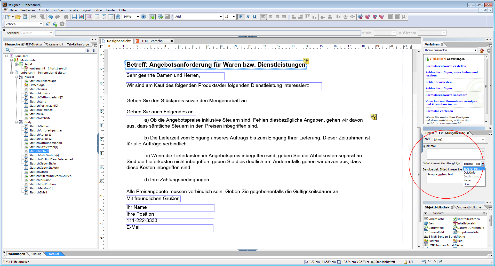

# Entwerfen barrierefreier HTML5-Formulare {#designing-accessible-html-forms}

Für HTML5-Formulare wird der ARIA-HTML5-Standard für Barrierefreiheit verwendet, um die HTML-Formulare barrierefrei zu gestalten. Diese Formulare unterstützen die Registerkartennavigation (außer Mozilla Firefox) und sind zertifiziert für ihre Kompatibilität mit den gängigen Bildschirmlesehilfen. Um ein HTML5-Formular mit Barrierefreiheitsmerkmalen zu generieren, entwerfen Sie die XFA-Formularvorlage nach einigen grundlegenden Entwurfsrichtlinien. Die Entwurfsrichtlinien umfassen das Konfigurieren der richtigen Registerkartenreihenfolge und die Bereitstellung des Sprechtext-Inhalts für jedes Formularsteuerelement. AEM Forms Designer unterstützt das Festlegen dieser Formularsteuerungsattribute zum Erstellen eines barrierefreien PDF- und HTML5-Formulars.

*Hinweis:Tabbed Die Navigation umfasst keine geschützten Felder, z. B. Berechnungsfelder mit der Summe von Werten. Damit die Bildschirmlesehilfe den Wert eines geschützten Felds liest, platzieren Sie ein leeres, schreibgeschütztes Feld entweder auf oder neben dem geschützten Feld. Weisen Sie den Wert des geschützten Feldes dem neuen, schreibgeschützten Feld zu. Die Bildschirmlesehilfe oder die Registerkartennavigation kann dieses schreibgeschützte Feld erfassen und als Wert des geschützten Felds wiedergeben.*

AEM Forms Designer enthält verschiedene Sprechtextoptionen, die an Bildschirmlesehilfen übergeben werden können. Benutzende können für jedes Objekt in einem Formular eine oder mehrere Einstellungen für den Text der Bildschirmlesehilfe angeben:

* Benutzerdefinierter Bildschirmlesehilfen-Text, der mithilfe der Palette „Barrierefreiheit“ festgelegt werden kann. Autorinnen und Autoren können die Namen von Schaltflächen und Feldern sowie deren Zweck kommentieren.
* QuickInfos, die in der Palette „Barrierefreiheit“ festgelegt werden können.
* Beschriftungen für Felder im Formular.
* Namen von Objekten (wie für die Option „Name“ der Registerkarte „Bindung“ angegeben).

Wenn mehrere Optionen wie QuickInfos, Bildschirmlesehilfen-Text und Beschriftung in einem Formularsteuerelement zur Verfügung stehen, verwendet die Bildschirmlesehilfe nur eine dieser Eigenschaften. Die Standardreihenfolge ist: Benutzerdefinierter Bildschirmlesehilfen-Text, QuickInfo, Beschriftung und Name. Diese Standardreihenfolge können Sie über die Option Bildschirmlesehilfen-**Rangfolge** in der Palette „Ein-/Ausgabehilfe“ außer Kraft setzen.
