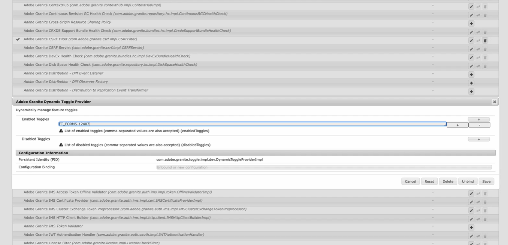
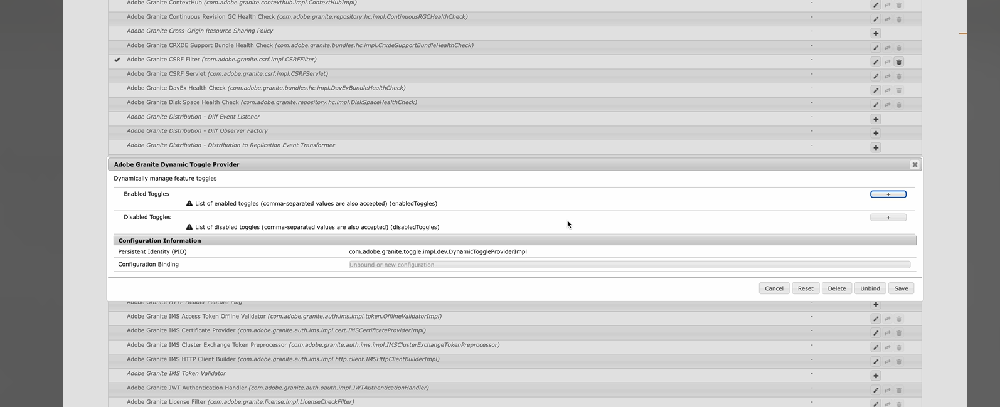

# Umschalten zwischen Funktionen in Adobe Experience Manager (AEM) 6.5{#enable-feature-toggle-aem-forms-65}

Der Funktionsumschalter ist eine Funktion in AEM, mit der Admins bestimmte Funktionen dynamisch aktivieren oder deaktivieren können. Diese Funktion ist besonders nützlich für die Verwaltung von **Early-Adopter**- und **Vorabversionsfunktionen** ohne größere Bereitstellungen oder Änderungen an der Code-Basis. Sie gewährleistet Flexibilität und Kontrolle darüber, auf welche Funktionen in einer AEM-Umgebung zugegriffen werden kann.

## Funktionsumschalter aktivieren {#enable-feature-toggle-65}

Funktionsumschalter für Early Adopters oder neue Funktionen können über die **AEM-Web-Konsole** konfiguriert werden, indem Sie die folgenden Schritte ausführen:

1. Melden Sie sich bei Ihrer AEM Forms-Instanz an.
2. Navigieren Sie zu `http://<author-instance-url>:portnumber/system/console/configMgr`.
3. Suchen Sie im Konfigurations-Manager nach **Adobe Granite Dynamic Toggle Provider**.
4. Klicken Sie auf das Symbol .
5. Klicken Sie im Abschnitt [!UICONTROL Aktivierte Umschalter] auf das .
6. Fügen Sie die Funktionsumschalter-ID für die Funktion hinzu, wie in der Abbildung unten dargestellt.
   

   >[!NOTE]
   >
   >Die Funktionsumschalter-ID finden Sie im dedizierten Dokument für die Early-Adopter-Funktionen.

7. Klicken Sie auf „Speichern“.

## Deaktivieren des Funktionsumschalters {#disable-feature-toggle-65}

Gehen Sie wie folgt vor, um die Funktionsumschalter für Funktionen zu deaktivieren, deren Umschalter aktiviert sind:

1. Melden Sie sich bei Ihrer AEM Forms-Instanz an.
2. Navigieren Sie zu `http://<author-instance-url>:portnumber/system/console/configMgr`.
3. Suchen Sie im Konfigurations-Manager nach **Adobe Granite Dynamic Toggle Provider**.
4. Klicken Sie auf das Symbol .
5. Klicken Sie im Abschnitt [!UICONTROL Deaktivierte Umschalter] auf das .
6. Fügen Sie die Umschalternummer für die zu deaktivierende Funktion hinzu.
   
7. Klicken Sie auf „Speichern“.

## Technische Überlegung

Funktionsumschalter sind umgebungsspezifisch und werden zur Laufzeit verwaltet, sodass kein Neustart des Servers erforderlich ist. Bei einigen Funktionen ist es jedoch möglicherweise erforderlich, die relevanten Seiten zu aktualisieren oder den Cache zu löschen, um Änderungen widerzuspiegeln.
Sie können über `http://<author-instance-url>:4502/etc.clientlibs/toggles.json` auf die Liste der Funktionen zugreifen, die über den Funktionsumschalter für Ihre Umgebung aktiviert sind.
