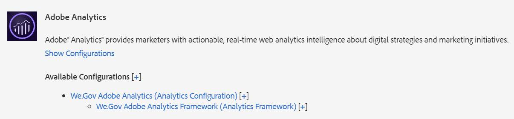

# Einrichten und Konfigurieren der Referenz-Sites We.Gov und We-Finance {#set-up-and-configure-we-gov-reference-site}

## Details zum Demopaket {#demo-package-details}

### Voraussetzungen für die Installation {#installation-prerequisites}

Dieses Paket wurde für **AEM Forms 6.4 OSGI-Autor** erstellt. Es wurde getestet und wird daher in den folgenden Plattformversionen unterstützt:

| AEM-VERSION | AEM FORMS-PAKET-VERSION | STATUS |
|---|---|---|
| 6.4 | 5.0.86 | **Unterstützt** |
| 6.5 | 6.0.80 | **Unterstützt** |
| 6.5.3 | 6.0.122 | **Unterstützt** |

Dieses Paket enthält eine Cloud-Konfiguration, die die folgenden Plattformversionen unterstützt:

| CLOUD-ANBIETER | SERVICE-VERSION | STATUS |
|---|---|---|
| Adobe Sign | v5-API | **Unterstützt** |
| Microsoft® Dynamics 365 | 1710 (9.1.0.3020) | **Unterstützt** |
| Adobe Analytics | v1.4-Rest-API | **Unterstützt** |

**Überlegungen zur Paketinstallation:**

* Installieren Sie das Paket auf einem bereinigten Server, der frei von anderen Demopaketen oder älteren Demopaketversionen ist.
* Installieren Sie das Paket auf einem OSGi-Server, der im Autorenmodus ausgeführt wird.

### Was enthält dieses Paket? {#what-does-this-package-include}

Das [AEM Forms-We.Gov-Demopaket](https://experience.adobe.com/#/downloads/content/software-distribution/en/aem.html?package=/content/software-distribution/en/details.html/content/dam/aem/public/adobe/packages/cq650/featurepack/we-gov-forms.pkg.all-2.0.2.zip) (**we-gov-forms.pkg.all-&lt;version>.zip**) wird als Paket geliefert, das mehrere andere Unterpakete und Services enthält. Das Paket enthält die folgenden Module:

* **we-gov-forms.pkg.all-&lt;version>.zip** – *Vollständiges Demopaket*

   * **we-gov-forms.ui.apps-&lt;version>.zip** *: Enthält alle Komponenten, Client-Bibliotheken, Beispielbenutzende, Workflow-Modelle usw.*

      * **we-gov-forms.core-&lt;version>.jar**: *Enthält alle OSGi-Services, die Implementierung benutzerdefinierter Workflow-Schritte usw.*

      * **we-gov-forms.derby&lt;version>.jar**: *Enthält alle OSGi-Services, Datenbankschemas usw.*

      * **core.wcm.components.all-2.0.4.zip** – *Sammlung von WCM-Beispielkomponenten*

      * **grid-aem.ui.apps-1.0-SNAPSHOT.zip** – *AEM Sites Grid-Layout-Paket für die Seitenspaltensteuerung in Sites*

   * **we-gov-forms.ui.content-&lt;version>.zip**: *Enthält alle Inhalte, Seiten, Bilder, Formulare, Assets der interaktiven Kommunikation usw.*

   * **we-gov-forms.ui.analytics-&lt;version>.zip**: *Enthält alle Forms-Analysedaten zu We.Gov, die im Repository gespeichert werden sollen.*

   * **we-gov-forms.config.public-&lt;version>.zip**: *Enthält alle standardmäßigen Konfigurationsknoten, einschließlich Platzhalter-Cloud-Konfigurationen, damit Probleme mit Formulardatenmodellen und der Dienstbindung vermieden werden.*

Zu den in diesem Paket enthaltenen Assets gehören:

* AEM-Website-Seiten mit bearbeitbaren Vorlagen
* Adaptive Formulare in AEM Forms
* Interaktive Kommunikation in AEM Forms (Print- und Web-Kanal)
* Aufzuzeichnendes XDP-Dokument in AEM Forms
* MS® Dynamics-Formulardatenmodell in AEM Forms
* Adobe Sign-Integration
* AEM-Workflow-Modell
* AEM Assets-Beispielbilder
* Beispiel-Apache Derby-Datenbank (im Speicher)
* Apache Derby-Datenquelle (zur Verwendung mit dem Formulardatenmodell)

## Installation des Demopakets {#demo-package-installation}

Dieser Abschnitt enthält Informationen zur Installation des Demopakets.

### Aus Software Distribution {#from-software-distribution}

1. Öffnen Sie [Software Distribution](https://experience.adobe.com/downloads). Zum Anmelden bei Software Distribution benötigen Sie eine Adobe ID.
1. Wählen Sie im Kopfzeilenmenü **[!UICONTROL Adobe Experience Manager]** aus.
1. Im Abschnitt **[!UICONTROL Filter]**:
   1. Wählen Sie **[!UICONTROL Formulare]** aus der Dropdown-Liste **[!UICONTROL Lösung]** aus.
   2. Wählen Sie die Version aus und geben Sie sie für das Paket ein. Sie können auch die Option **[!UICONTROL Downloads durchsuchen]** verwenden, um die Ergebnisse zu filtern.
1. Wählen Sie den Paketnamen **we-gov-forms.pkg.all-&lt;version>.zip**, dann **[!UICONTROL EULA-Bedingungen akzeptieren]** und schließlich **[!UICONTROL Herunterladen]** aus.
1. Öffnen Sie den [Paket-Manager](/help/sites-administering/package-manager.md) und klicken Sie auf **[!UICONTROL Paket hochladen]**, um das Paket hochzuladen.
1. Wählen Sie das Paket aus und klicken Sie auf **[!UICONTROL Installieren]**.

   

1. Lassen Sie den Abschluss des Installationsprozesses zu.
1. Navigieren Sie zu *https://&lt;aemserver>:&lt;port>/content/we-gov/home.html?wcmmode=disabled*, um sicherzustellen, dass die Installation erfolgreich war.

### Von einer lokalen ZIP-Datei {#from-a-local-zip-file}

1. Laden Sie die Datei **we-gov-forms.pkg.all-&lt;version>.zip** herunter und suchen Sie sie.
1. Gehen Sie zu *https://&lt;aemserver>:&lt;port>/crx/packmgr/index.jsp*.
1. Wählen Sie die Option „Paket hochladen“.

   

1. Verwenden Sie den Datei-Browser, um zur heruntergeladenen ZIP-Datei zu gelangen und sie auszuwählen.
1. Klicken Sie zum Hochladen auf „Öffnen“.
1. Wählen Sie nach dem Hochladen die Option „Installieren“, um das Paket zu installieren.

   

1. Lassen Sie den Abschluss des Installationsprozesses zu.
1. Gehen Sie zu *https://&lt;aemserver>:&lt;port>/content/we-gov/home.html?wcmmode=disabled*, um sicherzugehen, dass die Installation erfolgreich war.

### Installieren neuer Paketversionen {#installing-new-package-versions}

Um die neue Paketversion zu installieren, führen Sie die in 4.1 und 4.2 definierten Schritte aus. Sie können eine neuere Paketversion installieren, auch wenn bereits eine ältere Version installiert ist. Adobe empfiehlt jedoch, zuerst die ältere Paketversion zu deinstallieren. Gehen Sie dazu wie folgt vor:

1. Navigieren Sie zu *https://&lt;aemserver>:&lt;port>/crx/packmgr/index.jsp*
1. Suchen Sie die ältere Datei **we-gov-forms.pkg.all-&lt;version>.zip**.
1. Wählen Sie die Option **Mehr** aus.
1. Wählen Sie in der Dropdown-Liste die Option **Deinstallieren** aus.

   

1. Wählen Sie nach der Bestätigung **Deinstallieren** und warten Sie, bis der Deinstallationsvorgang abgeschlossen ist.

## Konfiguration des Demopakets {#demo-package-configuration}

Dieser Abschnitt enthält Details und Anweisungen zur Konfiguration des Demopakets nach der Bereitstellung vor der Präsentation.

### Konfigurieren eines fiktiven Benutzers {#fictional-user-configuration}

1. Navigieren Sie zu *https://&lt;aemserver>:&lt;port>/libs/granite/security/content/groupadmin.html*
1. Melden Sie sich als Admin an, um die unten aufgeführten Aufgaben durchzuführen.
1. Scrollen Sie nach unten zum Ende der Seite, um alle Benutzergruppen zu laden.
1. Suchen Sie nach **workflow**.
1. Wählen Sie die Gruppe **workflow-users** aus und klicken Sie auf **Eigenschaften**.
1. Navigieren Sie zur Registerkarte Mitglieder .
1. Geben Sie **Feld „Benutzer oder Gruppe**&quot; `wegov` ein.
1. Wählen Sie aus der Dropdown-Liste **We.Gov Forms Users**.

   

1. Klicken Sie **der Menüleiste auf** Speichern und schließen“.
1. Wiederholen Sie die Schritte 2-7, indem Sie nach **analytics** suchen, die Gruppe **Analytics-Administratoren** auswählen und die Gruppe **We.Gov Forms Users** als Mitglied hinzufügen.
1. Wiederholen Sie die Schritte 2-7, indem Sie nach **Forms-Benutzer** suchen, die Gruppe **forms-power-users** auswählen und die Gruppe **We.Gov Forms Users** als Mitglied hinzufügen.
1. Wiederholen Sie die Schritte 2-7, indem Sie nach **forms-users** suchen, die Gruppe **forms-users** auswählen und diesmal die Gruppe **We.Gov Users** als Mitglied hinzufügen.

### Konfiguration des E-Mail-Servers {#email-server-configuration}

1. Lesen Sie die Einrichtungsdokumentation [Konfigurieren von E-Mail-Benachrichtigungen](/help/sites-administering/notification.md)
1. Melden Sie sich als Administrator an, um diese Aufgabe durchzuführen.
1. Navigieren Sie zu *https://&lt;aemserver>:&lt;port>/system/console/configMgr*
1. Suchen Sie den **Day CQ Mail Service** und klicken Sie darauf, um ihn zu konfigurieren.

   

1. Konfigurieren Sie den Service für die Verbindung mit dem gewünschten SMTP-Server:

   1. **SMTP server hostname** (Host-Name des SMTP-Servers): z. B. „smtp.gmail.com“
   1. **Server Port**: z. B. „465“ für Gmail mit SSL
   1. **SMTP User:** (SMTP-Benuztende) demo@ &lt;companyname> .com
   1. **Von Adresse**: aemformsdemo@adobe.com

   

1. Klicken Sie auf **Speichern**, um die Konfiguration zu speichern.

### (Optional) AEM-SSL-Konfiguration {#aemsslconfig}

Dieser Abschnitt enthält Details zur SSL-Konfiguration in der AEM-Instanz, um die Adobe Sign-Cloud-Konfiguration einrichten zu können.

**Verweise:**

1. [Die Funktion „SSL By Default“ (SSL als Standard)](/help/sites-administering/ssl-by-default.md)

**Anmerkungen:**

1. Navigieren Sie zu „https://&lt;aemserver>:&lt;port>/aem/inbox“. Darüber können Sie den im obigen Link zur Referenzdokumentation beschriebenen Vorgang abschließen.
1. Das Paket `we-gov-forms.pkg.all-[version].zip` enthält einen Beispiel-SSL-Schlüssel und ein Beispiel-Zertifikat, auf die Sie zugreifen können, indem Sie den Ordner `we-gov-forms.pkg.all-[version].zip/ssl` extrahieren, der Teil des Pakets ist.

1. SSL-Zertifikat und Schlüsseldetails:

   1. ausgegeben an „CN=localhost“
   1. Gültigkeit von 10 Jahren
   1. Kennwortwert von „Kennwort“

1. Der private Schlüssel ist *localhostprivate.der*.
1. Das Zertifikat ist *localhost.crt*.
1. Klicken Sie auf **Weiter**.
1. Setzen Sie den HTTPS-Hostnamen auf *localhost*.
1. Setzen Sie Port auf einen Port, den das System offen gelegt hat.

### (Optional) Cloud-Konfiguration für Adobe Sign {#adobe-sign-cloud-configuration}

Dieser Abschnitt enthält Details und Anweisungen zur Adobe Sign Cloud-Konfiguration.

**Verweise:**

1. [Integrieren von Adobe Sign mit AEM Forms](adobe-sign-integration-adaptive-forms.md)

#### Cloud-Konfiguration {#cloud-configuration}

1. Überprüfen Sie die Voraussetzungen. Siehe [AEM-SSL-Konfiguration](../../forms/using/forms-install-configure-gov-reference-site.md#aemsslconfig) für die erforderliche SSL-Konfiguration.
1. Gehen Sie zu:

   *https://&lt;aemserver>:&lt;port>/libs/adobesign/cloudservices/adobesign.html/conf/we-gov*

   >[!NOTE]
   >
   >Um Konfigurationsprobleme zu vermeiden, stellen Sie sicher, dass die URL, die für den Zugriff auf den AEM-Server verwendet wird, mit der URL übereinstimmt, die im OAuth-Umleitungs-URI von Adobe Sign konfiguriert ist.
   >Beispiel: *https://&lt;aemserver>:&lt;port>/mnt/overlay/adobesign/cloudservices/adobesign/properties.html*

1. Wählen Sie die Konfiguration **We.gov Adobe Sign** aus.
1. Klicken Sie auf **Eigenschaften**.
1. Navigieren Sie zur Registerkarte „Einstellungen“.
1. Geben Sie die oAuth-URL ein. Beispiel: `https://secure.na1.echosign.com/public/oauth` (nur zu Veranschaulichungszwecken).
1. Geben Sie die konfigurierte Client-ID und das Client-Geheimnis aus der konfigurierten Adobe Sign-Instanz an.
1. Klicken Sie **Mit Adobe Sign verbinden**.
1. Klicken Sie nach erfolgreicher Verbindung auf **Speichern und schließen** um die Integration abzuschließen.

### (Optional) MS® Dynamics-Cloud-Konfiguration {#ms-dynamics-cloud-configuration}

Dieser Abschnitt enthält Details und Anweisungen zur MS® Dynamics-Cloud-Konfiguration.

**Verweise:**

1. [Microsoft](/help/forms/using/ms-dynamics-odata-configuration.md)
1. [Konfigurieren von Microsoft® Dynamics für AEM Forms](https://experienceleague.adobe.com/en/docs/experience-manager-learn/forms/adaptive-forms/using-ms-dynamics-with-aem-forms#)

#### MS® Dynamics OData-Cloud-Service {#ms-dynamics-odata-cloud-service}

1. Gehen Sie zu:

   https://&lt;aemserver>:&lt;port>/libs/fd/fdm/gui/components/admin/fdmcloudservice/fdm.html/conf/we-gov

   1. Stellen Sie sicher, dass Sie auf den Server zugreifen, indem Sie dieselbe Umleitungs-URL verwenden, die in der Registrierung des MS® Dynamics-Programms konfiguriert wurde.

1. Wählen Sie die Konfiguration „Microsoft® Dynamics OData Cloud-Dienst“.
1. Klicken Sie auf **Eigenschaften**.

   

1. Navigieren Sie zur Registerkarte „Authentifizierungseinstellungen“.
1. Geben Sie die folgenden Details ein:

   1. **Dienststamm:** zum Beispiel: `https://msdynamicsserver.api.crm3.dynamics.com/api/data/v9.1/`
   1. **Authentifizierungstyp**: OAuth 2.0
   1. **Authentifizierungseinstellungen** (siehe [Cloud-Konfigurationseinstellungen für MS® Dynamics](../../forms/using/forms-install-configure-gov-reference-site.md#dynamicsconfig), um diese Informationen zu sammeln):

      1. Client-ID – auch als Programm-ID bezeichnet
      1. Client-Geheimnis
      1. OAuth-URL: beispielsweise [https://login.microsoftonline.com/common/oauth2/authorize](https://login.microsoftonline.com/common/oauth2/authorize)
      1. Aktualisieren der Token-URL: beispielsweise [https://login.windows.net/common/oauth2/token](https://login.windows.net/common/oauth2/token)
      1. Zugriffstoken-URL: beispielsweise [https://login.windows.net/common/oauth2/token](https://login.windows.net/common/oauth2/token)
      1. Genehmigungsumfang – **openid**
      1. Authentifizierungs-Header – **Autorisierungsanbieter**
      1. Ressource: zum Beispiel `https://msdynamicsserver.api.crm3.dynamics.com`

   1. Klicken Sie auf **Verbindung zu OAuth herstellen**.

1. Klicken Sie nach erfolgreicher Authentifizierung auf **Speichern und schließen** um die Integration abzuschließen.

#### Cloud-Konfigurationseinstellungen für MS® Dynamics {#dynamicsconfig}

Die in diesem Abschnitt beschriebenen Schritte bieten Hilfe bei der Suche nach der Client-ID, dem Client-Geheimnis und Details aus Ihrer MS® Dynamics Cloud-Instanz.

1. Navigieren Sie zu [https://portal.azure.com/](https://portal.azure.com/) und melden Sie sich an.
1. Wählen Sie im Menü links die Option **Alle Services**.
1. Suchen Sie nach (App-Registrierung **oder navigieren Sie**.
1. Erstellen oder wählen Sie eine bestehende Programmregistrierung aus.
1. Kopieren Sie die **Programm-ID** zur Verwendung als OAuth-**Client-ID** in der AEM Cloud-Konfiguration
1. Klicken Sie auf **Einstellungen** oder **Manifest**, um die **Antwort-URLs zu konfigurieren.**

   1. Diese URL muss mit der URL übereinstimmen, die für den Zugriff auf Ihren AEM-Server beim Konfigurieren des OData-Services verwendet wird.

1. Klicken Sie in der Einstellungsansicht auf **Schlüssel**, um einen neuen Schlüssel anzuzeigen (der in AEM als Client-Geheimnis verwendet wird).

   1. Achten Sie darauf, eine Kopie des Schlüssels zu behalten, da Sie ihn später nicht mehr in Azure oder AEM anzeigen können.

1. Um die Ressourcen-URL/Dienststamm-URL zu finden, navigieren Sie zum Dashboard der MS® Dynamics-Instanz.
1. Klicken Sie in der oberen Navigationsleiste auf **Verkauf** oder Ihren eigenen Instanztyp und dann auf **Einstellungen auswählen**.
1. Klicken Sie unten rechts auf **Anpassungen** und **Entwicklerressourcen**.
1. Suchen Sie die Service-Stamm-URL. Beispiel:

   `https://msdynamicsserver.api.crm3.dynamics.com/api/data/v9.1/`

1. Details zur URL für Aktualisierungs- und Zugriffstoken finden Sie unter:

   [https://learn.microsoft.com/en-us/rest/api/datacatalog/authenticate-a-client-app](https://learn.microsoft.com/de-de/rest/api/datacatalog/authenticate-a-client-app)

#### Testen des Formulardatenmodells (Dynamics) {#testing-the-form-data-model}

Sobald die Cloud-Konfiguration abgeschlossen ist, können Sie das Formulardatenmodell testen.

1. Gehen Sie zu

   *https://&lt;aemserver>:&lt;port>/aem/forms.html/content/dam/formsanddocuments-fdm/we-gov*

1. Wählen Sie den **We.gov Microsoft® Dynamics CRM-FDM** und anschließend **Eigenschaften** aus.

   

1. Navigieren Sie zur Registerkarte **Quelle aktualisieren**.
1. Stellen Sie sicher **dass die** Kontextabhängige Konfiguration“ auf `/conf/we-gov` festgelegt ist und dass die konfigurierte Datenquelle `ms-dynamics-odata-cloud-service` ist.

   

1. Bearbeiten Sie das Formulardatenmodell.

1. Testen Sie die Services, um sicherzustellen, dass sie sich erfolgreich mit der konfigurierten Datenquelle verbinden.

   >[!NOTE]
   >
   >Klicken Sie nach dem Testen der Services auf **Abbrechen** um sicherzustellen, dass unfreiwillige Änderungen nicht an das Formulardatenmodell weitergegeben werden.

   >[!NOTE]
   >
   >Es wurde berichtet, dass ein Neustart des AEM-Servers erforderlich war, damit die Datenquelle erfolgreich an das FDM gebunden werden konnte.

   >[!NOTE]
   >
   >Adobe empfiehlt die Verwendung des Befehls `Ctrl + C` zum Neustart von SDK. Neustarten von AEM SDK mit alternativen Methoden. Das Anhalten von Java-Prozessen kann beispielsweise zu Inkonsistenzen in der AEM-Entwicklungsumgebung führen.

#### Testen des Forms-Datenmodells (Derby) {#test-fdm-derby}

Sobald die Cloud-Konfiguration abgeschlossen ist, können Sie das Forms-Datenmodell testen.

1. Navigieren Sie zu *https://&lt;aemserver>:&lt;port>/aem/forms.html/content/dam/formsanddocuments-fdm/we-gov*

1. Wählen Sie die **We.gov Enrollment FDM** und wählen Sie **Eigenschaften**.

   

1. Navigieren Sie zur Registerkarte **Quelle aktualisieren**.

1. Stellen Sie sicher, dass die **Kontextabhängige Konfiguration** auf `/conf/we-gov` gesetzt ist und dass die konfigurierte Datenquelle **We.Gov Derby DS** ist.

   

1. Klicken Sie auf **Speichern und schließen**.

1. [Testen der Services](work-with-form-data-model.md#test-data-model-objects-and-services), um sicherzustellen, dass sie sich erfolgreich mit der konfigurierten Datenquelle verbinden

   * Um die Verbindung zu testen, wählen Sie **HOMEMORTGAGEACCOUNT** aus und führen Sie dafür einen Dienstabruf durch. Testen Sie den Service, und Systemadministratoren können sehen, wie die Daten abgerufen werden.

### Adobe Analytics-Konfiguration (optional) {#adobe-analytics-configuration}

Dieser Abschnitt enthält Details und Anweisungen zur Adobe Analytics Cloud-Konfiguration.

**Verweise:**

* [Integration mit Adobe Analytics](../../sites-administering/adobeanalytics.md)

* [Herstellen einer Verbindung mit Adobe Analytics und Erstellen von Frameworks](../../sites-administering/adobeanalytics-connect.md)

* [Anzeigen von Seitenanalysedaten](../../sites-authoring/pa-using.md)

* [Konfigurieren von Analytics und Berichten](configure-analytics-forms-documents.md)

* [Anzeigen und Verstehen der Analytics-Berichte in AEM Forms](view-understand-aem-forms-analytics-reports.md)

### Adobe Analytics-Cloud-Service-Konfiguration {#adobe-analytics-cloud-service-configuration}

Dieses Paket ist für die Verbindung mit Adobe Analytics vorkonfiguriert. Die folgenden Schritte werden bereitgestellt, damit diese Konfiguration aktualisiert werden kann.

1. Navigieren Sie zu *https://&lt;aemserver>:&lt;port>/libs/cq/core/content/tools/cloudservices.html*
1. Suchen Sie den Abschnitt „Adobe Analytics“ und wählen Sie den Link „Konfigurationen anzeigen“.
1. Wählen Sie die Konfiguration „We.Gov Adobe Analytics (Analytics-Konfiguration)“ aus.

   

1. Klicken Sie auf die Schaltfläche „Bearbeiten“, um die Adobe Analytics-Konfiguration zu aktualisieren. (Sie müssen den gemeinsamen geheimen Schlüssel angeben.) Klicken Sie auf „Mit Analytics verbinden“, um eine Verbindung herzustellen, und auf „OK“, um den Vorgang abzuschließen.

   

1. Klicken Sie auf derselben Seite auf „We.Gov Adobe Analytics Framework (Analytics Framework)“, wenn Sie die Framework-Konfigurationen aktualisieren möchten (siehe [Aktivieren von AEM-Authoring](../../forms/using/forms-install-configure-gov-reference-site.md#enableauthoring), um das Authoring zu aktivieren).

#### Adobe Analytics – Suchen von Benutzeranmeldeinformationen {#analytics-locating-user-credentials}

Suchen Sie die Benutzeranmeldeinformationen für ein Adobe Analytics-Konto, das der Kontoadministrator ausführen muss, indem Sie die folgenden Aufgaben ausführen.

1. Navigieren Sie zum Adobe Experience Cloud-Portal.
Melden Sie sich mit Ihren Administrator-Anmeldeinformationen an.
1. Wählen Sie im Haupt-Dashboard das Adobe Analytics-Symbol aus.
   
1. Navigieren Sie zur Registerkarte „Admin“ und wählen Sie das Element „User Management (Legacy)“ aus.
   
1. Wählen Sie die Registerkarte **Benutzer** aus.
   
1. Wählen Sie den gewünschten Benutzer aus der Liste der Benutzer aus.
1. Scrollen Sie nach unten auf der Seite, und die Informationen zur Benutzerauthentifizierung werden unten auf der Seite angezeigt.
   
1. Der Benutzername und die Informationen zum gemeinsamen geheimen Schlüssel werden auf der rechten Seite des Berechtigungsfelds angezeigt.
1. Der Benutzername enthält einen Doppelpunkt im Namen. Bei allen Informationen links vom Doppelpunkt handelt es sich um den Benutzernamen und bei allen Informationen rechts vom Doppelpunkt um den Firmennamen, wie im folgenden Beispiel gezeigt:

   *Benutzername : Firmenname*

#### Einrichten der Benutzerauthentifizierung in Adobe Analytics {#setup-user-authentication}

Administratoren können Benutzern AEM Analytics-Berechtigungen erteilen, indem sie die folgenden Aktionen ausführen.

1. Navigieren Sie zur Adobe Admin Console.

1. Klicken Sie auf die Analytics-Instanz, die in der Admin Console angezeigt wird.

   Auf der Hauptseite der Admin-Seite.

1. Wählen Sie den vollständigen Administratorzugriff für Analytics aus.

1. Fügen Sie einen Benutzer zum Profil hinzu.

   

1. Klicken Sie auf die Registerkarte Berechtigungen , sobald die Benutzer-ID dem Profil zugeordnet ist.

1. Stellen Sie sicher, dass alle Berechtigungen dem Profil zugeordnet sind.

   

1. Nach Zuweisung der Berechtigungen kann es einige Stunden dauern, bis eine Benutzeranmeldung möglich ist.

### Adobe Analytics-Berichte {#adobe-analytics-reporting}

#### Anzeigen von Adobe Analytics Sites-Berichten {#view-adobe-analytics-sites-reporting}

>[!NOTE]
>
>Wenn Sie das `we-gov-forms.ui.analytics-<version>.zip` installieren, sind AEM Forms Analytics-Daten offline oder ohne Adobe Analytics Cloud-Konfiguration verfügbar. AEM Sites-Daten erfordern eine aktive Cloud-Konfiguration.

1. Navigieren Sie zu *https://&lt;aemserver>:&lt;port>/sites.html/content*
1. Wählen Sie die **AEM Forms We.Gov Site** aus, um die Seiten der Site anzuzeigen.
1. Wählen Sie eine der Seiten der Site aus (z. B. die Startseite) und wählen Sie **Analysen und Empfehlungen**.

   

1. Auf dieser Seite sehen Sie die von Adobe Analytics abgerufenen Informationen. Die Informationen beziehen sich auf die AEM Sites-Seite. Diese Informationen werden regelmäßig von Adobe Analytics aktualisiert und nicht in Echtzeit angezeigt.

   

1. Zurück auf der Seite „Seitenansicht“ (die Sie in Schritt 3. aufgerufen haben) können Sie die Informationen der Seitenansicht auch anzeigen, indem Sie die Anzeigeeinstellung so ändern, dass Elemente in der **Listenansicht“ angezeigt**.
1. Suchen Sie das Dropdown-Menü „Ansicht“ und wählen Sie **Listenansicht**.

   

1. Wählen Sie im gleichen Menü **Ansichtseinstellung** und wählen Sie die Spalten, die Sie anzeigen möchten, aus dem Abschnitt **Analytics** aus.

   

1. Klicken Sie auf **Aktualisieren**, um die neuen Spalten verfügbar zu machen.

   

#### Anzeigen von Adobe Analytics-Formularberichten {#view-adobe-analytics-forms-reporting}

>[!NOTE]
>
>AEM Forms Analytics-Daten sind offline oder ohne Adobe Analytics Cloud-Konfiguration verfügbar. Diese Funktion ist „true“, wenn das `we-gov-forms.ui.analytics-<version>.zip`-Paket installiert ist. AEM Sites-Daten erfordern jedoch eine aktive Cloud-Konfiguration.

1. Gehen Sie zu

   *https://&lt;aemserver>:&lt;port>/aem/forms.html/content/dam/formsanddocuments/adobe-gov-forms*

1. Wählen Sie das adaptive Formular „Registrierungsantrag für Gesundheitsleistungen“ aus und dann die Option „Analytics-Bericht“.

   

1. Warten Sie, bis die Seite geladen wurde, und zeigen Sie die Daten des Analytics-Berichts an.

   

### Aktivierung der automatisierten Konfiguration von Adobe-Formularen {#automated-forms-enablement}

Um AEM Forms mit Adobe Forms zu installieren und zu konfigurieren, müssen Benutzende des Konvertierungs-Tools über Folgendes verfügen:

1. Zugriff auf Adobe Developer.

1. Berechtigung zum Erstellen einer Integration mit dem Adobe Forms-Konvertierungs-Service.

1. Neuestes Service Pack von Adobe AEM 6.5, das als Autor ausgeführt wird.

Überprüfen Sie Folgendes, bevor Sie weitere Anweisungen lesen:

* [Service für die automatische Formularkonvertierung konfigurieren](https://experienceleague.adobe.com/en/docs/aem-forms-automated-conversion-service/using/configure-service#)

#### Erstellen einer IMS-Konfiguration - Teil 1 {#creating-ims-config}

Konfigurieren Sie den Dienst für die korrekte Kommunikation mit dem Forms Conversion Tool Benutzer müssen den Identity Management System (IMS)-Dienst konfigurieren, um sich bei Adobe I/O registrieren zu können.

1. Navigieren Sie zu https://&lt;aemserver>:&lt;port> und klicken Sie auf Adobe Experience
Manager oben links > Tools > Sicherheit > Adobe IMS-Konfiguration.

1. Klicken Sie auf „Erstellen“.

1. Führen Sie die Aktionen im folgenden Bild aus.

   

1. Stellen Sie sicher, dass Sie das Zertifikat herunterladen.

1. Fahren Sie nicht mit dem Rest der Konfiguration fort, sondern lesen Sie den Abschnitt [Erstellen der Integration in Adobe I/O](#create-integration-adobeio)

>[!NOTE]
>
>Das in diesem Abschnitt erstellte Zertifikat wird verwendet, um den Integrations-Service in Adobe I/O zu erstellen. Wenn Benutzende den Integrations-Service erstellt haben, können sie diese Informationen aus Adobe I/O verwenden, um die Konfiguration abzuschließen.

#### Erstellen der Integration in Adobe I/O {#create-integration-adobeio}

Vergewissern Sie sich, dass Sie die Möglichkeit haben, eine Integration in Ihrer Adobe-Domain zu erstellen. Wenn nicht, wenden Sie sich dafür an Ihr Systemadministrations-Team.

1. Navigieren Sie zu [Adobe Developer Console](https://developer.adobe.com/console/).

1. Klicken Sie auf **Integration erstellen**.

1. Wählen Sie **Zugriff auf eine API** aus.

1. Stellen Sie sicher, dass Sie sich in der richtigen Gruppe befinden (Dropdown-Liste oben rechts).

1. Wählen Sie im Abschnitt Experience Cloud das Forms-Konvertierungs-Tool aus.

1. Klicken Sie auf **Weiter**.

1. Geben Sie den Namen und die Beschreibung Ihrer Integration ein.

1. Durch Verwendung des öffentlichen Schlüssels aus Abschnitt 2.1 wird dieser in die Integration des Schlüssels eingefügt.

1. Wählen Sie ein Profil für Ihre automatische Formularkonvertierung aus.

   

#### Erstellen der IMS-Konfiguration, Teil 2 {#create-ims-config-part-next}

Nachdem Sie eine Integration erstellt haben, können Sie die Installation der IMS-Konfiguration abschließen.

1. Klicken Sie in Adobe I/O auf Ihre Integration, um die Verbindungsdetails anzuzeigen.

1. Navigieren Sie in AEM zu Ihrer IMS-Konfiguration (**Tools** > **Sicherheit** > **IMS**)

1. Klicken Sie **IMS** Konfigurationsbildschirm auf „Weiter“.

1. Geben Sie den Autorisierungs-Server ein (im Screenshot angezeigter Wert).

1. Geben Sie den API-Schlüssel ein.

1. Geben Sie das Client-Geheimnis ein (klicken Sie **Anzeigen** auf der Seite „Integration in Adobe I/O&quot;, um es anzuzeigen).

1. Klicken Sie in Adobe I/O auf die Registerkarte „JWT“, um die JWT-Payload abzurufen und sie in die Payload der IMS-Konfiguration einzufügen.

   

1. Klicken Sie nach der Erstellung auf die IMS-Konfiguration und wählen Sie Konsistenzprüfung aus. Die Benutzer sollten das folgende Ergebnis sehen.

   

#### Konfigurieren der Cloud-Konfiguration (We.Gov AFC Production) {#configure-cloud-configuration}

Sobald die IMS-Konfiguration abgeschlossen ist, können Sie die Cloud-Konfiguration in AEM überprüfen. Wenn die Konfiguration nicht vorhanden ist, führen Sie die folgenden Schritte aus, um die Cloud-Konfiguration in AEM zu erstellen:

1. Öffnen Sie den Browser und navigieren Sie zur System-URL https://&lt;domain_name>:&lt;system_port>

1. Klicken Sie oben links im Bildschirm auf „Adobe Experience Manager“ > „Tools“ > „Cloud Services“ > „Konfiguration der automatisierten Formularkonvertierung“.

1. Wählen Sie den Konfigurationsordner aus, in dem die Konfiguration abgelegt werden soll.

1. Klicken Sie auf „Erstellen“.

1. Geben Sie die Informationen im folgenden Screenshot ein.

   

1. Geben Sie der Konfiguration einen Titel und einen Namen.

1. Die Service-URL für das System ist auf `https://aemformsconversion.adobe.io/` festgelegt.

1. Vorlagen-URL */conf/we-gov/settings/wcm/templates/we-gov-flamingo-template*.

1. Design-URL: */content/dam/formsanddocuments-themes/adobe-gov-forms-themes/we-gov-theme*

1. Klicken Sie auf Weiter.

1. Für diese Konfiguration wurden die beiden Kontrollkästchenwerte leer gelassen.

   Weitere Informationen zu diesen Optionen finden Sie unter [Konfigurieren des Cloud-Service](https://experienceleague.adobe.com/en/docs/aem-forms-automated-conversion-service/using/configure-service#configure-the-cloud-service).

#### Konfigurieren der Cloud-Konfiguration (`We.Finance` AFC Production) {#configure-cloud-configuration-wefinance}

Sobald die IMS-Konfiguration abgeschlossen ist, können Sie mit der Erstellung der Cloud-Konfiguration in AEM fortfahren.

1. Öffnen Sie den Browser und navigieren Sie zur System-URL https://&lt;domain_name>:&lt;system_port>

1. Klicken Sie oben links im Bildschirm auf „Adobe Experience Manager“ > „Tools“ > „Cloud Services“ > „Konfiguration der automatisierten Formularkonvertierung“.

1. Wählen Sie den Konfigurationsordner aus, in dem die Konfiguration abgelegt werden soll.

1. Klicken Sie auf **Erstellen**.

1. Geben Sie die Informationen im folgenden Screenshot ein.

   

1. Geben Sie der Konfiguration einen Titel und einen Namen.

1. Die Service-URL für das System ist auf `https://aemformsconversion.adobe.io/` festgelegt

1. Vorlagen-URL: */conf/we-finance/settings/wcm/templates/we-finance-adaptive-form*

1. Design-URL: */content/dam/formsanddocuments-themes/adobe-finance-forms-themes/we-finance-theme*

1. Klicken Sie auf **Weiter**.

1. Für diese Konfiguration wurden die beiden Kontrollkästchenwerte leer gelassen.

   * Weitere Informationen zu diesen Optionen finden Sie unter [Konfigurieren des Cloud-Services](https://experienceleague.adobe.com/en/docs/aem-forms-automated-conversion-service/using/configure-service#configure-the-cloud-service).

#### Testen der Formularkonvertierung (We.Gov-Registrierungsprogramm) {#test-forms-conversion}

Nachdem die Konfiguration eingerichtet wurde, können Benutzer sie testen, indem sie ein PDF-Dokument hochladen.

1. Navigieren Sie zum AEM-System https://&lt;domain_name>:&lt;system_port>

1. Klicken Sie auf **Forms** > **Forms und Dokumente** > **AEM Forms We.gov Forms** > **AFC**.

1. Wählen Sie die PDF der We.Gov Enrollment Application aus.

1. Klicken Sie oben rechts auf die Option zum **Starten der automatischen Konvertierung**.

1. Benutzer können die Option wie unten dargestellt sehen.

   

1. Sobald die Schaltfläche ausgewählt ist, werden den Benutzenden die folgenden Optionen angezeigt:

   * Stellen Sie sicher, dass die Benutzenden die Konfiguration *We.Gov AFC Production* auswählen.

   

   

1. Wählen Sie „Konvertierung starten“ aus, nachdem Sie alle gewünschten Optionen konfiguriert haben.

1. Zu Beginn des Konvertierungsprozesses sehen Benutzerinnen und Benutzer Folgendes:

   

1. Nach Abschluss der Konvertierung sehen Benutzerinnen und Benutzer Folgendes:

   

   Klicken Sie auf den Ordner **Ausgabe**, um das generierte adaptive Formular anzuzeigen.

#### Bekannte Probleme und Hinweise {#known-issues-notes}

Zum Service der automatischen Formularkonvertierung gehören bestimmte [Best Practices, bekannte komplexe Muster](https://experienceleague.adobe.com/en/docs/aem-forms-automated-conversion-service/using/styles-and-pattern-considerations-and-best-practices#) und [bekannte Probleme](https://experienceleague.adobe.com/en/docs/aem-forms-automated-conversion-service/using/known-issues#). Lesen Sie diese Informationen, bevor Sie mit der Verwendung des Service zur automatischen Formularkonvertierung von AEM Forms beginnen.

1. Erstellen Sie das Formular mit aktivierter Option „Adaptive Formulare ohne Datenbindung generieren“, wenn Sie das Formular nach der Konvertierung an einen FDM binden möchten.

1. Stellen Sie sicher, dass im Vorlagenordner die Berechtigung für alle `jcr:read` aktiviert ist. Wenn die Berechtigung nicht festgelegt ist, kann der Service-Benutzer die Vorlage nicht aus dem Repository lesen, und die Konvertierung schlägt fehl.

## Anpassung von Demopaketen {#demo-package-customizations}

Dieser Abschnitt enthält Anweisungen zur Anpassung der Demo.

### Anpassung von Vorlagen {#templates-customization}

Bearbeitbare Vorlagen sind am folgenden Ort zu finden:

*https://&lt;aemserver>:&lt;port>/libs/wcm/core/content/sites/templates.html/conf/we-gov*

Zu diesen Vorlagen gehören die Vorlagen für AEM-Sites, adaptive Formulare und interaktive Kommunikation, die mit Komponenten erstellt und zusammengestellt wurden, welche unter folgender Adresse zu finden sind:

*https://&lt;aemserver>:&lt;port>/crx/de/index.jsp#/apps/we-gov/components*

#### Stilsystem {#customizetemplates}

Auf dieser Site finden Sie auch Client-Bibliotheken, von denen eine Bootstrap 4 importiert ([https://getbootstrap.com/](https://getbootstrap.com/)). Diese Client-Bibliothek ist verfügbar unter

*https://&lt;aemserver>:&lt;port>/crx/de/index.jsp#/apps/we-gov/clientlibs/clientlib-base/css/bootstrap*

Die bearbeitbaren Vorlagen, die in diesem Paket enthalten sind, sind auch mit Vorlagen-/Seitenrichtlinien vorkonfiguriert, die die Bootstrap 4 CSS-Klassen für Paginierung, Stil usw. verwenden. Nicht alle Klassen wurden den Vorlagenrichtlinien hinzugefügt, aber jede Klasse, die Bootstrap 4 unterstützt, kann den Richtlinien hinzugefügt werden. Eine Liste der verfügbaren Klassen finden Sie unter:

[https://getbootstrap.com/docs/4.1/getting-started/introduction/](https://getbootstrap.com/docs/4.1/getting-started/introduction/)

Die in diesem Paket enthaltenen Vorlagen unterstützen auch das Stilsystem:

[Stilsystem](../../sites-authoring/style-system.md)

#### Vorlagen-Logos {#template-logos}

Projekt-DAM-Assets umfassen auch Logos und Bilder zu We.Gov. Diese Assets sind verfügbar unter:

*https://&lt;aemserver>:&lt;port>/assets.html/content/dam/we-gov*

Bei der Bearbeitung der Seiten- und Formularvorlagen können Sie Markenlogos aktualisieren, indem Sie die Komponenten „Navigation“ und „Fußzeile“ bearbeiten. Diese Komponenten bieten ein konfigurierbares Dialogfeld für Marken und Logos, mit dem Logos aktualisiert werden können:

Weitere Informationen hierzu finden Sie unter „Bearbeiten von Seiteninhalten“:

[Bearbeiten des Seiteninhalts](../../sites-authoring/editing-content.md)

### Anpassung von Sites-Seiten {#sites-pages-customization}

Alle Sites-Seiten sind verfügbar unter: *https://&lt;aemserver>:&lt;port>/sites.html/content/we-gov*

Auf diesen Sites-Seiten wird auch das AEM Grid-Paket verwendet, um das Layout einiger Komponenten zu steuern.

#### Stilsystem {#style-system}

Die in diesem Paket enthaltenen Seiten unterstützen auch das Stilsystem:

[Stilsystem](../../sites-authoring/style-system.md)

Informationen zu [&#x200B; Stilen finden Sie unter &#x200B;](../../forms/using/forms-install-configure-gov-reference-site.md#customizetemplates) von Vorlagenanpassungen .

### Anpassung adaptiver Formulare {#adaptive-forms-customization}

Alle adaptiven Formulare sind verfügbar unter:

*https://&lt;aemserver>:&lt;port>/aem/forms.html/content/dam/formsanddocuments/adobe-gov-forms*

Sie können diese Formulare an bestimmte Anwendungsfälle anpassen. Bearbeiten Sie nicht bestimmte Felder und Übermittlungslogiken, um sicherzustellen, dass das Formular weiterhin ordnungsgemäß funktioniert, z. B. die folgenden:

**Anmeldeformular für Gesundheitsleistungen:**

* contact_id – Verstecktes Feld, das zum Empfangen der MS® Dynamics-Kontakt-ID während der Übermittlung verwendet wird
* Senden - Die Logik der Senden-Schaltfläche muss angepasst werden, um Callbacks zu unterstützen. In der Dokumentation wird die Anpassung beschrieben. Sie müssen jedoch ein umfangreiches Skript schreiben, um das Formular abzusenden und sowohl `POST`- als auch `GET` über das Forms-Datenmodell an MS® Dynamics durchzuführen.
* Das Ereignis „Stammbedienfeld – Initialisierung“ wird verwendet, um eine MS® Dynamics-Schaltfläche zum AEM-Posteingang hinzuzufügen, und zwar auf die am wenigsten aufdringliche Weise, da alle Granite-UI-Komponenten vom AEM-Posteingang nicht veränderbar sind.

#### Adaptives Formular-Styling {#adaptive-form-styling}

Adaptive Formulare können auch mit dem Stil-Editor oder dem Design-Editor formatiert werden:

* [Inline-Stile für Komponenten adaptiver Formulare](inline-style-adaptive-forms.md)
* [Erstellen und Verwenden von Designs](themes.md)

### Anpassung des Workflows {#workflow-customization}

Die adaptive Anmelde-Forms wird zur Verarbeitung an einen OSGi-Workflow übermittelt. Dieser Workflow befindet sich unter *https://&lt;aemserver>:&lt;port>/conf/we-gov/settings/models/we-gov-process.html*.

Aufgrund bestimmter Einschränkungen enthält dieser Workflow mehrere Skripte und benutzerdefinierte OSGi-Workflow-Prozessschritte. Diese Workflow-Schritte wurden als generische Schritte und nicht mit Konfigurationsdialogen erstellt. Derzeit beruht die Konfiguration der Workflow-Schritte auf Prozessargumenten.

Der gesamte Java-Code der Workflow-Schritte ist im Paket **we-gov-forms.core-&lt;version>.jar** enthalten.

## Überlegungen zur Demo und bekannte Probleme {#demo-considerations-and-known-issues}

Dieser Abschnitt enthält Informationen zu Demo-Funktionen und Design-Entscheidungen, die während des Demonstrationsprozesses möglicherweise besondere Überlegungen erfordern.

### Überlegungen zur Demo {#demo-considerations}

* Stellen Sie gemäß AGRS-159 sicher, dass der Name (Vor-, Mittel- und Nachname) des Kontakts, der im adaptiven Anmeldungsformular verwendet wird, einzigartig ist.
* Das adaptive Anmeldungsformular sendet die Adobe Sign-E-Mail an die E-Mail, die im E-Mail-Feld des Formulars angegeben ist. Diese E-Mail-Adresse darf nicht dieselbe E-Mail-Adresse sein wie die E-Mail, die zum Konfigurieren der Adobe Sign-Cloud-Konfiguration verwendet wurde.

### Bekannte Probleme {#known-issues}

* (AGRS-120) Die Site-Navigationskomponente unterstützt derzeit keine verschachtelten untergeordneten Seiten, die mehr als zwei Ebenen tief sind.
* (AGRS-159) Der aktuelle MS® Dynamics-FDM muss zwei Vorgänge ausführen, um zunächst die Daten des adaptiven Anmeldungsformulars per POST an Dynamics zu senden und dann den Benutzereintrag abzurufen, um die Kontakt-ID zu erhalten. Im aktuellen Status schlägt das Abrufen der Kontakt-ID fehl, wenn in Dynamics mehr als zwei Benutzer mit demselben Namen vorhanden sind, was die Übermittlung des adaptiven Anmeldungsformulars nicht zulässt.

## Konfigurieren von Zugänglichkeitstests {#configure-accessibility-testing}

### Aktivieren des Chrome-Add-ons für Zugänglichkeitstests {#enable-chrome-add-on}

Um Zugänglichkeitstests durchzuführen, installieren Sie das Chrome-Plug-in, das hier zu finden ist: `https://chrome.google.com/webstore/detail/accessibility-developer-t/fpkknkljclfencbdbgkenhalefipecmb?hl=en`. <!-- This URL is a 404. As such, fix and update this entire topic. We ought not to be writing about third-party software that we have no control over to avoid these 404s. Consider making this topic entirely generic and leaving it up to the user to choose their own Accessibility Testing add-on. -->

Laden Sie nach der Installation die Seite, die Sie testen möchten, im Chrome-Browser. Das Öffnen mehrerer Registerkarten kann sich auf die Punktzahl auswirken. Daher ist es vorzuziehen, nur eine Registerkarte zu öffnen. Nachdem die Seite geladen wurde, klicken **mit der rechten** auf die Seite und wählen Sie die Registerkarte **Audits** aus. Hier wählen Entwickler den Prüfungstyp aus, den das Barrierefreiheits-Plug-in durchführt. Nachdem die gewünschten Optionen ausgewählt sind, klicken Sie auf **Bericht generieren** um ein PDF-Dokument zu erstellen. Die PDF zeigt die allgemeine Zugänglichkeitsbewertung und was verwendet werden kann, um die Zugänglichkeitsbewertung insgesamt zu erhöhen.

Nachdem der Bericht ausgeführt wurde, sollten die Benutzenden Folgendes sehen:

Bei der Zahl, die vor den Anwendern angezeigt wird, handelt es sich um die allgemeine Zugänglichkeitsbewertung, die sie erhalten haben. Im Anschluss an die Bewertung wird auch beschrieben, wie diese berechnet wurde.

Wenn Sie diese Daten exportieren möchten, klicken Sie auf die drei Schaltflächen auf der rechten Bildschirmseite und wählen Sie eine der verfügbaren Optionen aus.

### Ultramarine-Design {#ultramarine-theme}

Das öffentlich verfügbare Ultramarine-Design, das von Adobe gepflegt wird, ist in die
`we-gov-forms.pkg.all-<version>.zip` installierbare ZIP-Datei integriert. Dieses Paket wird mit CRX installiert.

Package Manager-Benutzer können auf das Ultramarine-Design in AEM Forms zugreifen, indem sie zu **Forms** > **Designs** > **Referenz-Designs** > **Ultramarine-Accessible**.

## Konfigurationsoptionen {#configuration-options}

Anwender haben die Möglichkeit, verschiedene Workflow-Service-Optionen zu konfigurieren, darunter die folgenden:

1. Microsoft® Dynamics-Eintrag
1. Adobe Sign
1. AEM Custom Communication Management
1. Adobe Analytics

Um sie so zu konfigurieren, dass sie im Workflow aktiviert werden, müssen Benutzende die folgenden Aufgaben ausführen.

1. Gehen Sie zu https://&#39;[server]:[port]&#39;/system/console/configMgr.

1. Suchen Sie die *WeGov-Konfigurationen*.

1. Öffnen Sie die Service-Definition und aktivieren Sie den Aufruf der ausgewählten Services innerhalb des Workflows.

   >[!NOTE]
   >
   >Auch wenn Benutzende den Dienst auf der Seite des Konfigurations-Managers aktivieren, müssen sie dennoch eine Dienstkonfiguration einrichten, um mit den angefragten externen Diensten kommunizieren zu können.

   

1. Klicken Sie abschließend auf die Speichern-Schaltfläche, um die Einstellungen zu speichern.

## Nächste Schritte {#next-steps}

Sie sind im Begriff, die Referenz-Site von We.Gov zu erkunden. Weitere Informationen zum Workflow und den Schritten der WeGov-Referenz-Website finden Sie unter [Schrittweise Anleitung zur WeGov-Referenz-Website](../../forms/using/forms-gov-reference-site-user-demo.md).
