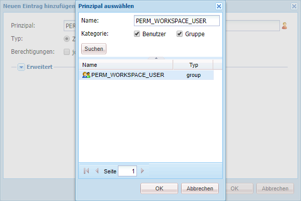

# Generische Schritte zur Anpassung von AEM Forms Workspace {#generic-steps-for-aem-forms-workspace-customization}

Für jede Anpassung gelten die folgenden generischen Schritte:

1. Melden Sie sich bei CRXDE Lite an, indem Sie auf `https://'[server]:[port]'/lc/crx/de/index.jsp` zugreifen.
1. Erstellen Sie einen Ordner `sling:Folder` mit dem Namen `ws` unter `/apps`, falls er noch nicht existiert. Um einen Ordner `sling:Folder` zu erstellen, klicken Sie mit der rechten Maustaste auf den Ordner `apps` und wählen Sie **[!UICONTROL Erstellen]** > **[!UICONTROL Knoten erstellen]**. Geben Sie den Namen als `ws` an, wählen Sie als Typ `sling:Folder` und klicken Sie auf **[!UICONTROL OK]**. Klicken Sie auf **[!UICONTROL Alle speichern]**.
1. Wechseln Sie zu `/apps/ws` und navigieren Sie zur Registerkarte **[!UICONTROL Zugriffssteuerung]**.
1. Wählen Sie die Option **[!UICONTROL Repository]**. Klicken Sie in der Liste **[!UICONTROL Zugriffssteuerung]** auf **[!UICONTROL +]**, um einen Eintrag hinzuzufügen. Klicken Sie erneut auf **[!UICONTROL +]**.
1. Suchen Sie den Prinzipal **PERM_WORKSPACE_USER** und wählen Sie ihn aus.

   

1. Erteilen Sie dem Prinzipal die Berechtigung `jcr:read`.
1. Klicken Sie auf **[!UICONTROL Alle speichern]**.
1. Kopieren Sie die Dateien `GET.jsp`, `index` und `html.jsp` aus dem Ordner `/libs/ws` in den Ordner `/apps/ws`.
1. Kopieren Sie den Ordner `/libs/ws/locales` in den Ordner `/apps/ws`. Klicken Sie auf **[!UICONTROL Alle speichern]**.
1. Aktualisieren Sie die Verweise und relativen Pfade in der Datei `GET.jsp`, wie unten gezeigt, und klicken Sie auf **[!UICONTROL Alles speichern]**.

   ```javascript
   <meta http-equiv="refresh" content="0;URL='/lc/apps/ws/index.html'" />
   ```

1. Führen Sie die folgenden Schritte für CSS-Anpassungen aus:

   1. Navigieren Sie zum Ordner `/apps/ws` und erstellen Sie einen Ordner mit dem Namen `css`.

   1. Erstellen Sie im Ordner `css` eine Datei mit dem Namen `newStyle.css`.

   1. Öffnen Sie `/apps/ws/html`.jsp und ändern Sie von

   ```javascript
   <link lang="en" rel="stylesheet" type="text/css" href="css/style.css" />
   <link lang="en" rel="stylesheet" type="text/css" href="css/jquery-ui.css"/>
   ```

   in

   ```javascript
   <link lang="en" rel="stylesheet" type="text/css" href="../../libs/ws/css/style.css" />
   <link lang="en" rel="stylesheet" type="text/css" href="css/newStyle.css" />
   <link lang="en" rel="stylesheet" type="text/css" href="../../libs/ws/css/jquery-ui.css"/>
   ```

   >[!NOTE]
   >
   >Platzieren Sie den Eintrag für die benutzerdefinierte CSS-Datei hinter demjenigen für die Datei „style.css“, wie oben gezeigt.

1. Ändern Sie in der Datei „apps/ws/html.jsp“ von

   ```jsp
   <script data-main="js/main" src="js/libs/require/require.js"></script>
   ```

   in

   ```jsp
   <script data-main="js/main" src="../../libs/ws/js/libs/require/require.js"></script>
   ```

1. Gehen Sie folgendermaßen vor:

   1. Erstellen Sie in `/apps/ws` einen Ordner mit dem Namen `js`. Klicken Sie auf **[!UICONTROL Alle speichern]**.

   1. Erstellen Sie in `/apps/ws/js` einen Ordner mit dem Namen `libs`. Klicken Sie auf **[!UICONTROL Alle speichern]**.

   1. Kopieren Sie den Ordner `/libs/ws/js/libs/jqueryui` nach `/apps/ws/js/libs`. Klicken Sie auf **[!UICONTROL Alle speichern]**.

1. Führen Sie die folgenden Schritte für HTML-Anpassungen aus:

   1. Erstellen Sie unter `/apps/ws/js` einen Ordner mit dem Namen `runtime`. Klicken Sie auf **[!UICONTROL Alle speichern]**.

   1. Erstellen Sie unter `/apps/ws/js/runtime` einen Ordner mit dem Namen `templates`. Klicken Sie auf **[!UICONTROL Alle speichern]**.

   1. Kopieren Sie `/libs/ws/js/main.js` nach `/apps/ws/js/main.js`.

   1. Kopieren Sie /libs/ws/js/registry.js nach `/apps/ws/js/registry.js`.

1. Klicken Sie auf **[!UICONTROL Alle speichern]**, löschen Sie den Cache und aktualisieren Sie den AEM Forms Workspace.

   Greifen Sie auf die URL `https://'[server]:[port]'/lc/ws` zu und melden Sie sich mit Administrator/Kennwort-Anmeldeinformationen an. Der Browser leitet Sie zu `https://'[server]:[port]'/lc/apps/ws/index.html` weiter.
