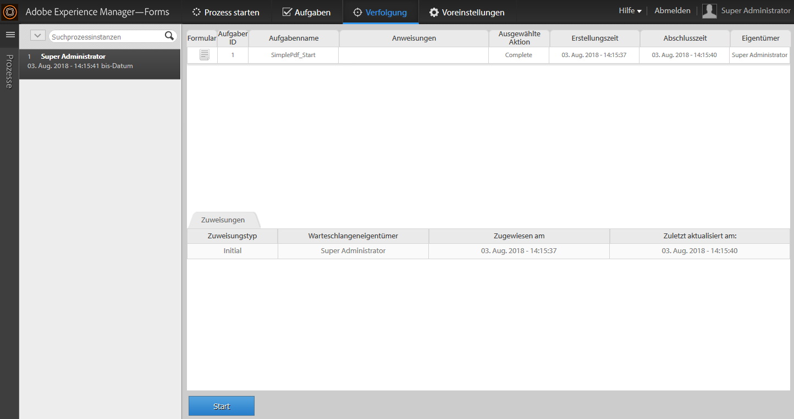
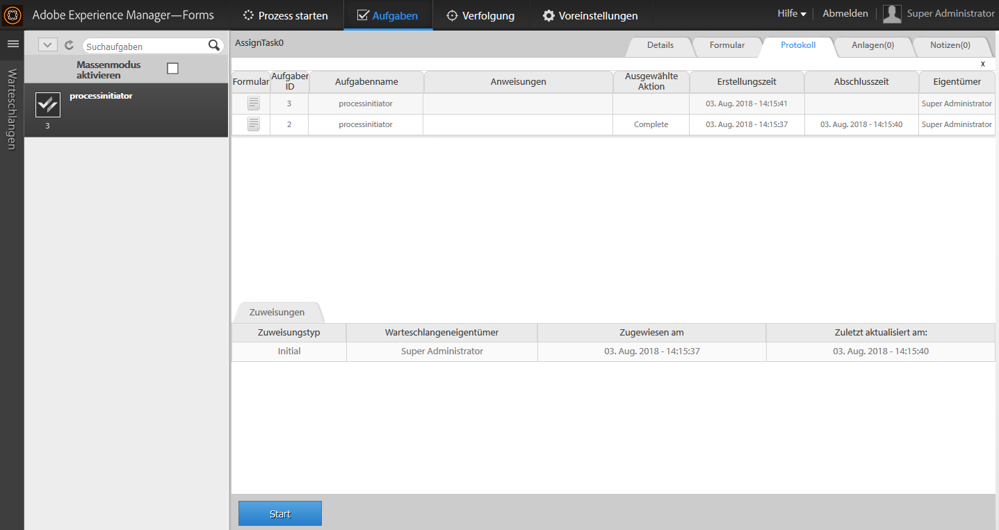

# Starten eines neuen Prozesses mit vorhandenen Prozessdaten in AEM Forms Workspace{#initiating-a-new-process-with-existing-process-data-in-aem-forms-workspace}

Sie können einen neuen Prozess mit den Daten eines vorhandenen Prozesses initiieren. Das Initiieren eines neuen Prozesses auf der Grundlage vorhandener Prozessdaten ist erforderlich, wenn dasselbe Formular häufig verwendet werden muss, wobei sich der Inhalt geringfügig ändert, etwa bei Formularen für bezahlten Urlaub. Mithilfe dieser Funktion können Benutzende Zeit und Mühe sparen, insbesondere, wenn ein umfangreiches Formular für den Prozess ausgefüllt werden muss.

Im Folgenden werden die Schritte zum Initiieren eines neuen Prozesses aus vorhandenen Prozessdaten beschrieben: -

1. Führen Sie eine der folgenden Aktionen aus:

   * Klicken Sie unter „Tracking“ auf die Prozessinstanz, deren Daten verwendet werden sollen. Klicken Sie in der Ansicht des Prozessverlaufs im rechten Bereich auf die Zeile der Aufgabe, die dem Startpunkt entspricht.
   * Wählen Sie unter „Tracking“ eine Suchvorlage aus, um eine Liste der Prozessinstanzen anzuzeigen. Wählen Sie die Instanz aus, deren Daten verwendet werden sollen.
   * Wählen Sie auf der Registerkarte **[!UICONTROL Aufgabenliste]** die Aufgabe aus. Klicken Sie auf die Registerkarte **[!UICONTROL Verlauf]** und wählen Sie die Aufgabe aus, die die Prozessinstanz initiiert hat.

    

1. In der Aufgabenaktionssymbolleiste klicken Sie auf **[!UICONTROL Start]**. Ein adaptives Formular für die neue Prozessinstanz wird mit automatischer Vorbefüllung angezeigt.

1. Aktualisieren Sie die Daten wie erforderlich und klicken Sie auf **[!UICONTROL Abschließen]** oder die entsprechende Schaltfläche im Formular.
