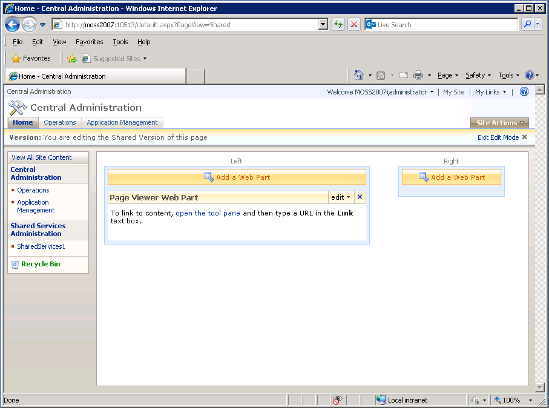
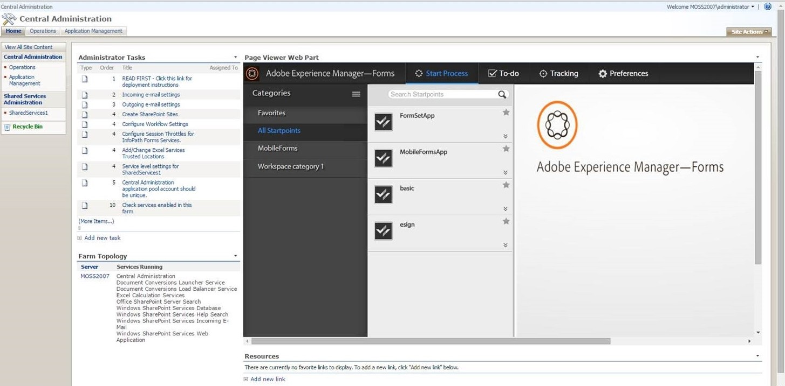

# Integrieren von AEM Forms Workspace in Microsoft Office SharePoint Server{#integrating-aem-forms-workspace-with-microsoft-office-sharepoint-server}

**- Voraussetzungen**

**Vorausgesetztes Wissen**
Bevor Sie AEM Forms Workspace zum SharePoint-Server hinzufügen können, benötigen Sie Zugriff auf SharePoint-Server mit den entsprechenden Berechtigungen. Außerdem müssen Sie die URL für den Zugriff auf Workspace kennen. Bei den folgenden Schritten wird davon ausgegangen, dass Sie mit SharePoint Server vertraut sind. Weitere Informationen zu Webparts in SharePoint Server finden Sie unter „Webparts in Windows SharePoint-Diensten“.

**Benutzerebene**
Anfang

Sie können AEM Forms Workspace als Webpart in Microsoft Office SharePoint Server (z. B. Microsoft Office SharePoint Server 2007) verwenden. Benutzer können auf AEM Forms Workspace zugreifen, indem sie mithilfe eines Webbrowsers eine Verbindung zu Ihrem SharePoint Server herstellen und so eine einheitliche Plattform erhalten. In diesem Artikel lernen Sie die grundlegenden Schritte zum Anzeigen von AEM Forms Workspace als Webpart in Microsoft Office SharePoint Server kennen. Sie können die in diesem Artikel beschriebenen Schritte ausführen, um ein einheitliches Erlebnis zu bieten, sodass Benutzende, die eine Verbindung zu Ihrem SharePoint-Server herstellen, von demselben Port aus auf AEM Forms Workspace zugreifen können.

>[!NOTE]
>
>Die Schritte, die in diesem Artikel aufgeführt sind, gelten für Microsoft SharePoint Server 2007. Sie können auch HTML Workspace mit anderen unterstützten Versionen von Microsoft SharePoint konfigurieren.

## Integrieren von AEM Forms Workspace in Microsoft Office SharePoint Server 2007 {#integrate-aem-forms-workspace-with-microsoft-office-sharepoint-server}

Führen Sie die folgenden Schritte aus, um AEM Forms Workspace in einen Webpart zu integrieren:

1. Navigieren Sie in einem Webbrowser zur SharePoint-Website, wie etwa `https://[myMOSSserver]:44299/default.aspx`, wobei `[myMOSSserver]` für den Namen oder die IP-Adresse von Sharepoint Server steht.

   >[!NOTE]
   >
   >44299 ist die Standard-Port-Nummer für den SharePoint-Server. Die Port-Nummer hängt von Ihrer Installation des SharePoint-Servers ab.

1. Klicken Sie oben rechts auf der Web-Seite auf **Site-Aktionen** und wählen Sie **Seite bearbeiten** aus.
1. Klicken Sie auf die Schaltfläche **Webpart hinzufügen.**
1. Wählen Sie im Web-Seiten-Dialogfeld „Webparts hinzufügen“ unter „Verschiedenes“ die Option **Seiten-Viewer-Webpart** aus und klicken Sie anschließend auf **Hinzufügen**.
1. Klicken Sie im Feld „Seiten-Viewer-Webpart“ auf **Bearbeiten** und wählen Sie **Freigegebenen Webpart ändern**.

   >[!NOTE]
   >
   >Das Feld „Seiten-Viewer-Webpart“ wird unter der Schaltfläche **Webpart hinzufügen**, auf die Sie in Schritt 3 geklickt haben, wie in der folgenden Abbildung dargestellt (Abbildung 1):

   

   Abbildung 1. – Das Feld „Seiten-Viewer-Webpart“ in Microsoft Office SharePoint Server

1. Führen Sie auf der Seite „Seiten-Viewer“ die folgenden Aufgaben aus:

   1. Geben Sie im Dialogfeld „Link“ die URL von AEM Forms Workspace ein, wie etwa `https://[AEM_forms_Server]:8080/lc/ws`, wobei `[AEM_forms_Server]` die IP-Adresse oder den Namen des AEM-Formular-Servers darstellt.
   1. Klicken Sie auf **Erscheinungsbild** und ändern Sie Höhe, Breite und Titel, sodass Sie die gesamte Workspace-Benutzeroberfläche sehen können. Sie können beispielsweise Höhe und Breite auf 15 bzw. 28 cm festlegen.
   1. Klicken Sie auf **Link testen**. Es wird ein neues Webbrowser-Fenster mit Workspace angezeigt.
   1. (Optional) Klicken Sie auf **Layout** und ändern Sie das Layout von Workspace im Webpart.
   1. (Optional) Klicken Sie auf **Erweitert** und ändern Sie andere Einstellungen, z. B. die Beschreibung und ob Workspace im Webpart minimiert oder geschlossen werden kann.

      Klicken Sie auf **Übernehmen**.

1. Klicken Sie auf **Bearbeitungsmodus beenden** und vergewissern Sie sich, dass Sie auf Workspace zugreifen können.

Nachdem Sie die oben genannten Schritte ausgeführt haben, sieht Ihre SharePoint-Site ähnlich wie in der folgenden Abbildung (Abbildung 2) gezeigt aus:

Abbildung 2 – AEM Forms Workspace in Microsoft Office SharePoint Server integriert
