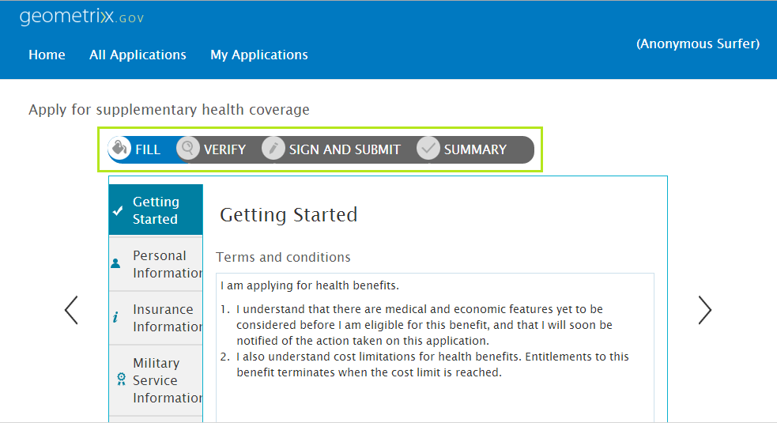

# Einführung in die mehrteilige Formularsequenz{#introduction-to-multi-step-form-sequence}

 Adobe empfiehlt, die modernen und erweiterbaren [Kernkomponenten](https://experienceleague.adobe.com/docs/experience-manager-core-components/using/adaptive-forms/introduction.html?lang=de) zur Datenerfassung zu verwenden, um [neue adaptive Formulare zu erstellen](/help/forms/using/create-an-adaptive-form-core-components.md) oder [adaptive Formulare zu AEM Sites-Seiten hinzuzufügen](/help/forms/using/create-or-add-an-adaptive-form-to-aem-sites-page.md). Diese Komponenten stellen einen bedeutenden Fortschritt bei der Erstellung adaptiver Formulare dar und sorgen für beeindruckende Anwendererlebnisse. In diesem Artikel wird ein älterer Ansatz zum Erstellen adaptiver Formulare mithilfe von Foundation-Komponenten beschrieben. 

## Gilt für {#applies-to}

Diese Dokumentation gilt für **AEM 6.5 LTS Forms**.

Die Dokumentation zu AEM as a Cloud Service finden Sie unter [AEM Forms auf Cloud Service](https://experienceleague.adobe.com/docs/experience-manager-cloud-service/content/forms/adaptive-forms-authoring/authoring-adaptive-forms-foundation-components/configure-layout-of-an-adaptive-form/introduction-form-sequence.html?lang=de).

Mit adaptiven Formularen können Formularautorinnen und -autoren ein müheloses, mehrstufiges Datenerfassungserlebnis schaffen. Es bietet integrierte Unterstützung für das Erstellen mehrerer Panels und das Verknüpfen jedes Panels mit verschiedenen Navigationsmustern. Formularautorinnen und -autoren können Formularfelder in logischen Abschnitten gruppieren und eine Gruppe als Bedienfeld darstellen. Die gesamte Navigation zwischen den Bedienfeldern wird mithilfe des Bedienfeldlayouts gesteuert. Autoren können die Bedienfelder in unterschiedlichen Layouts anordnen, beispielsweise nacheinander mithilfe des Assistentenlayouts, oder ad hoc mithilfe des Registerkartenlayouts. Informationen zu Panel-Layouts finden Sie unter [Layout-Möglichkeiten für adaptive Formulare](../../forms/using/layout-capabilities-adaptive-forms.md).

Beim typischen Ausfüllen eines Formulars sind mehr Schritte erforderlich als nur die Erfassung von Daten. Eine vollständige Formularübermittlung kann nämlich andere Schritte umfassen, z. B. das digitale Signieren des Formulars, die Überprüfung der im Formular eingegebenen Informationen und die Verarbeitung von Zahlungen. Sie unterscheidet sich von Fall zu Fall.

Wenn in Ihrem Fall für die Datenerfassung bestimmte Schritte ausgeführt werden müssen oder aufgrund von Bestimmungen vorgeschrieben sind, bietet AEM Forms die Möglichkeit, diese allgemeine Struktur bei allen Formularen zu erzwingen. Mit der Implementierung der vorher festgelegten Formularstruktur wird die Sequenz der Schritte für ein Formular definiert. 

Beispiel für eine mehrstufige Formularsequenz

Nehmen wir ein Fallbeispiel, in dem Sie für ein Formular eine Sequenz der Schritte „Ausfüllen“, „Überprüfen“, „Signieren“ und „Bestätigen“ erstellen müssen. Gehen Sie zur Erstellung einer solchen Sequenz wie folgt vor:

1. Definieren Sie eine Formularvorlage und fügen Sie ihr das erforderliche Panel hinzu. Für jeden Schritt der Sequenz sollte ein Panel vorhanden sein. Sie können jedoch untergeordnete Panels in ein Panel einbinden.

   In diesem Beispiel können die folgenden Panels hinzugefügt werden:

   * **Ausfüllen**: Enthält Formularfelder zum Erfassen von Daten. Hier können Sie verschachtelte untergeordnete Panels einfügen, um Abschnitte für verschiedene Arten von Informationen zu erstellen, z. B. persönlicher, familiärer, finanzieller Art usw.

   * **Verify**: Enthält die Komponente **Verify**, die in einem XFA-basierten adaptiven Formular verwendet werden kann. Es werden die Informationen angezeigt, die im Bedienfeld „Fill“ im schreibgeschützten Modus zur Überprüfung erfasst werden.

   * **E-sign**: Enthält die Komponente **Sign**, die in einem XFA-basierten adaptiven Formular verwendet werden kann. Damit werden die folgenden Services zum Signieren bereitgestellt:

     * Adobe Document Cloud eSignature-Services
     * Freihändige Unterschrift

   * **Bestätigung**: Enthält die Komponente **Zusammenfassung**, in der die Übermittlung in einer Meldung bestätigt wird, nachdem der Benutzer das Formular signiert hat und in der Sequenz den Bestätigungsschritt (Zusammenfassung) erreicht hat. Autoren können den Text der Komponente Zusammenfassung konfigurieren, eine Dankesmeldung oder einen Link zur erstellten PDF-Datei anzeigen usw.

1. Wählen Sie für das Layout des Stamm-Panels als **[!UICONTROL Assistent]** aus.
1. Führen Sie die restlichen Schritte aus, damit Sie die Formularvorlage erstellen können. Siehe [Erstellen einer benutzerdefinierten adaptiven Formularvorlage](../../forms/using/custom-adaptive-forms-templates.md)

Nachdem Sie die Formularsequenz in der Formularvorlage definiert haben, können Sie sie verwenden, um Formulare mit der Basisstruktur zu erstellen, die gegenwärtig als Sequenz definiert ist. Sie können das Formular jederzeit an Ihre Anforderungen anpassen.
