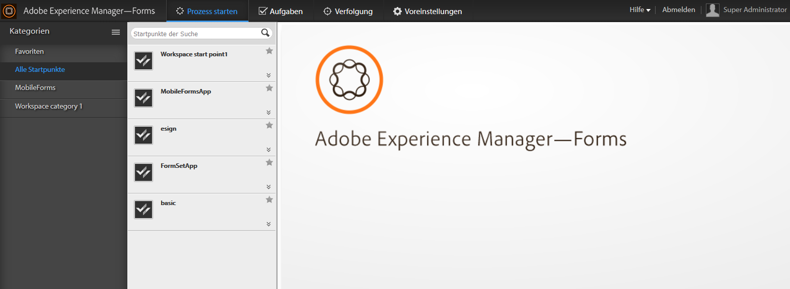

# Einführung in AEM Forms Workspace{#introduction-to-aem-forms-workspace}

Forms Workflow erhöht die Unternehmenseffizienz, indem kritische dokument- und formularbezogene Geschäftsprozesse automatisiert und sichtbar gemacht werden. Mit Process Management-Modulen können Sie optimierte, durchgängige Workflows erstellen - einschließlich Personen, Systemen, Inhalten und Geschäftsregeln -, auf die online oder offline zugegriffen werden kann.Der Forms-Workflow umfasst den AEM Forms-Arbeitsbereich. Mit AEM Forms Workspace kommen neue Funktionen zur Erweiterung, Integration und benutzerfreundlicheren Gestaltung des Arbeitsbereichs hinzu.

AEM Forms Workspace ist mit einer breiteren Palette von Geräten und Formfaktoren kompatibel. Dies ermöglicht die Aufgabenverwaltung auf Clients ohne Flash® Player und Adobe® Reader®. Die Wiedergabe von HTML-Formularen zusätzlich zu PDF-Formularen wird erleichtert.

**Schlüsselfunktionen**:

* Binden Sie Prozessteilnehmerinnen und -teilnehmer unabhängig vom Standort mit dynamischen PDF-Formularen, mobilen Schnittstellen und Web-Anwendungen ein.
* Integrieren Sie mühelos die Workspace-Komponenten in Ihre Web-Anwendungen. Da AEM Forms Workspace eine komponentenbasierte Software ist, lässt sie sich einfach anpassen und wiederverwenden.
* Erweitern Sie mit der AEM Forms Workspace-App Geschäftsprozesse auf Personen mit mobilen Arbeitsplätzen, sowohl online als auch offline.
* Zeigen Sie Berichte an, um Arbeitsrückstände, Warteschlangen und wichtige Leistungsindikatoren (KPIs) zu überwachen. Sie können APIs verwenden, um Daten für die weitergehende Analyse in Reporting-Tools von Drittanbietern zu extrahieren.
