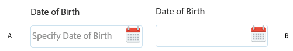

# Platzhaltertext in AEM Forms {#placeholder-text-in-aem-forms}

 Adobe empfiehlt, die modernen und erweiterbaren [Kernkomponenten](https://experienceleague.adobe.com/docs/experience-manager-core-components/using/adaptive-forms/introduction.html?lang=de) zur Datenerfassung zu verwenden, um [neue adaptive Formulare zu erstellen](/help/forms/using/create-an-adaptive-form-core-components.md) oder [adaptive Formulare zu AEM Sites-Seiten hinzuzufügen](/help/forms/using/create-or-add-an-adaptive-form-to-aem-sites-page.md). Diese Komponenten stellen einen bedeutenden Fortschritt bei der Erstellung adaptiver Formulare dar und sorgen für beeindruckende Anwendererlebnisse. In diesem Artikel wird der ältere Ansatz zum Erstellen adaptiver Formulare mithilfe von Foundation-Komponenten beschrieben. 

Der Platzhaltertext stellt ein Wort oder einen kurzen Satz dar. Er soll Benutzenden bei der Dateneingabe helfen, wenn das Steuerelement keinen Wert hat. Ein Platzhaltertext könnte ein Beispielwert oder eine kurze Beschreibung des erwarteten Formats sein. Der Platzhaltertext wird gezeigt, bevor der Benutzer einen Text eingibt, und entfernt, wenn der Benutzer einen Wert eingibt oder auswählt.

>[!NOTE]
>
>Der Platzhaltertext muss, falls angegeben, einen Wert enthalten, der keine neuen Zeilenzeichen enthält.

**A.** Datumskomponente mit Platzhaltertext **B.** Datumskomponente ohne Platzhaltertext

AEM Forms unterstützt Platzhaltertext für die Felder vom Typ „Kennwort“, „Datumsauswahl“, „Numerisches Feld“ und „Textfeld“.\
Platzhaltertexte werden für das native HTML5-Datum-Widget nicht unterstützt. Angeben eines Platzhaltertexts:

1. Klicken Sie mit der rechten Maustaste auf eine Komponente, die Platzhaltertext unterstützt, und klicken Sie dann auf **Bearbeiten**. Das Dialogfeld „Komponente bearbeiten“ wird angezeigt.

1. Öffnen Sie die Registerkarte **Titel und Text**.
1. Geben Sie ein Wort oder einen kurzen Satz im Feld **Platzhaltertext** ein. Klicken Sie auf **OK**.

>[!NOTE]
>
>Platzhaltertext wird in Microsoft Internet Explorer 9 nicht unterstützt.
