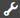

# Trennzeichenkomponenten in adaptiven Formularen{#separator-component-in-adaptive-forms}

 Adobe empfiehlt, die modernen und erweiterbaren [Kernkomponenten](https://experienceleague.adobe.com/docs/experience-manager-core-components/using/adaptive-forms/introduction.html?lang=de) zur Datenerfassung zu verwenden, um [neue adaptive Formulare zu erstellen](/help/forms/using/create-an-adaptive-form-core-components.md) oder [adaptive Formulare zu AEM Sites-Seiten hinzuzufügen](/help/forms/using/create-or-add-an-adaptive-form-to-aem-sites-page.md). Diese Komponenten stellen einen bedeutenden Fortschritt bei der Erstellung adaptiver Formulare dar und sorgen für beeindruckende Anwendererlebnisse. In diesem Artikel wird ein älterer Ansatz zum Erstellen adaptiver Formulare mithilfe von Foundation-Komponenten beschrieben. 

Sie können die Trennzeichenkomponente verwenden, um Bereiche eines Formulars visuell zu trennen. Sie können die Gesamtdarstellung und den Stil einer Trennzeichenkomponente definieren, indem Sie die folgenden Eigenschaften einer Trennzeichenkomponente angeben:

* **Elementname:** Gibt den Namen der Komponente an. Die SOM-Ausdrücke richten sich an die Komponente mit einem Wert, der im Feld „Elementname“ angegeben ist.
* **Stärke:** Gibt die Stärke der Trennzeichenkomponente in Pixel an.

* **CSS-Klasse:** Gibt die benutzerdefinierte CSS-Klasse für die Trennzeichenkomponente an.

* **Inline-Stile:** Mit AEM Forms können Sie jetzt CSS-Inline-Stile auf individuelle adaptive Formularkomponenten anwenden und eine Vorschau der Änderungen in Echtzeit anzeigen.

Im Layout-Modus können Sie die Anzahl der Spalten festlegen, die die Trennzeichenkomponente umfasst. Weitere Informationen finden Sie unter [Verwenden des Layout-Modus, um die Größe von Komponenten anzupassen](../../forms/using/resize-using-layout-mode.md).

Angeben der Eigenschaften einer Trennzeichenkomponente:

1. Wählen Sie eine Trennzeichenkomponente und dann  aus. Die Eigenschaften werden in der Seitenleiste angezeigt.
1. Klicken Sie auf eine Registerkarte im Abschnitt „Inline-CSS-Eigenschaften“, um CSS-Eigenschaften festzulegen. Beispiel: a. Klicken Sie auf der Registerkarte Feld auf **Element hinzufügen**. Es wird eine Zeile mit zwei Feldern hinzugefügt.
1. Geben Sie im ersten Feld von links eine CSS3-Eigenschaft an, die Sie anwenden möchten. Beispielsweise **Rahmen**. Sie können eine Eigenschaft auch auswählen, indem Sie auf den Pfeil nach unten klicken. Die Dropdown-Liste ist nicht vollständig und Sie können einen beliebigen unterstützten CSS3-Eigenschaftennamen in dieses Feld eingeben.
1. Geben Sie im angrenzenden Feld einen gültigen Wert für die angegebene CSS3-Eigenschaft an. Beispielsweise **3px solid black**.
1. Klicken Sie auf **Element hinzufügen**, um eine andere Eigenschaft und deren Wert anzugeben.
1. Klicken Sie auf **Vorschau**, um eine Vorschau der Änderungen im Formular anzuzeigen.
1. Klicken Sie auf **OK**, um die Änderungen zu bestätigen, oder auf **Abbrechen**, um das Dialogfeld ohne Änderungen zu schließen.
