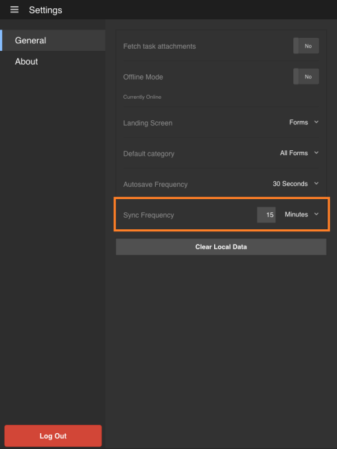

# Synchronisieren der App{#synchronizing-the-app}

## Synchronisieren der App {#synchronizing-the-app-1}

Die Formulare in Ihrer App werden vom AEM Forms-Server heruntergeladen. Die Formulare werden unter den Registerkarten „Aufgaben“ und „Formulare“ heruntergeladen. Aus Formularen erstellte Entwürfe werden auf der Registerkarte „Entwürfe“ heruntergeladen, und aus Aufgaben erstellte Entwürfe werden auf der Registerkarte „Aufgaben“ heruntergeladen. Für ein eigenständiges Formular auf dem OSGi-Server werden Formulare und Entwürfe auf den Registerkarten „Formulare“ bzw. „Entwürfe“ heruntergeladen.

Wenn Sie ein Formular ausfüllen und absenden, wird das Formular sofort wieder auf den AEM-Formular-Server hochgeladen, sofern die App online ist. Die Formulare werden beim Synchronisieren der App vom Server abgerufen. Die Entwürfe werden jedoch sofort mit dem Server synchronisiert, wenn die App online ist.

Wenn Sie mit dem AEM Forms-Server online sind, wird Ihre App standardmäßig alle 15 Minuten synchronisiert. Sie haben jedoch die Möglichkeit, die Synchronisierungsfrequenz zu ändern. Alternativ können Sie die Anwendung jederzeit manuell synchronisieren.

**Manuelles Synchronisieren der App**

Wählen Sie in der rechten unteren Ecke des Startbildschirms die Synchronisierungsschaltfläche  aus.

**Ändern der Synchronisierungsfrequenz**

1. Um zum Einstellungsbildschirm zu gelangen, wählen Sie in der linken oberen Ecke des Startbildschirms die Menüschaltfläche und dann **Einstellungen** aus.
1. Wählen Sie im Einstellungsbildschirm die Registerkarte „Allgemein“ aus.

   

1. Wählen Sie unter der Option „Synchronisierungsfrequenz“ den Wert rechts neben der Synchronisierungsfrequenz aus.
1. Wählen Sie in der Dropdown-Liste die neue Synchronisierungsfrequenz aus.

### Technische Spezifikationen {#technical-specifications}

* Die Hauptlogik für die Übermittlung der Offline-App-Daten an den AEM-Formular-Server ist in „runtime/offline/util/offline.js“ enthalten.
* In der .js-Datei der Aufruf von processOfflineSubmittedSavedTasks(..) sendet die gespeicherten/gesendeten Aufgaben an den Server. Er behandelt auch etwaige Fehler oder Konflikte im Synchronisierungsprozess. Wenn die Übermittlung einer Aufgabe fehlschlägt, wird die Aufgabe in der App als fehlgeschlagen markiert. Darüber hinaus verbleibt die Aufgabe in Ihrem Postausgang.
* Die Funktionen „syncSubmittedTask()“ und „syncSavedTask()“ führen Vorgänge für einzelne Aufgaben durch.
* Der Aufruf der Funktion „processOfflineSubmittedSavedTasks()“ wird von der Aufgabenlistenkomponente initiiert, nachdem jemand die Synchronisierung des Offline-Status mit dem Server auswählt oder eine automatische Synchronisierung durch den Hintergrund-Thread erfolgt.
