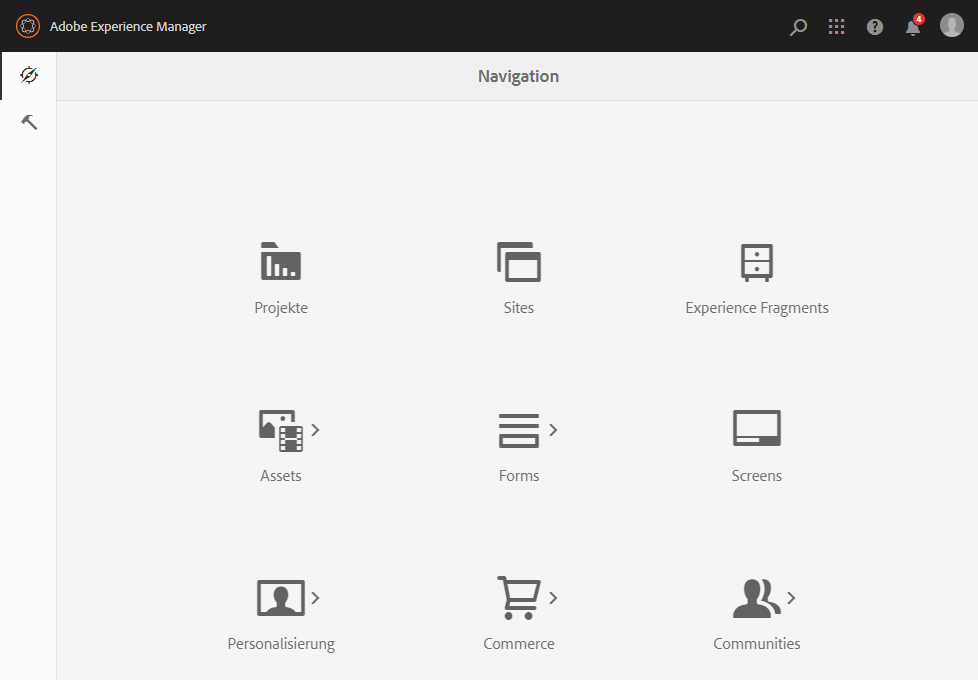

# Admin Consoles{#admin-consoles}

Die Möglichkeit, über die Admin Consoles zur klassischen Benutzeroberfläche zu wechseln, ist standardmäßig deaktiviert. Daher werden die Popup-Symbole, die beim Bewegen des Mauszeigers über bestimmte Konsolensymbole angezeigt wurden und den Zugriff auf die klassische Benutzeroberfläche ermöglichten, nicht mehr angezeigt.

Jede Konsole, die unter `/libs/cq/core/content/nav` über eine klassische Benutzeroberfläche verfügt, kann einzeln wieder aktiviert werden. Die Option **Klassische Benutzeroberfläche** wird für das Konsolensymbol dann wieder angezeigt, wenn Sie den Mauszeiger darüber bewegen.

In diesem Beispiel aktivieren wir die klassische Benutzeroberfläche wieder für die Sites-Konsole.

1. Suchen Sie in CRXDE Lite nach dem Knoten für die Admin Console, für die Sie die klassische Benutzeroberfläche wieder aktivieren möchten. Sie finden ihn hier:

   `/libs/cq/core/content/nav`

   Beispiel

   [`https://localhost:4502/crx/de/index.jsp#/libs/cq/core/content/nav`](https://localhost:4502/crx/de/index.jsp#/libs/cq/core/content/nav)

1. Wählen Sie den entsprechenden Knoten der Konsole aus, für die Sie die klassische Benutzeroberfläche wieder aktivieren möchten. In diesem Beispiel aktivieren wir die klassische Benutzeroberfläche wieder für die Sites-Konsole.

   `/libs/cq/core/content/nav/sites`

1. Erstellen Sie eine Überlagerung mit der Option **Überlagerungsknoten**. Beispiel:

   * **Pfad**: `/apps/cq/core/content/nav/sites`
   * **Pfad für Überlagerung**: `/apps/`
   * **Knotentypen abgleichen**: aktiv (aktivieren Sie das Kontrollkästchen)

1. Fügen Sie dem überlagerten Knoten die folgende boolesche Eigenschaft hinzu:

   `enableDesktopOnly = {Boolean}true`

1. Die Option **Klassische Benutzeroberfläche** ist in der Admin Console wieder als Popover-Option verfügbar.

   

Wiederholen Sie diese Schritte für jede Konsole, für die Sie den Zugriff auf die klassische Benutzeroberfläche erneut aktivieren möchten.
