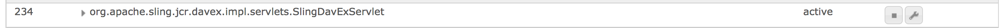

# Aktivieren von CRXDE Lite in AEM{#enabling-crxde-lite-in-aem}

Damit AEM-Installationen so sicher wie möglich sind, wird gemäß der Sicherheitsprüfliste empfohlen, in Produktionsumgebungen [WebDAV zu deaktivieren](/help/sites-administering/security-checklist.md#disable-webdav).

Allerdings hängt CRXDE Lite davon ab, dass das Paket `org.apache.sling.jcr.davex` ordnungsgemäß funktioniert, weshalb durch die Deaktivierung von WebDAV effektiv auch CRXDE Lite deaktiviert wird.

Wenn dies eintritt, wird beim Browsen zu `https://serveraddress:4502/crx/de/index.jsp` ein leerer Stammknoten angezeigt und alle HTTP-Anforderungen zu CRXDE Lite-Ressourcen schlagen fehl:

```xml
404 Resource at '/crx/server/crx.default/jcr:root/.1.json' not found: No resource found
```

Diese Empfehlung dient zwar dazu, Angriffsflächen so weit wie möglich zu minimieren, dennoch müssen Systemadmins manchmal vielleicht auf CRXDE Lite zugreifen, um Inhalte zu durchsuchen oder Probleme von Produktionsinstanzen zu debuggen.

Sie können CRXDE Lite entweder mit [OSGi-Einstellungen](#enabling-crxde-lite-osgi) oder mit einem [cURL-Befehl](#enabling-crxde-lite-curl) aktivieren.

>[!WARNING]
>
>Aufgrund leichter Unterschiede in der Funktionsweise dieser Methoden sollten Sie ***entweder*** OSGI ***oder*** cURL verwenden.
>
>Die beiden Methoden sind ***nicht*** austauschbar.

## Aktivieren von CRXDE Lite mit OSGI {#enabling-crxde-lite-osgi}

Wenn CRXDE Lite deaktiviert ist, können Sie es wieder aktivieren, indem Sie wie folgt vorgehen:

1. Gehen Sie zur OSGi-Komponentenkonsole auf `http://localhost:4502/system/console/components`
1. Suchen Sie nach der folgenden Komponente:

   * `org.apache.sling.jcr.davex.impl.servlets.SlingDavExServlet`

1. Klicken Sie auf das Schraubenschlüsselsymbol daneben, um die Konfigurationsoptionen anzuzeigen:

   

1. Erstellen Sie die folgende Konfiguration:

   * **Stammverzeichnis:** `/crx/server`
   * Markieren Sie das Kästchen unter **Absolute URIs verwenden**.

1. Wenn Sie mit der Verwendung von CRXDE Lite fertig sind, stellen Sie sicher, dass Sie WebDAV erneut deaktivieren.

## Aktivieren von CRXDE Lite mit cURL {#enabling-crxde-lite-curl}

Sie können CRXDE Lite auch über cURL aktivieren, indem Sie diese beiden Befehle ausführen:

* `create-absolute-uri` aktivieren:

  ```shell
  curl -u admin:admin 'http://localhost:4502/system/console/configMgr/org.apache.sling.jcr.davex.impl.servlets.SlingDavExServlet' --data-raw 'apply=true&action=ajaxConfigManager&%24location=&dav.create-absolute-uri=true&propertylist=dav.create-absolute-uri'
  ```

* `alias` definieren:

  ```shell
  curl -u admin:admin 'http://localhost:4502/system/console/configMgr/org.apache.sling.jcr.davex.impl.servlets.SlingDavExServlet' --data-raw 'apply=true&action=ajaxConfigManager&%24location=&alias=/crx/server&propertylist=alias'
  ```

## Sonstige -Ressourcen {#other-resources}

Weitere Informationen zu den Sicherheitsfunktionen von AEM 6 finden Sie auf den folgenden Seiten:

* [Die AEM-Sicherheitsprüfliste](/help/sites-administering/security-checklist.md)
* [Ausführung von AEM im produktionsbereiten Modus](/help/sites-administering/production-ready.md)
