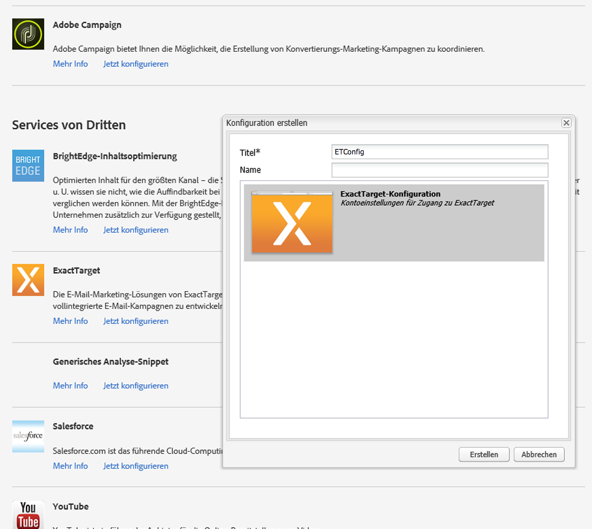
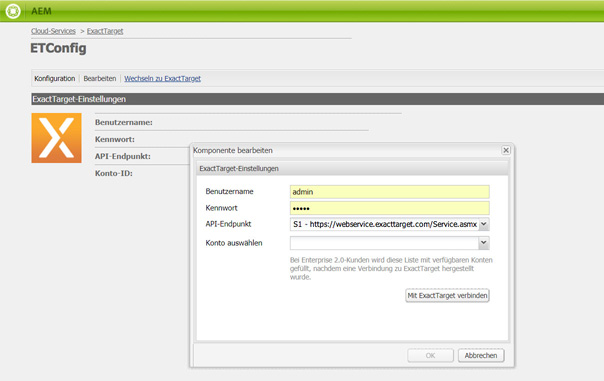
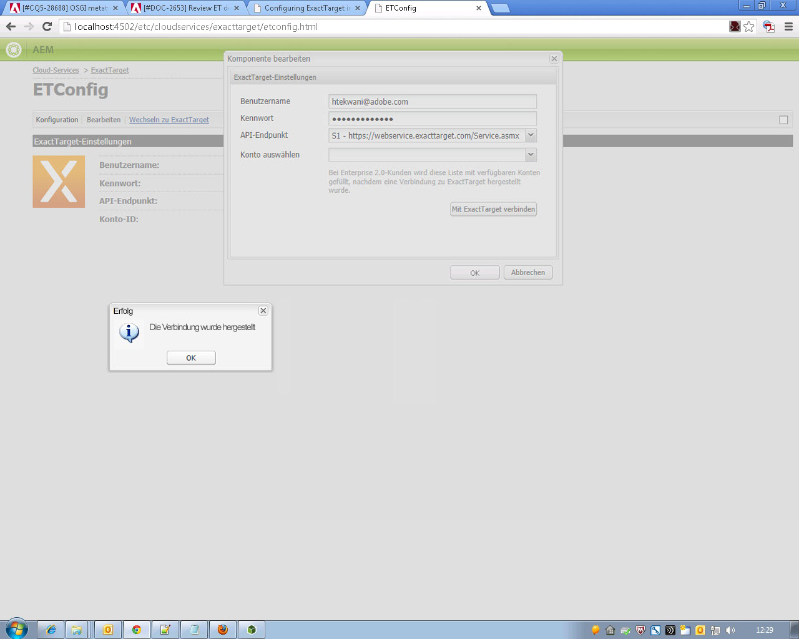
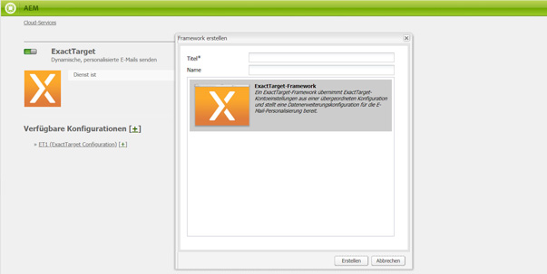
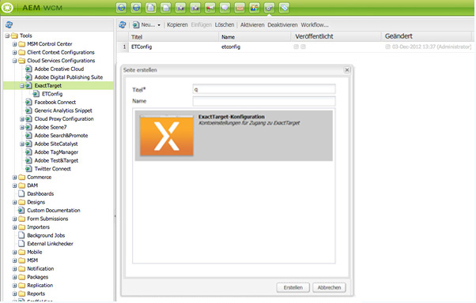

# Integrieren mit ExactTarget{#integrating-with-exacttarget}

Durch die Integration von Adobe Experience Manager (AEM) mit ExactTarget können Sie in AEM erstellte E-Mails über ExactTarget verwalten und versenden. Außerdem können Sie die Lead-Management-Funktionen von ExactTarget über AEM-Formulare auf AEM-Seiten verwenden.

Die Integration bietet die folgenden Funktionen:

* Die Möglichkeit, E-Mails in AEM zu erstellen und zur Verteilung in Exact Target zu veröffentlichen.
* Die Möglichkeit, die Aktion eines AEM Formulars festzulegen, um einen Exact Target-Abonnierenden zu erstellen.

Nachdem ExactTarget konfiguriert wurde, können Sie Newsletter oder E-Mails in ExactTarget veröffentlichen. Siehe [Veröffentlichen von Newslettern in einem E-Mail-Dienst](/help/sites-authoring/personalization.md).

## Erstellen einer ExactTarget-Konfiguration {#creating-an-exacttarget-configuration}

ExactTarget-Konfigurationen können über Cloud-Services oder Tools hinzugefügt werden. Beide Methoden werden in diesem Abschnitt beschrieben.

### Konfigurieren von ExactTarget über Cloud-Services {#configuring-exacttarget-via-cloudservices}

So erstellen Sie eine ExactTarget-Konfiguration in Cloud Services:

1. Klicken Sie auf der Startseite auf **Cloud Services**. (Oder gehen Sie direkt zu `https://<hostname>:<port>/etc/cloudservices.html`.)
1. Klicken Sie auf **ExactTarget** und dann auf **Konfigurieren**. Das ExactTarget-Konfigurationsfenster wird geöffnet.

   

1. Geben Sie einen Titel und optional einen Namen ein und klicken Sie auf **Erstellen**. Das Konfigurationsfenster **ExactTarget-Einstellungen** wird geöffnet.

   

1. Geben Sie den Benutzernamen und das Kennwort ein und wählen Sie einen API-Endpunkt aus (z. B. **https://webservice.exacttarget.com/Service.asmx**).
1. Klicken Sie auf **Verbindung zu ExactTarget herstellen.** Wenn Sie eine erfolgreiche Verbindung hergestellt haben, wird ein Erfolgsdialogfeld angezeigt. Klicken Sie auf **OK**, um das Fenster zu schließen.

   

1. Wählen Sie ein Konto aus, falls verfügbar. Das Konto richtet sich an Kundschaft von Enterprise 2.0. Klicken Sie auf **OK**.

   ExactTarget wurde konfiguriert. Sie können die Konfiguration bearbeiten, indem Sie auf **Bearbeiten** klicken. Sie können auf ExactTarget zugreifen, indem Sie auf **Wechseln zu ExactTarget** klicken.

1. AEM bietet jetzt eine Datenerweiterungsfunktion. Sie können Spalten zur Datenerweiterung in ExactTarget importieren. Klicken Sie zur Konfiguration auf das Pluszeichen (+), das neben der erfolgreich erstellten ExactTarget-Konfiguration angezeigt wird. Jede der vorhandenen Datenerweiterungen kann aus der Dropdown-Liste ausgewählt werden. Weitere Informationen zum Konfigurieren von Datenerweiterungen finden Sie unter [ExactTarget-Dokumentation](https://help.salesforce.com/s/articleView?id=sf.mc_es_data_extension_data_relationships_classic.htm&type=5).

   Importierte Datenerweiterungsspalten können Sie später über die Komponente **Text und Personalisierung** nutzen.

   

### Konfigurieren von ExactTarget über Tools {#configuring-exacttarget-via-tools}

So erstellen Sie eine ExactTarget-Konfiguration über die Tools:

1. Klicken Sie auf der Startseite auf **Tools**. Oder navigieren Sie über `https://<hostname>:<port>/misadmin#/etc` direkt dorthin.
1. Wählen Sie **Tools** > **Cloud Service-Konfigurationen** > **ExactTarget** aus.
1. Klicken Sie auf **Neu**, um das Fenster **Seite erstellen** zu öffnen.

   

1. Geben Sie den **Titel** und optional den **Namen** ein, und klicken Sie auf **Erstellen**.
1. Geben Sie die Konfigurationsinformationen ein, wie in Schritt 4 des vorherigen Verfahrens beschrieben. Befolgen Sie diesen Vorgang, um die Konfiguration von ExactTarget abzuschließen.

### Hinzufügen mehrerer Konfigurationen {#adding-multiple-configurations}

So fügen Sie mehrere Konfigurationen hinzu:

1. Klicken Sie auf der Startseite auf **Cloud Services** und dann auf **ExactTarget**. Klicken Sie auf **Konfigurationen anzeigen**, was eingeblendet wird, wenn mindestens eine ExactTarget-Konfiguration verfügbar ist. Alle verfügbaren Konfigurationen werden aufgelistet.
1. Klicken Sie auf das Pluszeichen **(+)** neben „Verfügbare Konfigurationen“. Das Fenster **Konfigurationen erstellen** wird geöffnet. Führen Sie die Schritte des vorherigen Konfigurationsverfahrens aus, um eine Konfiguration zu erstellen.
