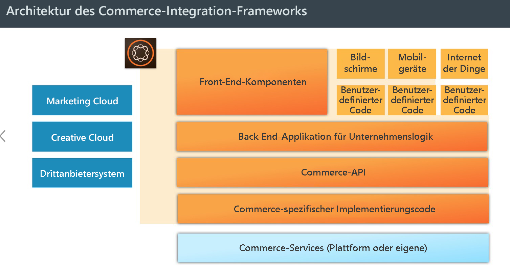
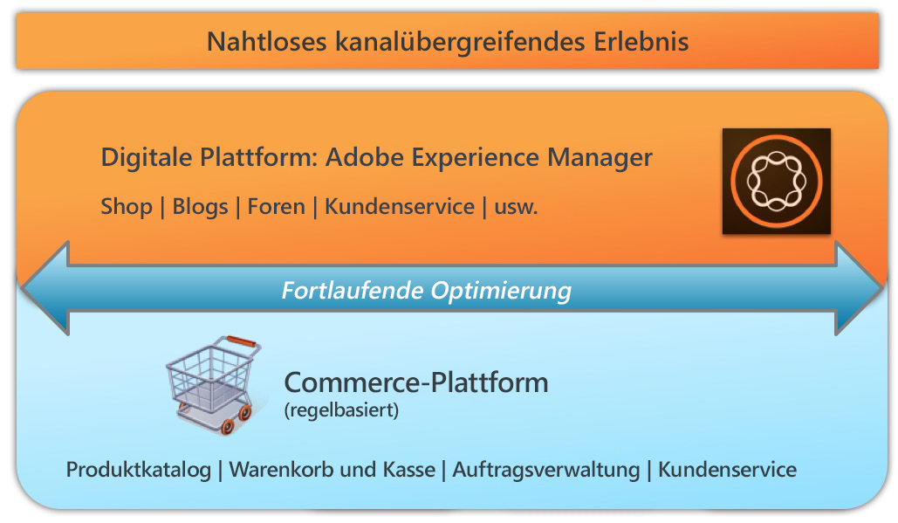

# AEM Commerce – Einhaltung der DSGVO{#aem-commerce-gdpr-readiness}

>[!IMPORTANT]
>
>Die DSGVO dient in den folgenden Abschnitten als Beispiel, die jeweiligen Informationen gelten jedoch für alle Datenschutzvorschriften und -bestimmungen wie DSGVO, CCPA usw.

Die Datenschutz-Grundverordnung der Europäischen Union ist seit Mai 2018 in Kraft. Weitere Informationen finden Sie auf der [DSGVO-Seite im Adobe Privacy Center](https://business.adobe.com/de/privacy/general-data-protection-regulation.html).

>[!NOTE]
>
>Weitere Informationen finden Sie unter [AEM – Einhaltung der DSGVO](/help/managing/data-protection-and-privacy.md).

Bei den vorkonfigurierten Commerce-Integrationen von Adobe bildet AEM die Ebene für das Kundenerlebnis, auf der Dienste genutzt und Daten zurück an die an Kunden gerichtete Commerce-Plattform übermittelt werden, die in einem Headless-Modus ausgeführt wird.

Bei einigen Commerce-Plattformen werden Profilinformationen (`/home/users`) und Commerce-Token (zur Anmeldung bei der Commerce-Plattform) in AEM gespeichert. Informationen zu diesen Nutzungsszenarien finden Sie unter [Handhabung von DSGVO-bezogenen Anfragen zur AEM-Plattform](/help/sites-administering/handling-gdpr-requests-for-aem-platform.md).

## Handhabung von DSGVO-bezogenen Anfragen in AEM Commerce {#handling-gdpr-requests-for-aem-commerce}

Für die Salesforce Commerce Cloud-Integration speichert AEM Commerce keine DSGVO-relevanten Informationen. Leiten Sie die Anfrage an die [Salesforce Cloud](https://documentation.b2c.commercecloud.salesforce.com/DOC1/index.jsp) weiter.

Im Rahmen der Integration von hybris mit HCL WebSphere® Commerce werden bestimmte Daten in AEM gespeichert. Verwenden Sie die [DSGVO-Anweisungen für AEM Platform](/help/sites-administering/handling-gdpr-requests-for-aem-platform.md) und berücksichtigen Sie dabei die folgenden Fragen:

1. **Wo werden meine Daten gespeichert/verwendet?** Zwischengespeicherte Benutzerprofilinformationen wie Name, Commerce-Benutzerkennung, Token, Kennwort und Adressdaten wie in AEM angezeigt.
1. **An wen gebe ich die erfassten DSGVO-Daten weiter?** Jegliche in Bezug auf die DSGVO relevanten Daten, die in AEM Commerce aktualisiert werden, werden nicht gespeichert (mit Ausnahme relevanter Profilinformationen, wie oben beschrieben), jedoch mittels Proxy zurück an die Commerce-Plattform übermittelt.
1. **Wie kann ich meine Benutzerdaten löschen**? Löschen Sie das Benutzerprofil in AEM und rufen Sie die Benutzerlöschung auf der Commerce-Plattform auf.

>[!NOTE]
>
>Konsultieren Sie bei Bedarf das [hybris-Wiki](https://wiki.hybris.com/) oder die [Dokumentation zu HCL WebSphere® Commerce](https://help.hcltechsw.com/commerce/index.html).
