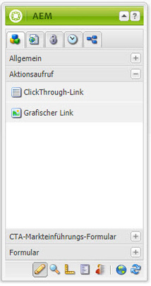
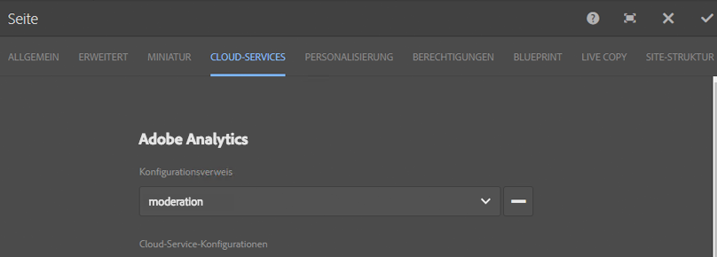

# Integrieren von Landingpages in Adobe Analytics{#integrating-landing-pages-with-adobe-analytics}

AEM hat die Landingpage-Lösung mithilfe des folgenden Aktionsaufrufs in [Adobe Analytics](https://www.omniture.com/de/products/analytics/sitecatalyst) integriert:

1. Clickthrough-Komponente
1. Grafische Link-Komponente

Diese Komponenten legen bestimmte Attribute offen, die über Adobe Analytics-Variablen (Traffic, Konversionsvariablen) und Erfolgsereignisse zugeordnet werden können, um Informationen an Adobe Analytics zu senden.

## Voraussetzungen {#prerequisites}

Adobe empfiehlt Ihnen, die [vorhandene AEM-Adobe Analytics-Integration](/help/sites-administering/adobeanalytics.md) durchzugehen, um deren Funktionsweise zu verstehen.

## Verfügbare Komponenten für die Zuordnung {#components-available-for-mapping}

In AEM können die **Aktionsaufruf**-Komponenten – **ClickThroughLink** und **GraphicalLink** –, die hier im Sidekick angezeigt werden, den Adobe Analytics-Variablen zugeordnet werden.

### Zuordnen von Landingpages zu Adobe Analytics {#mapping-landing-page-components-to-adobe-analytics}

Sie können Landingpages wie folgt zu Adobe Analytics zuordnen:

1. Wählen Sie nach der Erstellung der Adobe Analytics-Konfiguration und der Erstellung eines Frameworks die passende Suite für das Reporting aus dem Dropdown-Menü aus. Hierdurch erfolgt das Abrufen der Adobe Analytics-Variablen und ihre Anzeige in der Inhaltssuche.
1. Ziehen Sie CTA-Komponenten (Handlungsaufruf, Call to Action) Ihren Anforderungen entsprechend per Drag-and-Drop aus dem Sidekick in den Zuordnungsbereich in der Mitte der Seite.

<table>
 <tbody>
  <tr>
   <td><strong>Komponentenname</strong></td>
   <td><strong>Angegebene Attribute</strong></td>
   <td><strong>Bedeutung des Attributs</strong></td>
  </tr>
  <tr>
   <td><strong>CTA-Click-Through-Link</strong></td>
   <td><i>eventdata.clickthroughLinkLabel</i>   </td>
   <td>Das Etikett oder der Text des Links </td>
  </tr>
  <tr>
   <td>  </td>
   <td><i>eventdata.clickthroughLinkTarget</i>   </td>
   <td>Das Ziel, zu dem navigiert wird, wenn Sie auf den Link klicken. </td>
  </tr>
  <tr>
   <td>  </td>
   <td><i>eventdata.events.clickthroughLinkClick</i>   </td>
   <td>Das Klickereignis </td>
  </tr>
  <tr>
   <td><strong>CTA-Grafiklink</strong></td>
   <td><i>eventdata.clicktroughImageLabel</i>   </td>
   <td>Der Titel des CTA Bildes </td>
  </tr>
  <tr>
   <td>  </td>
   <td><i>eventdata.clicktroughImageTarget</i>   </td>
   <td>Das Ziel, zu dem navigiert wird, wenn Sie auf das Bild mit Link klicken.</td>
  </tr>
  <tr>
   <td>  </td>
   <td><i>eventdata.clicktroughImageAsset</i>   </td>
   <td>Der Pfad zum Bild-Asset im Repository </td>
  </tr>
  <tr>
   <td>  </td>
   <td><i>eventdata.events.clicktroughImageClick</i>   </td>
   <td>Das Klickereignis</td>
  </tr>
 </tbody>
</table>

1. Weisen Sie diese offengelegten Attribute beliebigen Adobe Analytics-Variablen aus der Inhaltssuche zu. Das Framework ist nun einsatzbereit.
1. Sie können jetzt eine neue Landingpage oder eine vorhandene Landingpage mit vorhandenen CTA-Komponenten erstellen und über den Sidekick in den **Seiteneigenschaften** auf die Registerkarte **Cloud-Dienste** klicken (wählen Sie in der Touch-optimierten Benutzeroberfläche **Eigenschaften öffnen** aus und klicken Sie auf **Cloud-Dienste**), um das für die Landingpage zu verwendende Framework zu konfigurieren. Wählen Sie das Framework aus der Dropdown-Liste aus.

   

1. Nach dem Konfigurieren des Frameworks für die Landingpage können Sie nun die instrumentierten Komponenten verwenden. Sämtliche Klicks auf den Aktionsaufrufen werden dann in Adobe Analytics aufgezeichnet.
