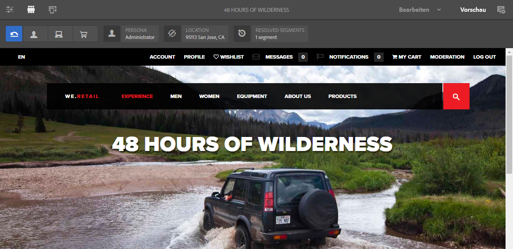
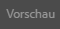

# Vorschau von Seiten mit ContextHub-Daten{#previewing-pages-using-contexthub-data}

In der [ContextHub](/help/sites-developing/contexthub.md)-Symbolleiste werden Daten aus ContextHub Stores angezeigt. Außerdem können mithilfe dieser Leiste Store-Daten bearbeitet werden. Die ContextHub-Symbolleiste ist für die Vorschau von Inhalten nützlich, die durch Daten in einem ContextHub-Store bestimmt werden.

Die Symbolleiste besteht aus einer Reihe von UI-Modi, die ein oder mehrere UI-Module enthalten.

* UI-Modi sind Symbole, die links in der Symbolleiste angezeigt werden. Wenn Sie auf ein Symbol klicken, zeigt die Symbolleiste die UI-Module an, die sie enthält.
* UI-Module zeigen Daten aus einem oder mehreren ContextHub-Stores an. Einige UI-Module ermöglichen es Ihnen auch, Store-Daten zu bearbeiten.

Es werden verschiedene Benutzeroberflächenmodi und -module von ContextHub installiert. Möglicherweise hat Ihr Admin [ContextHub so konfiguriert](/help/sites-developing/ch-configuring.md), dass andere Module als die hier gezeigten dargestellt werden.

## Einblenden der ContextHub-Symbolleiste {#revealing-the-contexthub-toolbar}

Die ContextHub-Symbolleiste ist im Vorschaumodus verfügbar. Die Symbolleiste wird nur für Autoreninstanzen angezeigt, wenn diese Funktion zuvor vom Admin aktiviert wurde.

1. Wählen Sie bei zur Bearbeitung geöffneter Seite in der Symbolleiste auf „Vorschau“.

   

1. Um die Symbolleiste anzuzeigen, klicken Sie auf das Symbol „ContextHub“.

   

## Benutzeroberflächenmodul-Funktionen {#ui-module-features}

Jedes UI-Modul bietet unterschiedliche Funktionen, die folgenden Arten von Funktionen sind jedoch allgemein üblich. Da sich die UI-Module erweitern lassen, können Entwicklerinnen und Entwickler je nach Wunsch weitere Funktionen implementieren.

### Inhalt der Symbolleiste {#toolbar-content}

Mit den Benutzeroberflächenmodulen können in der Symbolleiste Daten aus einem oder mehr ContextHub-Stores eingeblendet werden. Benutzeroberflächenmodule lassen sich anhand ihres Symbols oder Titels identifizieren.

### Popup-Inhalt {#popup-content}

Einige UI-Module zeigen ein überlagertes Popup an, wenn darauf geklickt oder getippt wird. In der Regel enthält das Popup zusätzlich zu den in der Symbolleiste verfügbaren Informationen weitere Daten.

### Popup-Formulare {#popup-forms}

In einigen Popup-Overlays der Benutzeroberflächenmodule befinden sich Formularelemente, mit deren Hilfe Sie Daten im ContextHub Store bearbeiten können. Wenn Seiteninhalt durch die Store-Daten bestimmt wird, können Sie das Formular verwenden und Änderungen am Seiteninhalt beobachten.

### Vollbildmodus {#fullscreen-mode}

Popup-Überlagerungen können ein Symbol enthalten, auf das Sie klicken können, um den Popup-Inhalt so zu erweitern, dass er das gesamte Browser-Fenster oder den Bildschirm einnimmt.

