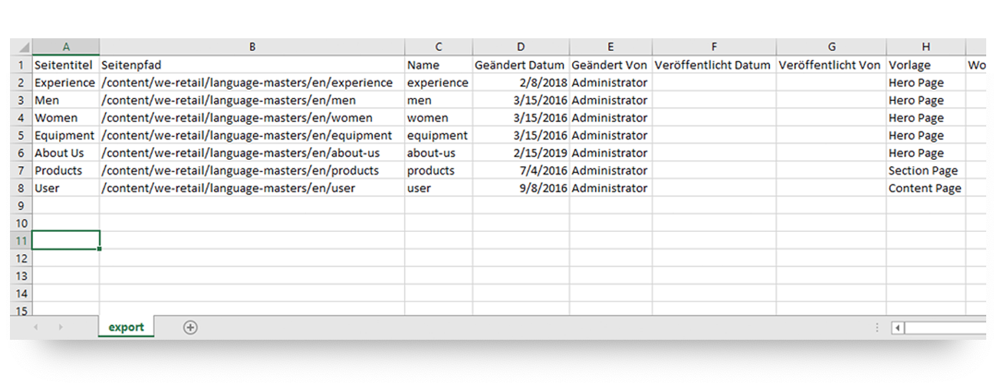
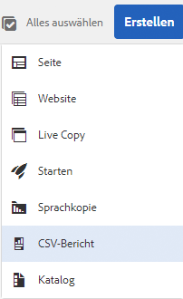
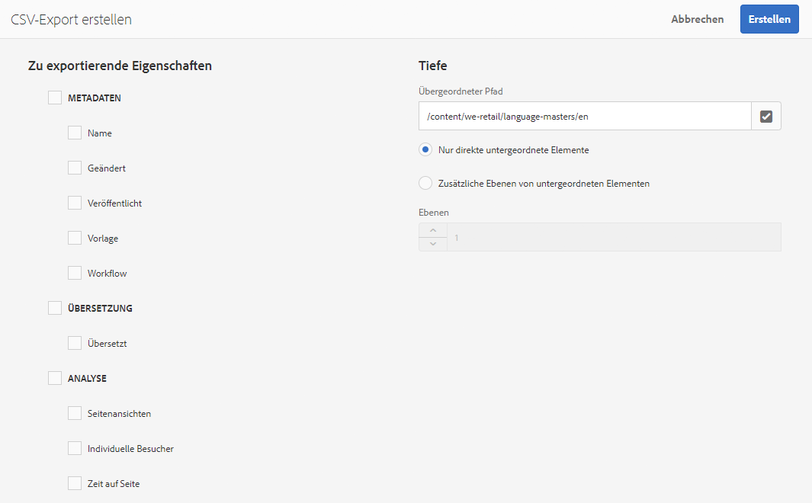

# Exportieren in CSV{#export-to-csv}

Mit **CSV-Bericht erstellen** können Sie Informationen über Ihre Seiten in eine CSV-Datei auf Ihrem lokalen System exportieren.

* Die heruntergeladene Datei erhält den Namen `export.csv`.
* Der Inhalt der Datei hängt davon ab, welche Eigenschaften Sie für den Export auswählen.
* Sie können den Pfad zusammen mit der Tiefe des Exports definieren.

>[!NOTE]
>
>Die Download-Funktion (und der Standard-Zielordner) Ihres Browsers werden verwendet.

Mit dem Assistenten zum **Erstellen eines CSV-Exports** können Sie Folgendes auswählen:

* Zu exportierende Eigenschaften
  * Metadaten
    * Name
    * Geändert
    * Veröffentlicht
    * Vorlage
    * Workflow
  * Übersetzung
    * Übersetzt
  * Analyse
    * Seitenansichten
    * Unique Visitors
    * Zeit auf Seite
* Tiefe
  * Übergeordneter Pfad
  * Nur direkte untergeordnete Elemente
  * Zusätzliche Ebenen von untergeordneten Elementen
  * Ebenen

Die resultierende Datei `export.csv` kann in Excel (oder einer anderen kompatiblen Anwendung) geöffnet werden.

Die Option **CSV-Bericht erstellen** ist in der **Sites-Konsole** (in der Listenansicht) verfügbar. Sie finden die Option im Dropdown-Menü **Erstellen**:

So erstellen Sie einen CSV-Export:

1. Öffnen Sie die **Sites-Konsole** und navigieren Sie ggf. zum gewünschten Speicherort.
1. Wählen Sie in der Symbolleiste **Erstellen** und dann **CSV-Bericht** aus, um den Assistenten zu öffnen:

   

1. Wählen Sie die Eigenschaften aus, die exportiert werden sollen.
1. Wählen Sie **Erstellen**.
