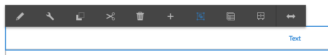

# Verwenden des Rich-Text-Editors zum Erstellen von Inhalten {#use-rich-text-editor-to-author-content}

Der Rich-Text-Editor (RTE) ist ein grundlegender Baustein für die Eingabe von Textinhalten in AEM. Er bildet die Grundlage für verschiedene Komponenten, darunter:

* [Text](https://experienceleague.adobe.com/de/docs/experience-manager-core-components/using/wcm-components/text)
* [Tabelle](https://experienceleague.adobe.com/de/docs/experience-manager-core-components/using/wcm-components/text#table)

## Bearbeiten im Kontext {#in-place-editing}

Bei der Auswahl einer textbasierten Komponente durch einen einfachen Klick wird, wie bei Komponenten üblich, die [Komponenten-Symbolleiste](/help/sites-authoring/editing-content.md#edit-configure-copy-cut-delete-paste) geöffnet.

Wenn Sie erneut klicken oder die Komponente anfangs mit einem langsamen Doppelklick auswählen, wird die Funktion zur Bearbeitung im Kontext geöffnet, die über eine eigene Symbolleiste verfügt. Hier können Sie den Inhalt bearbeiten und grundlegende Formatierungsänderungen vornehmen.

Diese Symbolleiste beinhaltet die folgenden Optionen:

* **Format**: Wählen Sie die Optionen „Fett“, „Kursiv“ und „Unterstrichen“ aus.
* **Listen**: Erstellen Sie Stichpunkt- oder Aufzählungslisten oder legen Sie einen Einzug fest.
* **Hyperlink**
* **Verknüpfung aufheben**
* **Vollbild**
* **Schließen**
* **Speichern**

## Bearbeitung im Vollbildmodus {#full-screen-editing}

Bei textbasierten Komponenten wird durch Antippen des Vollbildmodus in der Symbolleiste  der Rich-Text-Editor geöffnet und der restliche Seiteninhalt ausgeblendet.

Im Vollbildmodus werden alle konfigurierten Optionen angezeigt, die Sie zum Bearbeiten verwenden können. Die Verfügbarkeit der Optionen [hängt von der Konfiguration ab](/help/sites-administering/rich-text-editor.md).

Zusätzliche Optionen für den Rich-Text-Editor sind:

* **Anker**: Erstellen Sie einen Anker im Text, zu dem Sie später eine Verknüpfung/einen Verweis herstellen können.
* **Text links ausrichten**
* **Text zentrieren**
* **Text rechts ausrichten**

Den Vollbildmodus schließen Sie, indem Sie auf das Symbol zum Minimieren klicken.

>[!NOTE]
>
>Das Kopieren verschachtelter Listen aus Microsoft Word in den RTE kann zu inkonsistenten Ergebnissen führen und erfordert möglicherweise eine manuelle Anpassung, nachdem der Text in den RTE eingefügt wurde.
