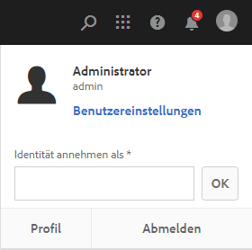
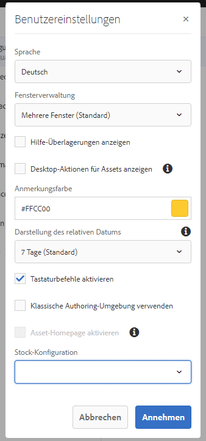

# Konfigurieren der Kontoumgebung{#configuring-your-account-environment}

AEM bietet Ihnen die Möglichkeit, Ihr Konto und bestimmte Aspekte der Autorenumgebung zu konfigurieren.

Mit der Option [Benutzer](/help/sites-authoring/user-properties.md#user-settings) in der [Kopfzeile](/help/sites-authoring/basic-handling.md#the-header) und dem verbundenen Dialogfeld [Benutzereinstellungen](#userpreferences) können Sie Benutzeroptionen bearbeiten.

Beginnen Sie, indem Sie in der Kopfzeile die Option [Benutzer](/help/sites-authoring/user-properties.md#user-settings) aufrufen.

## Benutzereinstellungen {#user-settings}

Im Dialogfeld **Benutzereinstellungen** können Sie auf Folgendes zugreifen:

* Identität annehmen als

  * Mit der Funktion [Identität annehmen als](/help/sites-administering/security.md#impersonating-another-user) können Benutzende im Namen anderer Benutzender arbeiten.

* Profil

  * Über das Profil kann bequem über einen Link auf [Benutzereinstellungen](/help/sites-administering/security.md) zugegriffen werden.

* [Benutzereinstellungen](/help/sites-authoring/user-properties.md#my-preferences)

  * Hier können verschiedene auf den jeweiligen Benutzer zugeschnittene Einstellungen festgelegt werden.

### Benutzereinstellungen {#my-preferences}

Auf das Dialogfeld **Benutzereinstellungen** kann über die Option [Benutzer](/help/sites-authoring/user-properties.md#user-settings) in der Kopfzeile zugegriffen werden.

Jede Benutzerin und jeder Benutzer kann bestimmte Eigenschaften für sich selbst festlegen.

* **Sprache**

  Dadurch wird die Sprache definiert, die für die Benutzeroberfläche der Autorenumgebung verwendet werden soll. Wählen Sie die gewünschte Sprache aus der Liste der verfügbaren Sprachen aus.

  Diese Konfiguration wird auch für die klassische Benutzeroberfläche verwendet.

* **Fensterverwaltung**

  Dies definiert das Verhalten oder das Öffnen von Fenstern. Wählen Sie eine der folgenden beiden Optionen aus:

  * **Mehrere Fenster** (Standard)

    * Seiten werden in einem neuen Fenster geöffnet.

  * **Einfaches Fenster**

    * Seiten werden im aktuellen Fenster geöffnet.

* **Desktop-Aktionen für Assets anzeigen**

  Für diese Option ist die AEM-Desktop-Anwendung erforderlich.

* **Anmerkungsfarbe**

  Dadurch wird die Standardfarbe definiert, die beim Erstellen von Anmerkungen verwendet wird.

  * Klicken Sie auf den Farbblock, damit Sie die Musterauswahl öffnen und eine Farbe auswählen können.
  * Alternativ dazu können Sie in das Feld den Hexcode für die gewünschte Farbe eingeben.

* **Darstellung des relativen Datums**

  Zur besseren Lesbarkeit rendert AEM Daten der letzten sieben Tage als relative Datumsangaben (z. B. „Vor drei Tagen“) und ältere Daten als genaue Datumsangaben (z. B. 20. März 2017).

  Diese Option definiert, wie Daten im System angezeigt werden. Die folgenden Optionen sind verfügbar:

  * **Immer exaktes Datum anzeigen**: Es wird immer das genaue Datum angezeigt (niemals ein relatives Datum).
  * **1 Tag**: Das relative Datum wird für Datumsangaben innerhalb eines Tages angezeigt; ansonsten wird das genaue Datum angegeben.

  * **7 Tage (Standard)**: Das relative Datum wird für Datumsangaben innerhalb eines Zeitraums von sieben Tages angezeigt; ansonsten wird das genaue Datum angegeben.

  * **1 Monat**: Das relative Datum wird für Datumsangaben innerhalb eines Monats angezeigt; ansonsten wird das genaue Datum angegeben.

  * **1 Jahr**: Das relative Datum wird für Datumsangaben innerhalb eines Jahres angezeigt; ansonsten wird das genaue Datum angegeben.

  * **Immer relatives Datum anzeigen**: Es werden niemals genaue Datumsangaben, sondern nur relative Daten angezeigt.

* **Tastaturbefehle aktivieren**

  AEM unterstützt verschiedene Tastaturbefehle, die eine noch effizientere Bearbeitung ermöglichen.

  * [Tastaturbefehle für die Seitenbearbeitung](/help/sites-authoring/page-authoring-keyboard-shortcuts.md)
  * [Tastaturbefehle für Konsolen](/help/sites-authoring/keyboard-shortcuts.md)

  Diese Option aktiviert Tastaturbefehle. Sie sind standardmäßig aktiviert, können aber deaktiviert werden, wenn z. B. Benutzende bestimmte Barrierefreiheitsanforderungen haben.

* **Klassisches Authoring-Erlebnis verwenden**

  Diese Option ermöglicht eine auf der [klassischen Benutzeroberfläche](/help/sites-classic-ui-authoring/classic-page-author-first-steps.md) basierende Seitenbearbeitung. Im Normalfall wird die Standard-Benutzeroberfläche verwendet.

* **Asset-Homepage aktivieren**

  Diese Option ist nur verfügbar, wenn Systemadmins die Asset-Homepage-Nutzung für das gesamte Unternehmen aktiviert haben.

* **Stock-Konfiguration**

  Mit dieser Option können Sie die bevorzugte Adobe Stock-Konfiguration angeben. Sie ist nur verfügbar, wenn Ihre Systemadmins die [Adobe Stock-Integration](/help/assets/aem-assets-adobe-stock.md) aktiviert haben.
