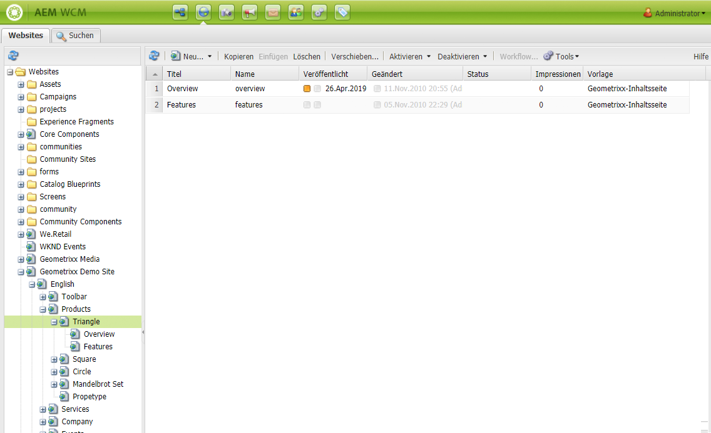
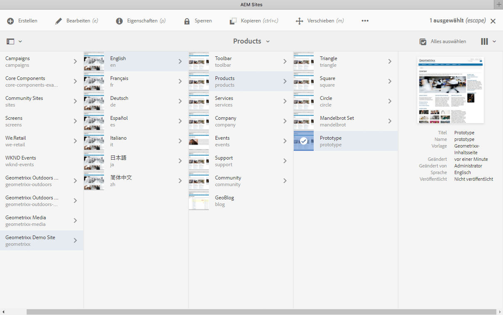
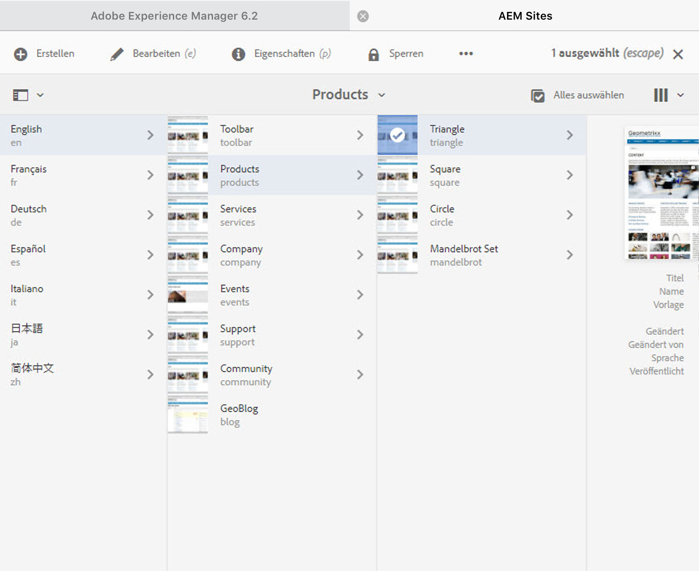

# Arbeiten mit der Autorenumgebung{#working-with-the-author-environment}

>[!NOTE]
>
>Die folgende Dokumentation bezieht sich auf die klassische Benutzeroberfläche. Informationen zu Bearbeitungsmöglichkeiten in der neuen Touch-optimierten Benutzeroberfläche finden Sie in der [Standarddokumentation zur Bearbeitung](/help/assets/assets.md).

In der Autorenumgebung können Sie folgende Aufgaben ausführen:

* [Bearbeiten](/help/sites-authoring/author.md) (einschließlich [Seitenbearbeitung](/help/sites-authoring/qg-page-authoring.md) und [Verwaltung von Assets](/help/assets/assets.md))

* [Verwaltungsaufgaben](/help/sites-administering/administer-best-practices.md), die Sie für die Erstellung und Verwaltung des Inhalts auf Ihrer Website benötigen

Zu diesem Zweck werden zwei grafische Benutzeroberflächen bereitgestellt. Diese können über jeden modernen Browser aufgerufen werden:

1. Klassische Benutzeroberfläche

   * Diese Benutzeroberfläche wird schon seit vielen Jahren in AEM verwendet.
   * Sie ist vorwiegend in Grün gehalten.
   * Sie wurde für die Nutzung auf Desktop-Geräten entwickelt.
   * Sie wird nicht mehr weiterentwickelt.
   * Die folgende Dokumentation bezieht sich auf die klassische Benutzeroberfläche. Informationen zu Bearbeitungsmöglichkeiten in der neueren, Touch-optimierten Benutzeroberfläche finden Sie in der [Standarddokumentation zur Bearbeitung](/help/sites-authoring/author.md).

   

1. Touch-optimierte Benutzeroberfläche

   * Dies ist die neue Standard-Benutzeroberfläche von AEM.
   * Sie ist vorwiegend in Grau gehalten und besitzt einen einfachen Aufbau.
   * Sie wurde sowohl für Touch- als auch für Desktop-Geräte entwickelt (für Touch optimiert). Das Erscheinungsbild ist auf allen Geräten identisch, obwohl das [Anzeigen und Auswählen Ihrer Ressourcen](/help/sites-authoring/basic-handling.md) etwas unterschiedlich aussehen kann (Tippen bzw. Klicken).
   * Weitere Informationen zur Verwendung der Touch-optimierten Benutzeroberfläche finden Sie in der [Standarddokumentation zur Bearbeitung](/help/sites-authoring/author.md). Die folgende Dokumentation bezieht sich auf die klassische Benutzeroberfläche.

   * Desktop:

   

   * Tablets (oder Desktop mit einer Breite von weniger als 1024 Pixeln):

   
