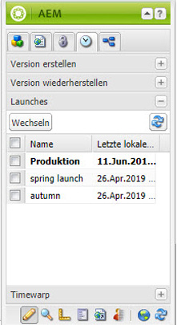
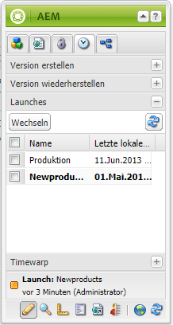

# Bearbeiten von Launches{#editing-launches}

## Bearbeiten von Launch-Seiten {#editing-launch-pages}

Wenn ein Launch für eine Seite (oder eine Reihe von Seiten) erstellt wurde, können Sie den Inhalt in der Launch-Kopie der Seiten bearbeiten.

1. Öffnen Sie die Seite zur Bearbeitung.
1. Wählen Sie im Sidekick die Registerkarte **Versionierung** aus und erweitern Sie dann die Gruppe **Launches**. Der Titel des Launches, der derzeit bearbeitet wird, verwendet eine fette Schriftart.

   

1. Wählen Sie den Launch aus, an dem Sie arbeiten möchten, und klicken Sie auf **Umschalten**.
1. Beginnen Sie mit der Bearbeitung.

   >[!NOTE]
   >
   >Sie können für Aktionen wie **Untergeordnete Seite erstellen** die Registerkarte **Seite** des Sidekicks verwenden.

## Bearbeiten einer Launch-Konfiguration {#editing-a-launch-configuration}

Wenn Sie einen Launch erstellt haben, können Sie den Namen und das Datum des Launches ändern. Sie können auch ein Bild angeben, das mit dem Launch verknüpft werden soll.

1. Öffnen Sie die Verwaltungsseite Launches ([http://localhost:4502/libs/launches/content/admin.html](http://localhost:4502/libs/launches/content/admin.html)).

1. Wählen Sie den gewünschten Launch aus und klicken Sie auf **Bearbeiten**, um das Dialogfeld zu öffnen:

   * In der Registerkarte **Allgemein** können Sie Folgendes bearbeiten:

     * **Titel**
     * **Live-Datum**: dieses entspricht dem Launch-Datum
     * **Produktionsbereit**

     Weitere Informationen über den Zweck und das Zusammenspiel dieser Felder finden Sie unter [Launches und die Reihenfolge der Ereignisse](/help/sites-authoring/launches.md#launches-the-order-of-events).

   * In der Registerkarte **Bild** können Sie eine Bilddatei hochladen.

1. Klicken Sie auf **Speichern**.

## Ermitteln des Launch-Status einer Seite {#discovering-the-launch-status-of-a-page}

Wenn Sie einen Launch einer Seite bearbeiten, werden Informationen zum Launch unten auf der Registerkarte **Versionierung** des Sidekicks angezeigt:

* Der Name des Launches.
* Die Zeit seit der letzten Änderung.
* Die Person, die die letzte Änderung vorgenommen hat.
* Der Status des Flags **Produktionsbereit** (orange = nicht festgelegt; grün = festgelegt).

