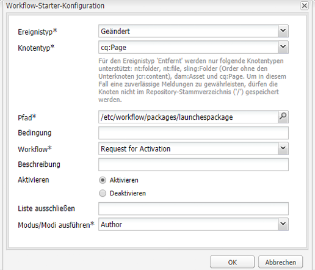

# Weiterleiten von Launches{#promoting-launches}

Sie müssen Launch-Seiten weiterleiten, damit der Inhalt vor der Veröffentlichung wieder in die Quelle (Produktion) verschoben wird. Beim Weiterleiten einer Launch-Seite wird die entsprechende Seite der Quellseiten mit dem Inhalt der weitergeleiteten Seite aktualisiert. Beim Weiterleiten einer Launch-Seite stehen die folgenden Optionen zur Verfügung:

* Ob nur die aktuelle Seite oder der gesamte Launch weitergeleitet werden soll.
* Ob die untergeordneten Seiten der aktuellen Seite weitergeleitet werden sollen.
* Ob der vollständige Launch hochgestuft werden soll oder nur Seiten, die geändert wurden.

## Weiterleiten von Launch-Seiten {#promoting-launch-pages}

Um Seiten hochzustufen, führen Sie beim Bearbeiten der Launch-Seite, die Sie hochstufen möchten, die folgenden Schritte aus:

1. Klicken Sie auf der Registerkarte **Seite** in Sidekick auf **Launch hochstufen**.
1. Geben Sie die hochzustufenden Seiten an:

   * (Standard) Um nur die aktuelle Seite weiterzuleiten, wählen Sie **Änderungen an der Seite in Produktionsversion weiterleiten** aus.
   * Um auch die untergeordneten Seiten der aktuellen Seite weiterzuleiten, wählen Sie **Unterseiten einschließen** aus.
   * Um alle Seiten im Launch hochzustufen, wählen Sie **Vollständigen Launch zur Produktionsversion hochstufen**.

1. Um die Produktionsseiten einem Workflow-Paket hinzuzufügen, wählen Sie **Zum Workflow-Paket hinzufügen** und wählen Sie dann das Workflow-Paket aus.
1. Klicken Sie auf **Hochstufen**.

## Bearbeiten weitergeleiteter Seiten mit einem AEM-Workflow {#processing-promoted-pages-using-aem-workflow}

Verwenden Sie Workflow-Modelle, um Seiten von weitergeleiteten Launches massenweise zu verarbeiten:

1. Erstellen Sie ein Workflow-Paket.
1. Wenn Autorinnen und Autoren Launch-Seiten weiterleiten, speichern sie sie im Workflow-Paket.
1. Starten Sie ein Workflow-Modell mit dem Paket als Payload.

Um einen Workflow automatisch zu starten, wenn Seiten hochgestuft werden, [konfigurieren Sie einen Workflow-Starter](/help/sites-administering/workflows-starting.md#workflows-launchers) für den Paketknoten.

Sie können z. B. automatisch Seitenaktivierungsanfragen generieren, wenn Autoren Launches-Seiten weiterleiten. Konfigurieren Sie einen Workflow-Starter, um den Aktivierungsanfrage-Workflow zu starten, wenn der Paketknoten geändert wurde.

