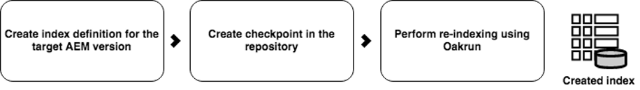

# Offline-Neuindizierung für AEM {#offline-reindexing-for-aem}

## Einführung {#introduction}

Bei AEM Assets-Projekten, die in der Regel über große Datenspeicher und eine hohe Anzahl von Asset-Uploads verfügen, kann die Neuindizierung von Oak-Indizes erheblich dauern.

In diesem Abschnitt wird beschrieben, wie Sie mit dem Oak-run-Tool eine Offline-Neuindizierung durchführen. Die angezeigten Schritte können auf [Lucene](https://jackrabbit.apache.org/oak/docs/query/lucene.html)-Indizes für Versionen AEM 6.4 und höher angewendet werden.

## Übersicht {#overview}

AEM-Repositorys erfordern häufig eine Neuindizierung aus verschiedenen Gründen, z. B. aufgrund von Änderungen der Indexdefinition, Leistungsoptimierung oder nach wesentlichen Inhaltsänderungen. Bei der Bereitstellung von Assets ist eine Neuindizierung aufwändig, da Text in Assets (z. B. Text in PDF-Dateien) extrahiert und indiziert wird. Bei MongoMK-Repositorys werden die Daten über das Netzwerk beibehalten, was den Zeitaufwand für die Neuindizierung weiter erhöht. Die Lösung besteht darin, die Neuindizierung **offline** mit dem Tool &quot;Oak-run“ durchzuführen und dann die vordefinierten Indizes in die aktive AEM-Instanz zu importieren. Dieser Ansatz minimiert die Neuindizierungszeit und ermöglicht ein besseres Ressourcenmanagement.

## Ansatz {#approach}


Indizes offline mit dem Tool [Oak-run](/help/sites-deploying/indexing-via-the-oak-run-jar.md) erstellen und dann in die laufende AEM-Instanz importieren. Das obige Diagramm zeigt den Ansatz der Offline-Neuindizierung.

Außerdem ist dies die Reihenfolge der Schritte, wie sie in dem Ansatz beschrieben sind:

1. Zuerst wird der Text aus den Binärdateien extrahiert
2. Indexdefinitionen werden erstellt oder aktualisiert
3. Offline-Indizes werden erstellt
4. Die Indizes werden dann in die laufende AEM-Instanz importiert

### Textextraktion {#text-extraction}

Um eine vollständige Indizierung in AEM zu ermöglichen, wird Text aus Binärdateien wie PDF extrahiert und dem Index hinzugefügt. Dies ist in der Regel ein aufwendiger Schritt im Indizierungsprozess. Die Textextraktion ist ein Optimierungsschritt, der insbesondere für die Neuindizierung von Asset-Repositorys empfohlen wird, da in diesen eine große Anzahl von Binärdateien gespeichert ist.


Text aus im System gespeicherten Binärdateien kann mit dem oak-run-Tool und der Tika-Bibliothek extrahiert werden. Für diesen Textextraktionsprozess kann ein Klon des Produktionssystems erstellt und verwendet werden. Dieser Prozess erstellt dann den Textspeicher, indem er die folgenden Schritte durchläuft:

**1. Durchlaufen des Repository und Erfassen von Details der Binärdateien**

Dieser Schritt erzeugt eine CSV-Datei mit einem Tupel von Binärdateien, das einen Pfad und eine Blob-ID enthält.

Führen Sie den folgenden Befehl in dem Verzeichnis aus, in dem Sie den Index erstellen möchten. Im folgenden Beispiel wird von dem Basisverzeichnis des Repositorys ausgegangen.

```
java java -jar oak-run.jar tika <nodestore path> --fds-path <datastore path> --data-file text-extraction/oak-binary-stats.csv --generate
```

Wo `nodestore path` die `mongo_uri` oder `crx-quickstart/repository/segmentstore/` ist

Verwenden Sie den Parameter `--fake-ds-path=temp` anstelle von `–fds-path`, um den Prozess zu beschleunigen.

**2. Verwenden Sie den binären Textspeicher wieder, der im vorhandenen Index verfügbar ist.**

Entladen Sie die Indexdaten aus dem bestehenden System und extrahieren Sie den Textspeicher.

Sie können die vorhandenen Indexdaten mit dem folgenden Befehl entladen:

```
java -jar oak-run.jar index <nodestore path> --fds-path=<datastore path> --index-dump
```

Wo `nodestore path` die `mongo_uri` oder `crx-quickstart/repository/segmentstore/` ist

Verwenden Sie dann den obigen Index-Dump, um den Speicher aufzufüllen:

```
java -jar oak-run.jar tika --data-file text-extraction/oak-binary-stats.csv --store-path text-extraction/store --index-dir ./indexing-result/index-dumps/<oak-index-name>/data populate
```

Wobei `oak-index-name` der Name des Volltextindex ist, z. B. „lucene“.

**3. Ausführen des Textextraktionsvorgangs mit der Tika-Bibliothek für die im obigen Schritt ausgelassenen Binärdateien**

```
java -cp oak-run.jar:tika-app-*.jar org.apache.jackrabbit.oak.run.Main tika --data-file text-extraction/oak-binary-stats.csv --store-path text-extraction/store --fds-path <datastore path> extract
```

>[!NOTE]
>
>Verwenden Sie dieselbe Version von Tika wie in AEM.

Wo `datastore path` der Pfad zum binären Datenspeicher ist.

Der erstellte Textspeicher kann aktualisiert und für zukünftige Neuindizierungsszenarien wiederverwendet werden.

Weitere Einzelheiten über den Textextraktionsprozess finden Sie in der [Dokumentation zu Oak-run](https://jackrabbit.apache.org/oak/docs/query/pre-extract-text.html).

### Offline-Neuindizierung {#offline-reindexing}



Erstellen Sie den Lucene-Index offline. Wenn Sie MongoMK verwenden, wird empfohlen, es direkt auf einem der MongoMK-Knoten auszuführen, da dies einen zu großen Netzwerk-Overhead vermeidet.

Gehen Sie wie folgt vor, um den Index offline zu erstellen:

**1. Generieren von Oak Lucene-Indexdefinitionen**

Entladen Sie die vorhandenen Indexdefinitionen. Indexdefinitionen können mit dem Adobe Granite-Repository-Bundle und oak-run generiert werden.

Führen Sie diesen Befehl aus, um die Indexdefinition aus der AEM-Instanz zu entladen:

>[!NOTE]
>
>Weitere Einzelheiten zum Entladen von Indexdefinitionen finden Sie in der [Oak-Dokumentation](https://jackrabbit.apache.org/oak/docs/query/oak-run-indexing.html#async-index-data).

```
java -jar oak-run.jar index --fds-path <datastore path> <nodestore path> --index-definitions
```

Wobei `datastore path` und `nodestore path` aus der AEM-Instanz stammen.

Generieren Sie dann Indexdefinitionen mit dem entsprechenden Granite-Repository-Bundle.

```
java -cp oak-run.jar:bundle-com.adobe.granite.repository.jar org.apache.jackrabbit.oak.index.IndexDefinitionUpdater --in indexing-definitions_source.json --out merge-index-definitions_target.json --initializer com.adobe.granite.repository.impl.GraniteContent
```

>[!NOTE]
>
>Das oben beschriebene Verfahren zur Erstellung von Indexdefinitionen wird erst ab der Version `oak-run-1.12.0` unterstützt. Das Targeting erfolgt mithilfe des Granite-Repository-Pakets `com.adobe.granite.repository-x.x.xx.jar`.

Die oben genannten Schritte erstellen eine JSON-Datei mit dem Namen `merge-index-definitions_target.json` , die die Indexdefinition enthält.

**2. Erstellen eines Checkpoints im Repository**

Erstellen Sie einen Checkpoint in der AEM-Produktionsinstanz mit einer langen Lebensdauer. Dies sollte vor dem Klonen des Repositorys geschehen.

Gehen Sie über die JMX-Konsole von `http://serveraddress:serverport/system/console/jmx` nach `CheckpointMBean` und erstellen Sie einen Checkpoint mit einer ausreichend langen Lebensdauer (z. B. 200 Tage). Rufen Sie dazu `CheckpointMBean#createCheckpoint` mit `17280000000` als Argument für die Lebenszeitdauer in Millisekunden auf.

Kopieren Sie anschließend die neu erstellte Checkpoint-ID und validieren Sie die Lebensdauer mit JMX `CheckpointMBean#listCheckpoints`.

>[!NOTE]
>
>Dieser Checkpoint wird gelöscht, wenn der Index später importiert wird.

Weitere Einzelheiten finden Sie in der Oak-Dokumentation im Abschnitt [Checkpoint-Erstellung](https://jackrabbit.apache.org/oak/docs/query/oak-run-indexing.html#out-of-band-create-checkpoint).

**Durchführen der Offline-Indizierung für die generierten Indexdefinitionen**

Die Neuindizierung von Lucene kann offline mit Oak-run durchgeführt werden. Dieser Prozess erstellt Indexdaten auf der Festplatte unter `indexing-result/indexes`. Er schreibt **nicht** in das Repository und erfordert daher nicht das Anhalten der laufenden AEM-Instanz. Der erstellte Textspeicher wird in diesen Prozess eingespeist:

```
java -Doak.indexer.memLimitInMB=500 -jar oak-run.jar index <nodestore path> --reindex --doc-traversal-mode --checkpoint <checkpoint> --fds-path <datastore path> --index-definitions-file merge-index-definitions_target.json --pre-extracted-text-dir text-extraction/store

Sample <checkpoint> looks like r16c85700008-0-8
—fds-path: path to data store.
--pre-extracted-text-dir: Directory of pre-extracted text.
merge-index-definitions_target: JSON file having merged definitions for the target AEM instance. indexes in this file will be re-indexed.
```

Die Verwendung des `--doc-traversal-mode`-Parameters ist bei MongoMK-Installationen praktisch, da er die Neuindizierung erheblich beschleunigt, indem er Repository-Inhalte in eine lokale flache Datei spoolt. Allerdings wird dafür zusätzlicher Speicherplatz benötigt, der doppelt so groß ist wie das Repository.

Im Falle von MongoMK kann dieser Prozess beschleunigt werden, wenn dieser Schritt in einer Instanz ausgeführt wird, die näher an der MongoDB-Instanz liegt. Wenn er auf demselben Computer ausgeführt wird, kann ein zu großer Netzwerk-Overhead vermieden werden.

Weitere technische Details finden Sie in der [Oak-run-Dokumentation zur Indizierung](Https://jackrabbit.apache.org/oak/docs/query/oak-run-indexing.html).

### Importieren von Indizes {#importing-indexes}

In AEM 6.4 und neueren Versionen verfügt AEM über die integrierte Funktion zum Importieren von Indizes von der Festplatte während der Startsequenz. Der Ordner `<repository>/indexing-result/indexes` wird beim Start auf das Vorhandensein von Indexdaten überwacht. Sie können den vorab erstellten Index in den oben genannten Speicherort kopieren, bevor Sie die AEM-Instanz starten. AEM importiert es in das Repository und entfernt den entsprechenden Checkpoint aus dem System. Eine Neuindizierung wird somit vollständig vermieden.

## Zusätzliche Tipps und Fehlerbehebung {#troubleshooting}

Nachfolgend finden Sie einige hilfreiche Tipps und Anleitungen zur Fehlerbehebung.

### Verringerung der Auswirkungen auf das Live-Produktionssystem {#reduce-the-impact-on-the-live-production-system}

Es wird empfohlen, das Produktionssystem zu klonen und den Offline-Index mithilfe des Klons zu erstellen. Dadurch werden mögliche Auswirkungen auf das Produktionssystem vermieden. Der für den Indeximport erforderliche Checkpoint muss jedoch im Produktionssystem vorhanden sein. Daher ist es wichtig, einen Checkpoint zu erstellen, bevor der Klon angelegt wird.

### Vorbereiten eines Runbooks und Testlauf {#prepare-a-runbook-and-trial-run}

Es wird empfohlen, ein Runbook vorzubereiten und einige Testläufe durchzuführen, bevor der Neuindizierungsprozess in der Produktion ausgeführt wird.

### doc-traversal-mode mit Offline-Indizierung {#doc-traversal-mode-with-offline-indexing}

Die Offline-Indizierung erfordert mehrere Durchläufe durch das gesamte Repository. Bei MongoMK-Installationen erfolgt der Zugriff auf das Repository über das Netzwerk, was die Leistung des Indizierungsprozesses beeinträchtigt. Eine Option besteht darin, den Offline-Indizierungsprozess auf der MongoDB-Replik selbst auszuführen, wodurch der Netzwerk-Overhead entfällt. Eine weitere Möglichkeit ist die Verwendung des doc-traversal-mode.

Der doc-traversal-mode kann durch Hinzufügen des Befehlszeilenparameters `—doc-traversal` zum Befehl oak-run für die Offline-Indizierung angewendet werden. Dieser Modus spoolt eine Kopie des gesamten Repositorys auf der lokalen Festplatte als flache Datei und verwendet diese für die Indizierung.
