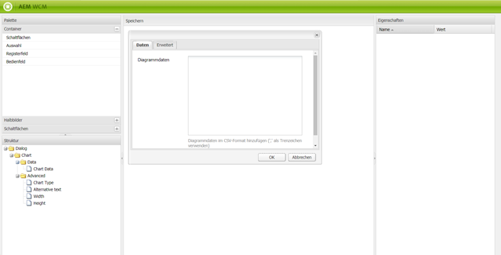

# Dialogfeldeditor{#dialog-editor}

Der Dialogfeldeditor bietet eine grafische Oberfläche zur einfachen Erstellung und Bearbeitung von Dialogfeldern und Strukturvorlagen.

Sehen Sie sich die Funktionsweise genauer an, indem Sie CRXDE Lite aufrufen, in der Explorer-Struktur zu `/libs/foundation/components/chart` navigieren und auf den Knoten `dialog` doppelklicken:

Der Dialogfeldknoten wird anschließend im **Dialogfeldeditor** geöffnet:

## Überblick über die Benutzeroberfläche {#user-interface-overview}

Die Benutzeroberfläche des Dialogfeldeditors besteht aus vier Bereichen:

* **Palette** links oben. In diesem Bereich befinden sich die zum Erstellen eines Dialogfelds erforderlichen Widgets, etwa Registerkartenfelder, Textfelder, Auswahllisten und Schaltflächen. Sie können die verschiedenen Kategorien in der Palette maximieren, indem Sie auf die gewünschte Trennleiste klicken.
* Der Bereich **Struktur** links unten. In diesem Bereich wird die hierarchische Struktur der Knoten angezeigt, aus der die Dialogfelddefinition besteht. Dieselbe Struktur können Sie sehen, wenn Sie den Dialogfeldknoten in CRXDE Lite oder CRX Content Explorer maximieren.
* Der Fensterbereich **Rendern** befindet sich in der Mitte des Fensters. Darin ist zu sehen, wie die im Strukturfenster definierte Dialogfelddefinition tatsächlich als Dialogfeld gerendert wird.
* Der Fensterbereich **Eigenschaften**. In diesem Bereich werden die Eigenschaften des im Strukturbereich markierten Knotens angezeigt.

### Verwenden des Dialogfeldeditors {#using-the-dialog-editor}

Erstellen Sie ein Dialogfeld, indem Sie Elemente innerhalb der Dialogfeld-Definitionshierarchie aus der Palette in den Strukturbereich in Position ziehen.

Wenn Sie die gewünschte Struktur abgeschlossen haben, klicken Sie ganz oben im Bereich „Rendern“ auf **Speichern**.

>[!CAUTION]
>
>Der Dialogfeldeditor dient zum Erstellen einfacher Dialogfelder. Komplexere Dialogfelddefinitionen können möglicherweise nicht bearbeitet werden. In Fällen, in denen der Dialogfeldeditor die Bearbeitung einer Dialogfeldstruktur nicht zulässt, muss die Dialogfelddefinition manuell erstellt und/oder bearbeitet werden. Hierzu können Sie die Knotenstruktur beispielsweise direkt mit CRXDE Lite oder CRX Content Explorer bearbeiten.

### Erstellen eines neuen Dialogfelds {#creating-a-new-dialog}

Um ein neues Dialogfeld zu erstellen, wählen Sie die gewünschte Komponente aus und klicken Sie anschließend auf **Erstellen** und dann auf **Dialogfeld erstellen**.

Geben Sie die erforderlichen Informationen ein und klicken Sie auf **Alle speichern**. Nun können Sie auf das Dialogfeld doppelklicken, um es im Editor zu öffnen.

### Verwenden des Dialogfeldeditors für Strukturvorlagen {#using-the-dialog-editor-for-scaffolds}

Eine Strukturvorlage ist eine spezielle Seite mit einem Formular, das in einem Schritt ausgefüllt und gesendet werden kann. Damit können Sie mithilfe der eingegebenen Inhalte sehr schnell eine Seite erstellen.

Das Formular, aus dem eine Strukturvorlage besteht, wird durch eine Dialogfelddefinition definiert, im Grunde wie ein normales Dialogfeld, mit dem Unterschied, dass es auf der Strukturvorlagenseite in einer anderen Form erscheint. Da Dialogfelddefinitionen zum Definieren von Strukturvorlagen verwendet werden, können Sie Strukturvorlagen mit dem Dialogfeldeditor entwerfen. Wird der Dialogfeldeditor auf diese Weise verwendet, wird die Dialogfelddefinition im Bereich „Rendern“ immer noch in Form eines Dialogfelds und nicht als Strukturvorlage anzeigt.
