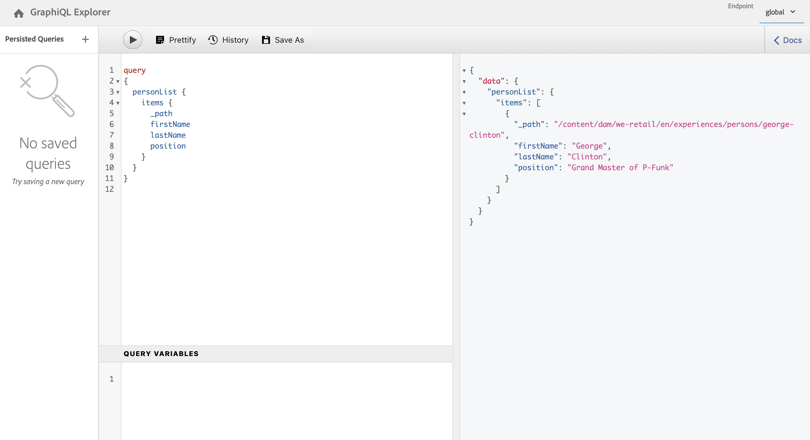

# Schnellstartanleitung für Headless: Abrufen und Bereitstellen von Inhaltsfragmenten {#accessing-delivering-content-fragments}

Erfahren Sie, wie Sie die AEM Assets-REST-API zum Verwalten von Inhaltsfragmenten und die GraphQL-API für die Headless-Bereitstellung von Inhalten der Inhaltsfragmente verwenden.

## Was sind GraphQL- und Assets-REST-APIs? {#what-are-the-apis}

[Nachdem Sie einige Inhaltsfragmente erstellt haben,](create-content-fragment.md) können Sie die APIs von AEM verwenden, um sie headless bereitzustellen.

* Mit der [GraphQL-API](/help/sites-developing/headless/graphql-api/graphql-api-content-fragments.md) können Sie Anfragen für den Zugriff auf und die Bereitstellung von Inhaltsfragmenten erstellen.
   * Um sie verwenden zu können, [müssen Endpunkte in AEM definiert und aktiviert werden](/help/sites-developing/headless/graphql-api/graphql-endpoint.md#enabling-graphql-endpoint) und, falls erforderlich, muss die [GraphiQL-Oberfläche installiert werden](/help/sites-developing/headless/graphql-api/graphql-api-content-fragments.md#installing-graphiql-interface).
* Mit der [Assets-REST-API](/help/assets/assets-api-content-fragments.md) können Sie Inhaltsfragmente (und andere Assets) erstellen und ändern.

Der Rest dieses Handbuchs konzentriert sich auf den GraphQL-Zugriff und die Bereitstellung von Inhaltsfragmenten.

## Bereitstellen eines Inhaltsfragments mit GraphQL {#how-to-deliver-a-content-fragment}

Informationsarchitektinnen und -architekten müssen Abfragen für ihre Kanalendpunkte entwerfen, um Inhalte bereitzustellen. Berücksichtigen Sie diese Abfragen nur einmal pro Endpunkt und Modell. Erstellen Sie für dieses Erste-Schritte-Handbuch nur eine.

1. Melden Sie sich bei AEM an und rufen Sie die [GraphiQL-Oberfläche](/help/sites-developing/headless/graphql-api/graphiql-ide.md) auf:
   * Beispiel: `http://<host>:<port>/aem/graphiql.html`.

1. GraphiQL ist ein In-Browser-Abfrage-Editor für GraphQL. Sie können damit Abfragen zum Abrufen von Inhaltsfragmenten erstellen, um diese als JSON-Datei „headless“ bereitzustellen.
   * Im linken Bedienfeld können Sie Ihre Abfrage erstellen.
   * Im rechten Bedienfeld werden die Ergebnisse angezeigt.
   * Der Abfrage-Editor bietet Code-Vervollständigung und Hotkeys, um die Abfrage einfach auszuführen.
     

1. Angenommen, das von uns erstellte Modell `person` wurde mit den Feldern `firstName`, `lastName` und `position` aufgerufen. Wir können dann eine einfache Abfrage erstellen, um den Inhalt unseres Inhaltsfragments abzurufen.

   ```text
   query 
   {
     personList {
       items {
         _path
         firstName
         lastName
         position
       }
     }
   }
   ```

1. Geben Sie die Abfrage in das linke Bedienfeld ein.
<!--
   
-->

1. Klicken Sie auf das Symbol **Abfrage ausführen** (Pfeil nach rechts) oder verwenden Sie das Tastaturkürzel `Ctrl-Enter`. Die Ergebnisse werden als JSON im rechten Bedienfeld angezeigt.
   

1. Klicken Sie auf:
   * **Dokumente** oben rechts auf der Seite, um eine kontextbezogene Dokumentation anzuzeigen, die Sie bei der Erstellung Ihrer Abfragen unterstützt und sich an Ihre eigenen Modelle anpasst.
   * **Verlauf** in der oberen Symbolleiste, um frühere Abfragen anzuzeigen.
   * Wählen Sie **Speichern unter** und **Speichern**, um Ihre Abfragen zu speichern. Danach können Sie sie im Bedienfeld **Persistierte Abfragen** auflisten, abrufen und **veröffentlichen**.
     

GraphQL ermöglicht strukturierte Abfragen, die nicht nur auf bestimmte Datensätze oder einzelne Datenobjekte abzielen, sondern auch bestimmte Elemente der Objekte und verschachtelte Ergebnisse bereitstellen, Unterstützung für Abfragevariablen bieten und vieles mehr.

GraphQL kann iterative API-Anfragen und zu häufige Bereitstellungen vermeiden. Stattdessen ermöglicht es Massenbereitstellung von genau dem, was zum Rendern als Antwort auf eine einzelne API-Anfrage benötigt wird. Das resultierende JSON kann verwendet werden, um Daten in anderen Sites oder Mobile Apps bereitzustellen.

## Nächste Schritte {#next-steps}

Das war´s! Sie haben nun ein grundlegendes Verständnis für das Headless-Content-Management in AEM. Es gibt viele weitere Ressourcen, mit deren Hilfe Sie sich ein umfassendes Verständnis der verfügbaren Funktionen aneignen können.

* **[Konfigurations-Browser](create-configuration.md)** – Weitere Informationen zum AEM-Konfigurations-Browser
* **[Inhaltsfragmente](/help/assets/content-fragments/content-fragments.md)** – Weitere Informationen zum Erstellen und Verwalten von Inhaltsfragmenten
* Siehe **[GraphiQL-IDE](/help/sites-developing/headless/graphql-api/graphiql-ide.md)** für weitere Informationen zur Verwendung der GraphiQL-IDE
* Siehe **[Persistierte Abfragen](/help/sites-developing/headless/graphql-api/persisted-queries.md)** für weitere Informationen zu persistierten Abfragen
* **[Unterstützung von Inhaltsfragmenten in der AEM Assets-HTTP-API](/help/assets/assets-api-content-fragments.md)** – Weitere Informationen zum direkten Zugriff auf AEM-Inhalte über die HTTP-API über CRUD-Vorgänge (Erstellen, Lesen, Aktualisieren, Löschen)
* **[GraphQL-API](/help/sites-developing/headless/graphql-api/graphql-api-content-fragments.md)** – Weitere Informationen zum Headless-Bereitstellen von Inhaltsfragmenten
