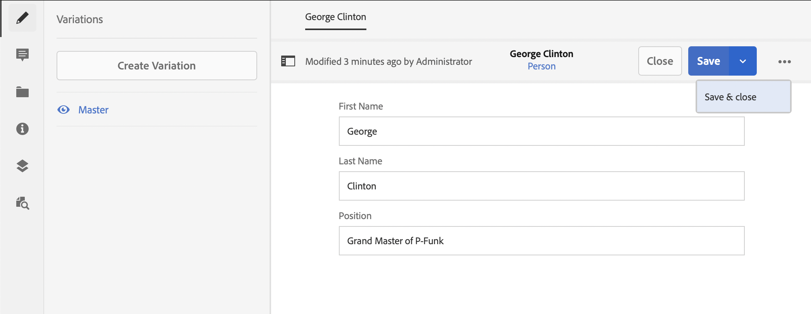

# Schnellstartanleitung zum Erstellen von Inhaltsfragmenten per Headless-Implementierung {#creating-content-fragments}

Erfahren Sie, wie Sie mit den Inhaltsfragmenten von AEM seitenunabhängige Inhalte für die Headless-Bereitstellung entwerfen, erstellen, kuratieren und verwenden können.

## Was sind Inhaltsfragmente? {#what-are-content-fragments}

[Nachdem Sie einen Asset-Ordner erstellt haben](create-assets-folder.md), in dem Ihre Inhaltsfragmente gespeichert werden sollen, können Sie nun Fragmente erstellten.

Mit Inhaltsfragmenten können Sie seitenunabhängige Inhalte entwerfen, erstellen, kuratieren und veröffentlichen. Außerdem können Sie Inhalte zur Verwendung an mehreren Orten und über mehrere Kanäle hinweg vorbereiten.

Inhaltsfragmente enthalten strukturierte Inhalte und können im JSON-Format bereitgestellt werden.

## Erstellen eines Inhaltsfragments {#how-to-create-a-content-fragment}

Inhaltsautorinnen und -autoren können eine beliebige Anzahl von Inhaltsfragmenten für ihre Inhalte erstellen. Das die zentrale Aufgabe, die sie in AEM ausführen. Für die Zwecke dieser Anleitung für den Einstieg müssen wir nur ein Fragment erstellen.

1. Melden Sie sich bei AEM an und wählen Sie im Hauptmenü **Navigation > Assets** aus.
1. Navigieren Sie zu dem [zuvor erstellten Ordner](create-assets-folder.md).
1. Klicken Sie auf **Erstellen > Inhaltsfragment**.
1. Die Erstellung eines Inhaltsfragments erfolgt mithilfe eines Assistenten in zwei Schritten. Wählen Sie zuerst das Modell aus, das Sie zum Erstellen des Inhaltsfragments verwenden möchten, und klicken Sie dann auf **Weiter**.
   * Die verfügbaren Modelle hängen von der [**Cloud-Konfiguration** ab, die Sie für den Asset-Ordner](create-assets-folder.md) definiert haben, in dem Sie das Inhaltsfragment erstellen.
   * Wenn Ihnen die Meldung `We could not find any models` angezeigt wird, überprüfen Sie die Konfiguration Ihres Asset-Ordners.

   
1. Geben Sie nach Bedarf einen **Titel**, eine **Beschreibung** und **Tags** ein und klicken Sie auf **Erstellen**.

   
1. Klicken Sie im Bestätigungsfenster auf **Öffnen**.

   
1. Geben Sie im Inhaltsfragment-Editor die Details des Inhaltsfragments an.

   
1. Klicken Sie auf **Speichern** oder **Speichern und schließen**.

Inhaltsfragmente können auf andere Inhaltsfragmente verweisen, was bei Bedarf eine verschachtelte Inhaltsstruktur ermöglicht.

Inhaltsfragmente können auch auf andere Assets in AEM verweisen. [Diese Assets müssen in AEM gespeichert werden](/help/assets/manage-assets.md), bevor ein Verweis auf das Inhaltsfragment erstellt wird.

## Nächste Schritte {#next-steps}

Nachdem Sie nun ein Inhaltsfragment erstellt haben, können Sie zum letzten Teil der Anleitung für den Einstieg übergehen und [API-Anfragen erstellen, um auf Inhaltsfragmente zuzugreifen und diese bereitzustellen](create-api-request.md).

>[!TIP]
>
>Ausführliche Informationen zur Verwaltung von Inhaltsfragmenten finden Sie in der [Dokumentation zu Inhaltsfragmenten](/help/assets/content-fragments/content-fragments.md).
