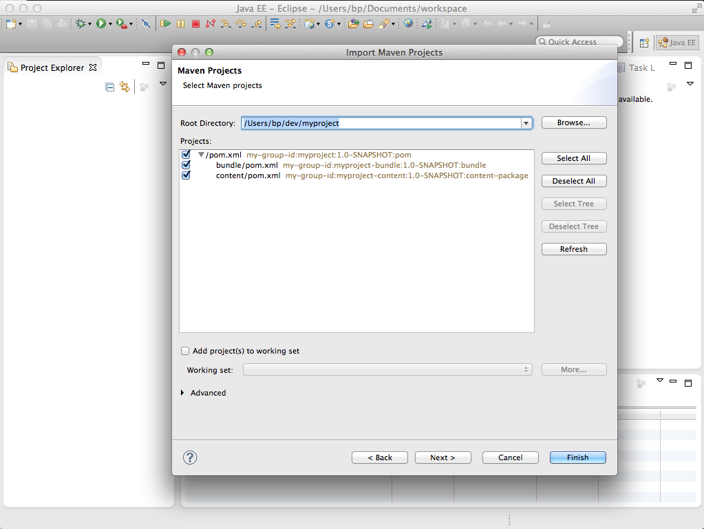

# Entwickeln von AEM-Projekten mit Eclipse{#how-to-develop-aem-projects-using-eclipse}

In dieser Anleitung erfahren Sie, wie Sie Eclipse zur Entwicklung von AEM-basierten Projekten verwenden.

>[!NOTE]
>
>Adobe stellt nun die [AEM-Entwicklungs-Tools für Eclipse](/help/sites-developing/aem-eclipse.md) bereit, die Sie dabei unterstützen, AEM-Lösungen mit Eclipse zu entwickeln.

## Übersicht {#overview}

Die folgenden Schritte sind erforderlich, um mit der AEM-Entwicklung unter Eclipse zu beginnen.

Im Rest dieser Anleitung werden die einzelnen Schritte genauer ausgeführt.

* Installieren von Eclipse 4.3 (Kepler)
* Einrichten Ihres AEM-Projekts auf Grundlage von Maven
* Vorbereiten der JSP-Unterstützung für Eclipse im Maven-POM
* Importieren des Maven-Projekts in Eclipse

>[!NOTE]
>
>Dieses Handbuch basiert auf Eclipse 4.3 (Kepler) und AEM 5.6.1.

## Installieren von Eclipse {#install-eclipse}

Laden Sie „Eclipse IDE for Java EE Developers“ von der [Eclipse-Downloadseite](https://www.eclipse.org/downloads/) herunter.

Installieren Sie Eclipse anhand der [Installationsanweisungen](https://wiki.eclipse.org/Eclipse/Installation).

## Einrichten Ihres AEM-Projekts auf Grundlage von Maven {#set-up-your-aem-project-based-on-maven}

Richten Sie Ihr Projekt anschließend wie in [So erstellen Sie AEM-Projekte mit Apache Maven](/help/sites-developing/ht-projects-maven.md) beschrieben mit Maven ein.

## Vorbereiten der JSP-Unterstützung für Eclipse {#prepare-jsp-support-for-eclipse}

Eclipse kann auch die Arbeit mit JSP unterstützen, z. B.:

* automatische Vervollständigung von Tag-Bibliotheken
* Eclipse-Präsenz von durch &lt;cq:defineObjects /> und &lt;sling:defineObjects /> definierten Objekten

Gehen Sie wie folgt vor, damit dies funktioniert:

1. Folgen Sie den Anweisungen im Abschnitt [So arbeiten Sie mit JSPs](/help/sites-developing/ht-projects-maven.md#how-to-work-with-jsps) in [So erstellen Sie AEM-Projekte mit Apache Maven](/help/sites-developing/ht-projects-maven.md).
1. Fügen Sie Folgendes zum &lt;build />-Abschnitt im POM Ihres Inhaltsmoduls hinzu.

   Das Eclipse-Plug-in zur Unterstützung von Maven, m2e, bietet keine Unterstützung für das Plug-in maven-jspc. Diese Konfiguration weist zudem m2e an, das Plug-in und die zugehörige Aufgabe zur Bereinigung der temporären Kompilierungsergebnisse zu ignorieren.

   Dies stellt kein Problem dar, denn wie in [So arbeiten Sie mit JSPs](/help/sites-developing/ht-projects-maven.md#how-to-work-with-jsps) beschrieben, wird das maven-jspc-Plug-in bei dieser Konfiguration nur verwendet, um zu überprüfen, dass JSPs im Zuge des Build-Prozesses kompiliert werden. Eclipse meldet sämtliche Probleme in JSPs bereits und ist dazu nicht von diesem Maven-Plug-in abhängig.

   **myproject/content/pom.xml**

   ```xml
   <build>
     <!-- ... -->
     <pluginManagement>
       <plugins>
         <!--This plugin's configuration is used to store Eclipse m2e settings only. It has no influence on the Maven build itself.-->
         <plugin>
           <groupId>org.eclipse.m2e</groupId>
           <artifactId>lifecycle-mapping</artifactId>
           <version>1.0.0</version>
           <configuration>
             <lifecycleMappingMetadata>
               <pluginExecutions>
                 <pluginExecution>
                   <pluginExecutionFilter>
                     <groupId>org.apache.sling</groupId>
                     <artifactId>maven-jspc-plugin</artifactId>
                     <versionRange>[2.0.6,)</versionRange>
                     <goals>
                       <goal>jspc</goal>
                     </goals>
                   </pluginExecutionFilter>
                   <action>
                     <ignore/>
                   </action>
                 </pluginExecution>
                 <pluginExecution>
                   <pluginExecutionFilter>
                     <groupId>org.apache.maven.plugins</groupId>
                     <artifactId>maven-clean-plugin</artifactId>
                     <versionRange>[2.4.1,)</versionRange>
                     <goals>
                       <goal>clean</goal>
                     </goals>
                   </pluginExecutionFilter>
                   <action>
                     <ignore/>
                   </action>
                 </pluginExecution>
               </pluginExecutions>
             </lifecycleMappingMetadata>
           </configuration>
         </plugin>
       </plugins>
     </pluginManagement>
   </build>
   ```

### Importieren des Maven-Projekts in Eclipse {#import-the-maven-project-into-eclipse}

1. Öffnen Sie Eclipse und wählen Sie „Datei“ > „Importieren“.
1. Wählen Sie im Dialogfeld zum Importieren „Maven“ > „Bestehende Maven-Projekte“ aus und klicken Sie auf „Weiter“.

   

1. Geben Sie den Pfad zum Ordner auf der obersten Ebene Ihres Projekts an und klicken Sie auf „Alle auswählen“ > „Fertig“.

   

1. Sie können nun mit der Entwicklung Ihres AEM-Projekts in Eclipse beginnen und auch die automatische Vervollständigung für JSP nutzen.

   

   >[!NOTE]
   >
   >Wenn Sie `/libs/foundation/global.jsp` oder andere JSPs in `/libs` einschließen, müssen Sie diese Elemente in Ihr Projekt kopieren, damit Eclipse sie auflösen kann. Zudem müssen Sie darauf achten, dass sie nicht von Maven in Ihr Inhaltspaket mit eingeschlossen werden. Weitere Informationen finden Sie unter [So erstellen Sie AEM-Projekte mit Apache Maven](/help/sites-developing/ht-projects-maven.md).
