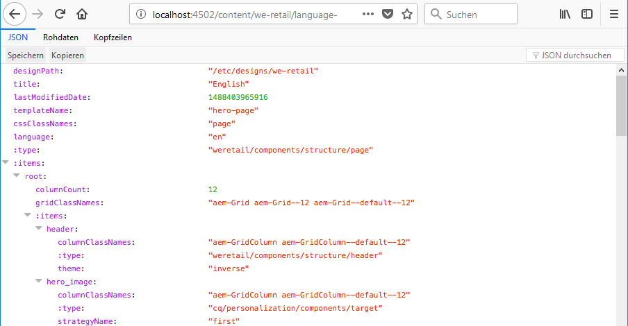
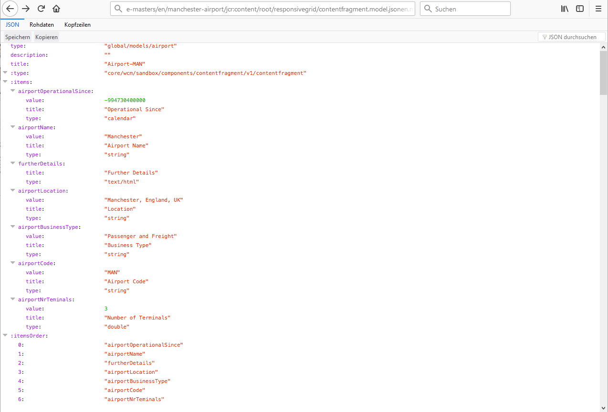

# JSON-Exporter für Content Services{#json-exporter-for-content-services}

Mit den AEM Content Services können die Beschreibung und Bereitstellung von Inhalten in/über AEM über einen Fokus auf Web-Seiten hinweg generalisiert werden.

Sie ermöglichen die Bereitstellung von Inhalten in Kanälen, die keine traditionellen AEM-Web-Seiten sind, und nutzen standardisierte Methoden, die von allen Clients genutzt werden können. Diese Kanäle können Folgendes sein:

* [Single Page Applications (SPA)](spa-walkthrough.md)
* native Mobile Apps
* weitere AEM-externe Kanäle und Touchpoints

Über Inhaltsfragmente, die strukturierte Inhalte verwenden, können Sie Content Services zur Verfügung stellen, indem Sie die Inhalte mit JSON Exporter auf einer (beliebigen) AEM-Seite im JSON-Datenmodellformat bereitstellen. Diese Methode kann dann von Ihren eigenen Anwendungen genutzt werden.

>[!NOTE]
>
>Die hier beschriebene Funktionalität ist für alle Kernkomponenten seit [Version 1.1.0 der Kernkomponenten](https://experienceleague.adobe.com/docs/experience-manager-core-components/using/introduction.html?lang=de) verfügbar.

## JSON Exporter mit Inhaltsfragment-Kernkomponenten {#json-exporter-with-content-fragment-core-components}

Mit dem AEM JSON Exporter können Sie den Inhalt einer beliebigen AEM-Seite im JSON-Datenmodellformat bereitstellen. Diese Methode kann dann von Ihren eigenen Anwendungen genutzt werden.

Im Rahmen von AEM erfolgt die Bereitstellung über den Selektor `model` und die Erweiterung `.json`.

`.model.json`

1. Beispielsweise werden durch eine URL wie:

   ```shell
   http://localhost:4502/content/we-retail/language-masters/en.model.json
   ```

1. Inhalte bereitgestellt wie:

   

Alternativ können Sie die Inhalte eines strukturierten Inhaltsfragments bereitstellen, indem Sie dieses spezifisch nachverfolgen.

Verwenden Sie den gesamten Pfad zum Fragment (über `jcr:content`), zum Beispiel mit einem Suffix wie.

`.../jcr:content/root/responsivegrid/contentfragment.model.json`

Ihre Seite kann entweder ein einzelnes Inhaltsfragment oder mehrere Komponenten verschiedener Typen enthalten. Sie können auch Mechanismen wie Listenkomponenten verwenden, um automatisch nach relevanten Inhalten zu suchen.

* Beispielsweise werden durch eine URL wie:

  ```shell
  http://localhost:4502/content/we-retail/language-masters/en/manchester-airport/jcr:content/root/responsivegrid/contentfragment.model.json
  ```

* Inhalte bereitgestellt wie:

  

  >[!NOTE]
  >
  >Sie können [Ihre eigenen Komponenten anpassen](/help/sites-developing/json-exporter-components.md), um auf diese Daten zuzugreifen und sie zu verwenden.

  >[!NOTE]
  >
  >Obwohl es sich nicht um eine Standardimplementierung handelt, werden [mehrere Selektoren unterstützt,](json-exporter-components.md#multiple-selectors) jedoch muss `model` der erste sein.

### Weiterführende Informationen {#further-information}

Siehe auch:

* Assets-HTTP-API

  * [Assets-HTTP-API](/help/assets/mac-api-assets.md)

* Sling-Modelle:

  * [Sling-Modelle - Zuordnen einer Modellklasse zu einem Ressourcentyp seit 1.3.0](https://sling.apache.org/documentation/bundles/models.html#associating-a-model-class-with-a-resource-type-since-130)

* AEM mit JSON:

  * [Ermitteln von Seiteninformationen im JSON-Format](/help/sites-developing/pageinfo.md)

## Verwandte Dokumentation {#related-documentation}

Weiterführende Ressourcen:

* Das [Thema „Inhaltsfragmente“ im Assets-Benutzerhandbuch](/help/assets/content-fragments/content-fragments.md)

* [Inhaltsfragmentmodelle](/help/assets/content-fragments/content-fragments-models.md)
* [Bearbeitung mit Inhaltsfragmenten](/help/sites-authoring/content-fragments.md)
* [Aktivieren eines JSON-Exports für eine Komponente](/help/sites-developing/json-exporter-components.md)

* [Kernkomponenten](https://experienceleague.adobe.com/docs/experience-manager-core-components/using/introduction.html?lang=de) und die [Inhaltsfragmentkomponente](https://experienceleague.adobe.com/docs/experience-manager-core-components/using/wcm-components/content-fragment-component.html?lang=de)
