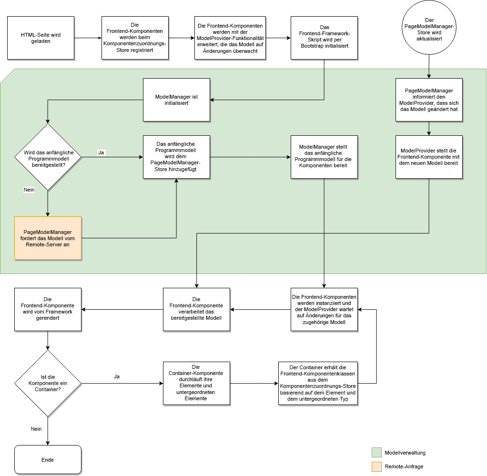

# Zuordnung dynamischer Modelle zu Komponenten für SPAs{#dynamic-model-to-component-mapping-for-spas}

In diesem Dokument wird beschrieben, wie die Zuordnung des dynamischen Modells zu Komponenten im JavaScript SPA SDK für Adobe Experience Manager erfolgt.

{{ue-over-spa}}

## ComponentMapping-Modul {#componentmapping-module}

Das `ComponentMapping`-Modul wird dem Frontend-Projekt als NPM-Paket bereitgestellt. Es speichert Frontend-Komponenten und bietet der Single Page Application die Möglichkeit, Frontend-Komponenten AEM-Ressourcentypen zuzuordnen. Dies ermöglicht beim Parsen des JSON-Modells des Programms eine dynamische Auflösung von Komponenten.

Alle im Modell vorhandenen Elemente enthalten ein Feld `:type`, das einen AEM-Ressourcentyp verfügbar macht. Bei der Implementierung kann sich die Frontend-Komponente mit dem Fragment des Modells, das sie von den zugrunde liegenden Bibliotheken erhalten hat, selbst rendern.

Weitere Informationen zum Parsen von Modellen und zum Zugriff der Frontend-Komponenten auf das Modell finden Sie unter [SPA-Blueprint](/help/sites-developing/spa-blueprint.md).

Weitere Informationen finden Sie im npm-Paket: [https://www.npmjs.com/package/@adobe/aem-spa-component-mapping](https://www.npmjs.com/package/@adobe/aem-spa-component-mapping)

## Modellgesteuerte Single Page Application {#model-driven-single-page-application}

Anwendungen mit einzelnen Seiten, die das JavaScript SPA SDK für AEM nutzen, sind modellgesteuert:

1. Frontend-Komponenten registrieren sich selbst im [Komponentenzuordnungs-Store](/help/sites-developing/spa-dynamic-model-to-component-mapping.md#componentmapping-module).
1. Anschließend durchläuft der [Container](/help/sites-developing/spa-blueprint.md#container), sobald ihm ein Modell vom [Modellanbieter](/help/sites-developing/spa-blueprint.md#the-model-provider) zur Verfügung gestellt wurde, seinen Modellinhalt ( `:items`).

1. Wenn es eine Seite gibt, erhalten ihre untergeordneten Elemente (`:children`) zuerst eine Komponentenklasse aus der [Komponentenzuordnung](/help/sites-developing/spa-blueprint.md#componentmapping) und instanziieren sie dann.

## App-Initialisierung {#app-initialization}

Jede Komponente wird um die Funktionen des [`ModelProvider`](/help/sites-developing/spa-blueprint.md#the-model-provider) erweitert. Die Initialisierung hat daher die folgende allgemeine Form:

1. Jeder Modellanbieter initialisiert sich selbst und wartet auf Änderungen, die an dem Modell vorgenommen wurden, das seiner inneren Komponente entspricht.
1. [`PageModelManager`](/help/sites-developing/spa-blueprint.md#pagemodelmanager) muss gemäß dem [Initialisierungsfluss](/help/sites-developing/spa-blueprint.md) initialisiert werden.

1. Nach dem Speichern gibt der Seitenmodell-Manager das vollständige Modell der App zurück.
1. Dieses Modell wird dann an die Frontend-Stamm-[Container](/help/sites-developing/spa-blueprint.md#container)-Komponente der App übergeben.
1. Teile des Modells werden schließlich auf jede einzelne untergeordnete Komponente übertragen.

