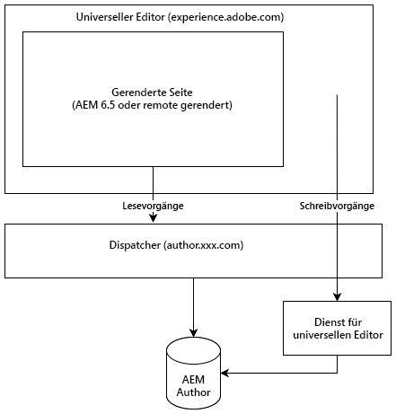

# Über den universellen Editor {#universal-editor}

Erfahren Sie mehr über die Flexibilität des universellen Editors und wie er Ihre Headless-Erlebnisse mit AEM 6.5 LTS unterstützen kann.

## Überblick {#overview}

Der universelle Editor ist ein vielseitiger visueller Editor, der Teil von Adobe Experience Manager Sites ist. Damit können Autorinnen und Autoren die Bearbeitung eines Headless-Erlebnisses in WYSIWYG (What you see is what you get) durchführen.

* Autoren profitieren von der Flexibilität des universellen Editors. Es unterstützt dieselbe konsistente visuelle Bearbeitung für alle Formen von AEM Headless-Inhalten.
* Entwicklerinnen und Entwickler profitieren von der Vielseitigkeit des universellen Editors, da er auch eine echte Entkopplung der Implementierung unterstützt. Es ermöglicht Entwicklern die Verwendung praktisch jedes Frameworks oder jeder Architektur ihrer Wahl, ohne dass SDK- oder Technologiebeschränkungen auferlegt werden.

Weitere Informationen finden Sie in der [AEM as a Cloud Service-Dokumentation zum universellen Editor](https://experienceleague.adobe.com/de/docs/experience-manager-cloud-service/content/implementing/developing/universal-editor/introduction).

## Architektur {#architecture}

Der universelle Editor ist ein Service, der mit AEM zusammenarbeitet, um Inhalte „headless“ zu erstellen.

* Der universelle Editor befindet sich unter `https://experience.adobe.com/#/aem/editor/canvas` und kann Seiten bearbeiten, die von AEM 6.5 LTS gerendert werden.
* Der universelle Editor liest die AEM-Seite über die Dispatcher aus der AEM-Autoreninstanz.
* Der universelle Editor-Dienst, der auf demselben Host wie Dispatcher ausgeführt wird, schreibt Änderungen zurück in die AEM-Autoreninstanz.



## Voraussetzungen {#requirements}

Folgendes unterstützt den universellen Editor:

* AEM 6.5 LTS GA
   * Sowohl On-Premise- als auch Adobe Managed Services (AMS)*-Hosting werden unterstützt.
* [AEM 6.5](https://experienceleague.adobe.com/de/docs/experience-manager-65/content/implementing/developing/headless/universal-editor/introduction)
   * Sowohl On-Premise- als auch AMS*-Hosting werden unterstützt.
* [AEM as a Cloud Service](https://experienceleague.adobe.com/de/docs/experience-manager-cloud-service/content/implementing/developing/universal-editor/introduction) (Version `2023.8.13099` oder höher)

Dieses Dokument konzentriert sich auf die Unterstützung von AEM 6.5 LTS für den universellen Editor. Um den universellen Editor mit AEM 6.5 LTS zu verwenden, benötigen Sie Folgendes:

* AEM 6.5 LTS GA
* Dispatcher ordnungsgemäß konfiguriert

>[!NOTE]
>
>*Wenn Sie Adobe Managed Services (AMS) verwenden, wenden Sie sich an Ihren Customer Success Engineer (CSE), wenn Sie den universellen Editor verwenden möchten.

## Setup {#setup}

Gehen Sie wie folgt vor, um den universellen Editor zu verwenden:

1. [Konfigurieren Sie die Services auf Ihrer AEM-Autoreninstanz.](#configure-aem)
1. [Richten Sie einen lokalen universellen Editor-Dienst ein.](#set-up-ue)
1. [Passen Sie Ihre Dispatcher an, um den universellen Editor-Dienst zuzulassen.](#update-dispatcher)

Nachdem Sie die Einrichtung abgeschlossen haben, können Sie [Ihre Anwendungen so instrumentieren, dass sie den universellen Editor verwenden](#instrumentation).

### Konfigurieren von Services {#configure-aem}

Der universelle Editor beruht auf einer Reihe von Services, die konfiguriert werden müssen.

#### Legen Sie das SameSite-Attribut für das Cookie `login-token` fest. {#samesite-attribute}

1. Öffnen Sie den Configuration Manager.
   * `http://<host>:<port>/system/console/configMgr`
1. Suchen Sie **Adobe Granite Token Authentication Handler** in der Liste und klicken Sie auf **Konfigurationswerte ändern**.
1. Ändern Sie im Dialogfeld den Wert **SameSite-Attribut für das Cookie des Anmelde-Tokens** (`token.samesite.cookie.attr`) auf `Partitioned`.
1. Klicken Sie auf **Speichern**.

#### Entfernen Sie die Option „X-Frame“ für `SAMEORIGIN`-Header. {#sameorigin}

1. Öffnen Sie den Configuration Manager.
   * `http://<host>:<port>/system/console/configMgr`
1. Suchen Sie **Apache Sling Main Servlet** in der Liste und klicken Sie auf **Edit the configuration values** (Konfigurationswerte bearbeiten).
1. Löschen Sie den Wert `X-Frame-Options=SAMEORIGIN` aus dem Attribut **Zusätzliche Antwortkopfzeilen** (`sling.additional.response.headers`), falls vorhanden.
1. Klicken Sie auf **Speichern**.

#### Konfigurieren des Adobe Granite Query Parameter Authentication Handlers {#query-parameter}

1. Öffnen Sie den Configuration Manager.
   * `http://<host>:<port>/system/console/configMgr`
1. Suchen Sie **Adobe Granite Query Parameter Authentication Handler** in der Liste und klicken Sie auf **Edit the configuration values** (Konfigurationswerte bearbeiten).
1. Fügen Sie im Feld **Pfad** (`path`) `/` hinzu, um zu aktivieren.
   * Ein leerer Wert deaktiviert den Authentifizierungs-Handler.
1. Klicken Sie auf **Speichern**.

#### Definieren, welche Inhaltspfade oder `sling:resourceTypes` im universellen Editor geöffnet werden {#paths}

1. Öffnen Sie den Configuration Manager.
   * `http://<host>:<port>/system/console/configMgr`
1. Suchen Sie **Universal Editor URL Service** in der Liste und klicken Sie auf **Edit the configuration values** (Konfigurationswerte bearbeiten).
1. Definieren Sie, für welche Inhaltspfade oder `sling:resourceTypes` der universelle Editor geöffnet werden soll.
   * Geben Sie im Feld **Universal Editor Opening Mapping** (Universeller Editor – Zuordnung zum Öffnen) die Pfade an, für die der universelle Editor geöffnet wird.
   * Geben **im Feld :resourceTypesSling“, das vom universellen Editor geöffnet werden soll** eine Liste von Ressourcen ein, die der universelle Editor direkt öffnet.
1. Klicken Sie auf **Speichern**.
1. Überprüfen Sie Ihre [Externalizer](/help/sites-developing/externalizer.md)Konfiguration und stellen Sie zumindest sicher, dass die lokale Umgebung sowie die Autoren- und Veröffentlichungsumgebung wie im folgenden Beispiel festgelegt sind:

   ```text
   "local $[env:AEM_EXTERNALIZER_LOCAL;default=http://localhost:4502]",
   "author $[env:AEM_EXTERNALIZER_AUTHOR;default=http://localhost:4502]",
   "publish $[env:AEM_EXTERNALIZER_PUBLISH;default=http://localhost:4503]"
   ```

Sobald diese Konfigurationsschritte abgeschlossen sind, öffnet AEM den universellen Editor für Seiten in der folgenden Reihenfolge:

1. AEM prüft die Zuordnungen unter `Universal Editor Opening Mapping`. Wenn sich der Inhalt unter einem der dort definierten Pfade befindet, wird der universelle Editor dafür geöffnet.

1. Für Inhalte außerhalb der in `Universal Editor Opening Mapping` definierten Pfade prüft AEM, ob die `resourceType` mit einem Eintrag in **Sling) übereinstimmt:resourceTypes der vom universellen Editor geöffnet werden**. Wenn sie übereinstimmt, öffnet AEM den Inhalt im universellen Editor unter `${author}${path}.html`.
1. Andernfalls öffnet AEM den Seiteneditor.

Die folgenden Variablen stehen zur Definition Ihrer Zuordnungen unter `Universal Editor Opening Mapping` zur Verfügung.

* `path`: Inhaltspfad der zu öffnenden Ressource
* `localhost`: Externalizer-Eintrag für `localhost` ohne Schema, z. B. `localhost:4502`
* `author`: Externalizer-Eintrag für Autor ohne Schema, z. B. `localhost:4502`
* `publish`: Externalizer-Eintrag für Veröffentlichung ohne Schema, z. B. `localhost:4503`
* `preview`: Externalizer-Eintrag für Vorschau ohne Schema, z. B. `localhost:4504`
* `env`: `prod`, `stage`, `dev` basierend auf den definierten Sling-Ausführungsmodi
* `token`: Für `QueryTokenAuthenticationHandler` erforderliches Abfrage-Token

Beispielzuordnungen

* Öffnen Sie alle Seiten unter `/content/foo` in der AEM-Autoreninstanz:
   * `/content/foo:${author}${path}.html?login-token=${token}`
   * Ergebnisse im `https://localhost:4502/content/foo/x.html?login-token=<token>`
* Öffnen Sie alle Seiten unter `/content/bar` auf einem NextJS-Remote-Server und geben Sie alle Variablen als Informationen an
   * `/content/bar:nextjs.server${path}?env=${env}&author=https://${author}&publish=https://${publish}&login-token=${token}`
   * Ergebnisse im `https://nextjs.server/content/bar/x?env=prod&author=https://localhost:4502&publish=https://localhost:4503&login-token=<token>`

### Einrichten des universellen Editor-Dienstes {#set-up-ue}

Nachdem AEM aktualisiert und konfiguriert wurde, können Sie einen lokalen universellen Editor-Dienst für Ihre eigene lokale Entwicklung und Tests einrichten.

1. Installieren Sie eine Version >=20 von Node.js.
1. Laden Sie den neuesten universellen Editor-Service von [Software Distribution](https://experienceleague.adobe.com/de/docs/experience-cloud/software-distribution/home) herunter und entpacken Sie ihn.
1. Konfigurieren Sie den universellen Editor-Dienst mithilfe von Umgebungsvariablen oder `.env`.
   * [Weitere Informationen finden Sie in der Dokumentation zum universellen Editor von AEM as a Cloud Service .](https://experienceleague.adobe.com/de/docs/experience-manager-cloud-service/content/implementing/developing/universal-editor/local-dev#setting-up-service)
   * Beachten Sie, dass Sie möglicherweise die Option `UES_MAPPING` verwenden müssen, wenn eine interne IP-Umschreibung erforderlich ist.
1. Führen Sie `universal-editor-service.cjs` aus.

### Aktualisieren des Dispatchers {#update-dispatcher}

Wenn AEM konfiguriert ist und ein lokaler universeller Editor-Dienst ausgeführt wird, müssen Sie einen Reverse-Proxy für den neuen Dienst (in [&#x200B; Dispatcher) zulassen](https://experienceleague.adobe.com/de/docs/experience-manager-dispatcher/using/dispatcher)

1. Passen Sie die vhost-Datei der Autoreninstanz an, um einen Reverse-Proxy einzuschließen.

   ```html
   <IfModule mod_proxy.c>
    ProxyPass "/universal-editor" "http://localhost:8080"
    ProxyPassReverse "/universal-editor" "http://localhost:8080"
   </IfModule>
   ```

   >[!NOTE]
   >
   >8080 ist der Standard-Port. Wenn Sie dies mit dem Parameter `UES_PORT`in [Ihrer `.env`-Datei](https://experienceleague.adobe.com/de/docs/experience-manager-cloud-service/content/implementing/developing/universal-editor/local-dev#setting-up-service) geändert haben, müssen Sie den Port-Wert hier entsprechend anpassen.

1. Starten Sie Apache neu.

## Instrumentieren der App {#instrumentation}

Wenn AEM aktualisiert wurde und ein lokaler universeller Editor-Dienst ausgeführt wird, können Sie mit der Bearbeitung von Headless-Inhalten mit dem universellen Editor beginnen.

Ihre App muss jedoch so instrumentiert sein, dass sie den universellen Editor nutzen kann. Dazu gehören Meta-Tags, die den Editor anweisen, wie und wo der Inhalt beibehalten werden soll. Weitere Informationen zu dieser Instrumentierung finden Sie in der [Dokumentation zum universellen Editor für AEM as a Cloud Service.](https://experienceleague.adobe.com/de/docs/experience-manager-cloud-service/content/implementing/developing/universal-editor/getting-started#instrument-page)

Beachten Sie, dass bei Verwendung der Dokumentation für den universellen Editor mit AEM as a Cloud Service die folgenden Änderungen mit AEM 6.5 LTS gelten.

* Das Protokoll im Meta-Tag muss `aem65` statt `aem` sein.

  ```html
  <meta name="urn:adobe:aue:system:aemconnection" content={`aem65:${getAuthorHost()}`}/>
  ```

* Der Service-Endpunkt des universellen Editors muss über ein Meta-Tag angekündigt werden.

  ```html
  <meta name="urn:adobe:aue:config:service" content={`${getAuthorHost()}/universal-editor`}/>
  ```

* Im Abschnitt `plugins` der Komponentendefinition muss `aem65` anstelle von `aem` verwendet werden.

>[!TIP]
>
>Ein umfassendes Entwicklerhandbuch für den universellen Editor finden Sie unter [Übersicht über den universellen Editor für AEM-Entwickler](https://experienceleague.adobe.com/de/docs/experience-manager-cloud-service/content/implementing/developing/universal-editor/developer-overview) in der Dokumentation zu AEM as a Cloud Service. Beachten Sie die in diesem Abschnitt beschriebenen Änderungen an AEM 6.5 LTS.

## Unterschiede zwischen AEM 6.5 LTS und AEM as a Cloud Service {#differences}

Der universelle Editor in AEM 6.5 LTS funktioniert im Großen und Ganzen genauso wie in AEM as a Cloud Service, einschließlich der Benutzeroberfläche und eines Großteils des Setups. Es gibt jedoch Unterschiede, die Sie beachten sollten.

* Der universelle Editor in 6.5 LTS unterstützt nur den Headless-Anwendungsfall.
* Das Setup des universellen Editors variiert bei 6.5 LTS leicht [wie &#x200B;](#setup) aktuellen Dokument beschrieben).
* Der universelle Editor in 6.5 LTS verwendet eine andere Asset-Auswahl und eine andere Inhaltsfragmentauswahl als AEM as a Cloud Service.
