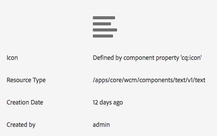

# Testen der Kernkomponenten in We.Retail{#trying-out-core-components-in-we-retail}

Die Kernkomponenten sind moderne, flexible Komponenten, die sich problemlos erweitern und in Ihre Projekte integrieren lassen. Sie basieren auf mehreren wichtigen Design-Prinzipien wie HTL, unmittelbarer Nutzbarkeit, Konfigurierbarkeit, Versionierung und Erweiterbarkeit. Die `We.Retail`-Site basiert auf Kernkomponenten.

## Jetzt ausprobieren {#trying-it-out}

1. Starten Sie Adobe Experience Manager (AEM) mit dem `We.Retail` Beispielinhalt und öffnen Sie die [Komponentenkonsole](/help/sites-authoring/default-components-console.md).

   **Globale Navigation > Tools > Komponenten**

1. Wenn Sie die Leiste in der Komponentenkonsole öffnen, können Sie nach einer bestimmten Komponentengruppe filtern. Die Kernkomponenten befinden sich unter:

   * `.core-wcm`: Die standardmäßigen Kernkomponenten
   * `.core-wcm-form`: Die Kernkomponenten für die Formularübermittlung

   Choose `.core-wcm`.

   

1. Alle Kernkomponenten verwenden den Namen **v1**, um die erste Version jeder Komponente anzugeben. Für die Zukunft sind reguläre Versionen geplant, die versionskompatibel mit AEM sind und eine einfache Aktualisierung ermöglichen, sodass Sie die neuesten Funktionen nutzen können.
1. Klicken Sie auf **Text (v1)**.

   Hier können Sie sehen, dass der **Ressourcentyp** der Komponente `/apps/core/wcm/components/text/v1/text` lautet. Kernkomponenten befinden sich unter `/apps/core/wcm/components` und werden pro Komponente versioniert.

   

1. Klicken Sie auf die Registerkarte **Dokumentation**, um die Entwicklerdokumentation für die Komponente anzuzeigen.

   

1. Kehren Sie zur Komponentenkonsole zurück. Filtern Sie nach dem **`We.Retail`** und wählen Sie die Komponente **Text** aus.
1. Hier können Sie sehen, dass der **Ressourcentyp** auf eine Komponente verweist, wie unter `/apps/weretail` erwartet, aber der **Ressourcen-Supertyp** zurück auf die Kernkomponente `/apps/core/wcm/components/text/v1/text` verweist.

   

1. Klicken Sie auf die Registerkarte **Live-Nutzung**, um anzuzeigen, auf welchen Seiten diese Komponente verwendet wird. Klicken Sie auf die erste **Dankeseite**, um die Seite zu bearbeiten.

   

1. Wählen Sie auf der Dankesseite die Textkomponente aus und klicken Sie im Bearbeitungsmenü der Komponente auf das Symbol „Vererbung abbrechen“.

   [`We.Retail` verfügt über eine globalisierte Site](/help/sites-developing/we-retail-globalized-site-structure.md)Struktur, bei der Inhalte von der primären Sprach-Site über einen Mechanismus [Vererbung“ an Live Copies ](/help/sites-administering/msm.md). Aus diesem Grund muss die Vererbung abgebrochen werden, damit Benutzende den Text manuell bearbeiten können.

   

1. Klicken Sie **Ja**, um den Abbruch zu bestätigen.

   

1. Wenn die Vererbung abgebrochen ist und Sie die Textkomponenten auswählen, stehen Ihnen viele weitere Optionen zur Verfügung. Klicken Sie auf **Bearbeiten**.

   

1. Sie können nun sehen, welche Bearbeitungsmöglichkeiten für die Textkomponente zur Verfügung stehen.

   

1. Wählen Sie aus dem Menü **Seiteninformationen** die Option **Vorlage bearbeiten** aus.
1. Klicken Sie im Vorlageneditor der Seite auf das **Richtlinien**-Symbol der Textkomponente im **Layout-Container** der Seite.

   

1. Mit den Kernkomponenten kann ein Vorlagenautor bzw. eine Vorlagenautorin konfigurieren, welche Eigenschaften den Seitenautorinnen und -autoren zur Verfügung stehen. Zu diesen Eigenschaften gehören Funktionen wie zulässige Einfügequellen, Formatierungsoptionen und verfügbare Absatzstile.

   Solche Design-Dialogfelder stehen für viele Kernkomponenten zur Verfügung und arbeiten mit dem Vorlageneditor zusammen. Sobald diese aktiviert sind, stehen sie den Autorinnen und Autoren über die Komponenteneditoren zur Verfügung.

   

## Siehe auch {#further-information}

Weitere Informationen zu Kernkomponenten finden Sie im Authoring-Handbuch [Kernkomponenten](https://experienceleague.adobe.com/de/docs/experience-manager-core-components/using/introduction) für einen Überblick über die Funktionen. Eine technische Übersicht finden [ im Handbuch ](https://experienceleague.adobe.com/en/docs/experience-manager-core-components/using/developing/overview)Entwickeln von Kernkomponenten“.

Weitere Informationen zu den Kernkomponenten finden Sie im Dokument [Kernkomponenten](https://experienceleague.adobe.com/de/docs/experience-manager-core-components/using/introduction) für einen Überblick über die Kernkomponentenfunktionen und im Entwicklerdokument [Entwickeln von Kernkomponenten](https://experienceleague.adobe.com/en/docs/experience-manager-core-components/using/developing/overview) für technische Details.

Sie können sich auch mit ([ Vorlagen) ](/help/sites-developing/we-retail-editable-templates.md). Umfassende Informationen zu bearbeitbaren Vorlagen finden Sie [ Dokument zum Erstellen von ](/help/sites-authoring/templates.md) oder im Entwicklerdokument [Bearbeitbare Vorlagen](/help/sites-developing/page-templates-editable.md).
